# 《基于大语言模型的个人智能影音平台设计与实现》系统架构设计文档

## 文档信息

| 项目 | 内容 |
| --- | --- |
| 文档名称 | 系统架构设计文档 |
| 上游需求基线 | `docs/01-项目需求文档.md` |
| 文档性质 | 第一版系统架构与关键技术方案基线 |
| 核心业务后端 | Spring Boot |
| AI服务 | FastAPI + LangChain + LangGraph |
| Web前端 | Vue 3 + Vite + TypeScript |
| 核心业务存储 | MySQL |
| P0影片图片存储 | 自有OSS；Vue日常可通过OSS/CDN读取 |
| P0影片元数据Provider | TMDBMovieMetadataProvider（TMDB官方API） |
| P0媒体探测Provider | FfprobeMediaProbeProvider（ffprobe） |
| P0媒体来源Adapter | WebDavMediaSourceAdapter（AList等仅为WebDAV Provider） |
| P0用户入口 | 自主注册/登录，注册后默认空片库 |
| P0角色模型 | 应用内仅USER/ADMIN两级角色；部署维护者是独立运行环境角色 |
| 产品结构 | 弱后台、强个人端；同一Vue Web应用提供轻量系统管理区域 |
| 浏览器认证 | Spring Security + JWT Bearer；CurrentUser全链路隔离；Admin use case额外校验ADMIN |
| P0向量存储 | FastAPI侧嵌入式持久向量存储 |
| P0缓存结论 | 不引入Redis |
| 默认播放客户端 | Windows本机mpv |
| 文档状态 | 已完成“公共Movie首次建档 + TMDB图片OSS持久化”增量修订的架构基线 |

> 本文档仅进行系统架构、服务边界和关键技术方案设计，不创建数据库表，不定义完整API清单，不编写Controller、FastAPI路由、Vue代码、Docker Compose或业务实现代码。

---

## 1. 文档目的

本文档将《项目需求文档》中的P0需求转化为可实施的系统架构，明确Web前端、Spring Boot业务服务、FastAPI AI服务、媒体来源、TMDB官方API、ffprobe、数据存储和Windows播放客户端之间的边界与协作方式。

本文档重点解决以下架构问题：

1. Spring Boot与FastAPI如何通信，以及AI如何安全调用真实业务能力。
2. 用户自主注册后如何从空片库添加自己的WebDAV来源，并保证全链路用户隔离。
3. P0唯一实际来源Adapter如何在保留统一媒体来源抽象的前提下接入WebDAV。
4. WebDAV播放定位如何在不代理视频流的前提下受控交给mpv。
5. 自然语言搜索、混合检索、RAG和LangGraph Agent如何与系统中的当前用户业务事实融合。
6. MySQL、Redis和向量存储分别承担什么职责。
7. 开发答辩与云部署环境如何部署，以及未来本地资源扩展如何保持在P0之外。
8. 如何在不建设内容运营后台或复杂RBAC的前提下，通过同一Vue应用与Spring Boot `admin`上层编排模块提供轻量系统管理。
9. OperationRecord、技术运行日志、任务/AI可观察信息如何分层，并通过`request_id`、`task_id`和健康摘要支持排障且不泄露敏感内容。
10. 公共Movie如何在多用户首次扫描时只建档一次，以及TMDB图片如何经Spring Boot持久化到OSS供日常稳定展示。

### 1.1 需求事实来源

`docs/01-项目需求文档.md`是本项目唯一需求事实来源。本架构不增加新的P0产品能力；架构设计与需求发生冲突时，以01文档为准。

### 1.2 本文档不覆盖

- 具体数据库表、字段、索引和SQL。
- 完整HTTP接口路径、请求体和响应体定义。
- Spring Boot Controller、FastAPI路由或Vue组件。
- LangGraph、LangChain或模型SDK实现代码。
- Docker Compose及服务器安装脚本。
- Windows注册表脚本和mpv安装脚本。

---

## 2. 架构设计目标

### 2.1 可交付目标

- 支撑01文档定义的P0完整业务闭环。
- 保持技术组件数量适合本科毕业设计独立实现和答辩演示。
- 让基础片库在AI组件故障时仍可使用。
- 让AI回答建立在Spring Boot提供的真实业务事实之上。
- 让Movie事实、MediaResource文件事实和AI生成语义信息拥有明确且不可互相覆盖的数据链路。
- 让高码率视频从媒体来源直接流向mpv，不经过Spring Boot或FastAPI。
- 让`ADMIN`通过明确Admin Application Service查看聚合统计、账号状态、任务/AI运行摘要、脱敏审计和健康配置摘要，而不获得用户私人内容运营权。
- 让关键请求、任务、外部依赖与降级状态具有可追踪、可审计、可定位的轻量可观察性。
- 让公共Movie及其固定主Poster/Backdrop被所有关联用户复用，并使已刮削片库不依赖TMDB图片CDN实时可用。
- 允许后续在不重写核心业务的前提下增加其他标准来源协议、模型或独立向量数据库。

### 2.2 质量目标

- **边界明确**：Spring Boot管理业务事实，FastAPI管理AI推理，mpv负责播放。
- **数据一致**：任何观看状态、收藏、资源版本和可访问性均以Spring Boot当前查询结果为准。
- **故障隔离**：外部模型、向量存储、WebDAV来源、TMDB或ffprobe单独故障时，不拖垮无关模块。
- **安全可控**：FastAPI只获得当前请求所需的只读业务能力，LLM不能直接访问MySQL。
- **最小管理面**：系统内仅`USER/ADMIN`两级角色，管理端只承担系统维护辅助，不形成第二业务事实源或内容运营后台。
- **可观察但不泄密**：OperationRecord、技术日志和任务/AI摘要分层，记录标识/状态/耗时/错误类别，不记录完整Prompt、凭据或PlaybackLocator。
- **部署独立**：服务器端无需Windows桌面和mpv，Windows客户端无需运行Spring Boot或FastAPI。
- **可演进**：扩展点通过Provider、Adapter和Gateway形成，而不是提前实现P1/P2功能。

---

## 3. 架构原则

### 3.1 简单优先

P0采用一个Spring Boot业务服务、一个FastAPI AI服务、一个MySQL实例和一个嵌入式持久向量存储。不采用服务注册中心、API网关产品、Kafka、RabbitMQ、分布式事务或Kubernetes。

系统采用“弱后台、强个人端”。轻量系统管理中心仍位于现有Vue与Spring Boot模块化单体内，不新增第二套管理前端、独立管理服务、任务平台、Redis、ELK/Loki、Prometheus/Grafana强依赖或大型BI系统。

本文中的`ADMIN`是负责账号状态、聚合监控、脱敏审计和系统健康的“系统管理员”，不是负责影片审核、公共资源或内容运营的“内容运营管理员”；本项目不设置后者。

### 3.2 单一业务事实源

用户、影片、媒体资源、媒体来源、收藏、标签、观看状态和播放记录只由Spring Boot管理，并以MySQL中的业务状态为准。FastAPI不得直接读取或修改核心业务数据库。

### 3.3 控制面与数据面分离

- **控制面**：确定影片是什么、资源在哪里、是否可访问、选择哪个版本、当前播放定位是什么。
- **数据面**：读取数十GB电影数据并完成解码、HDR、音频和字幕播放。

Spring Boot和FastAPI只位于控制面。P0媒体数据面由用户WebDAV来源直接连接Windows本机mpv，不经过业务服务中转。

### 3.4 AI受业务约束

LLM可以解析意图、生成语义查询和解释结果，但不能跳过Spring Boot施加的用户隔离、硬条件、资源归属和状态检查。

### 3.5 端口与适配器思想

媒体来源、影片元数据、媒体探测、模型和向量存储均通过架构端口访问。P0保留统一`MediaSourceAdapter`端口，但媒体来源只实现`WebDavMediaSourceAdapter`；同时实现TMDBMovieMetadataProvider和FfprobeMediaProbeProvider。P0不提前实现FileSystem、SMB、Local Agent、云盘厂商Adapter、其他影视数据库、PotPlayer或其他扩展。AList、NAS WebDAV和Nextcloud仅是可用于测试和部署的WebDAV Provider。

### 3.6 可降级优先

语义检索失败时退化为结构化检索；AI失败时退化为传统片库；WebDAV来源失败时保留其他来源；TMDB失败时保留已刮削内容；ffprobe失败时保留资源并将技术字段标记为UNKNOWN或空。

---

## 4. 系统总体架构

系统采用“Web前端 + 业务核心 + 独立AI服务 + 外部播放客户端”的轻量分层架构。Vue只通过Spring Boot访问普通业务、AI和管理入口；Spring Boot作为唯一公网业务入口与事实源；FastAPI位于内部网络，通过受控业务工具获取数据；Windows本机mpv独立于服务器部署。

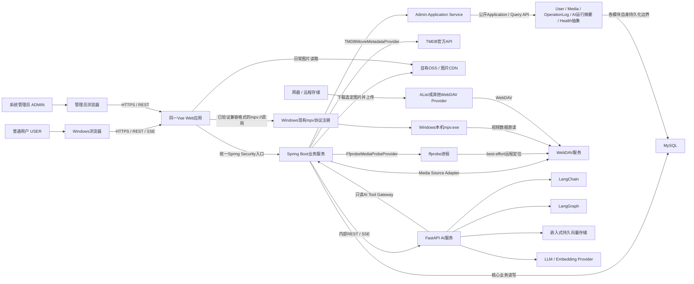

### 4.1 一句话架构

> Spring Boot统一管理个人影音业务事实、公共Movie建档、TMDB图片持久化与媒体控制面，FastAPI通过只读工具网关提供RAG和Agent能力，Vue的业务请求只访问Spring Boot、日常展示图片从自有OSS/CDN读取，并使用`mpv://`调用Windows本机mpv，让影片数据从媒体来源直接进入播放器。

轻量管理链路为：`ADMIN`在同一Vue应用发起请求，经Spring Security和Admin Application Service调用各模块公开Query/Application API，并只获得脱敏聚合结果；它不改变上述个人影音主架构。

P0端到端架构主流程固定为：

> 用户注册/登录 → 默认空片库 → 添加自己的WebDAV媒体源 → 测试连接 → 扫描目录 → 文件名识别 → TMDB刮削 → 建立CurrentUser独立片库 → 搜索/收藏/观看记录 → AI搜索、推荐、RAG、Agent → 获取当前PlaybackLocator → 浏览器通过`mpv://`调用用户Windows本机mpv

P0辅助管理流程固定为：

> ADMIN登录 → 系统概览/普通用户账号启停 → 任务与AI运行摘要 → 系统级脱敏OperationRecord → 健康与只读配置摘要

---

## 5. 系统上下文图

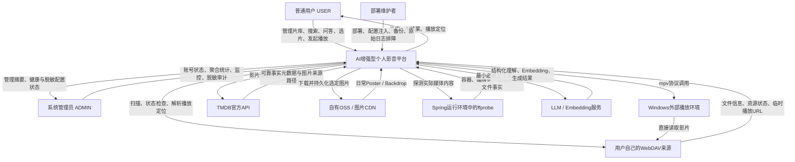

### 5.1 信任边界

- 浏览器、Windows现有mpv URL协议注册和mpv.exe属于用户客户端环境。
- `USER`与`ADMIN`是应用内身份；部署维护者属于运行环境职责。实际可由同一人承担，但`ADMIN`不直接连接MySQL或原始日志，部署维护者也不因服务器权限自动获得产品管理入口。
- Vue静态资源、Spring Boot、FastAPI、MySQL和向量数据属于平台服务环境；自有OSS/CDN属于受控图片存储与分发边界，不属于影片视频数据面。
- WebDAV服务、TMDB官方API、OSS服务和云端模型属于外部依赖边界；AList可能位于WebDAV服务之后，不是平台核心Adapter类型；ffprobe属于Spring Boot运行环境内的基础设施工具边界。
- WebDAV凭据、模型密钥和临时播放定位跨越边界时必须最小化暴露。

---

## 6. 逻辑架构

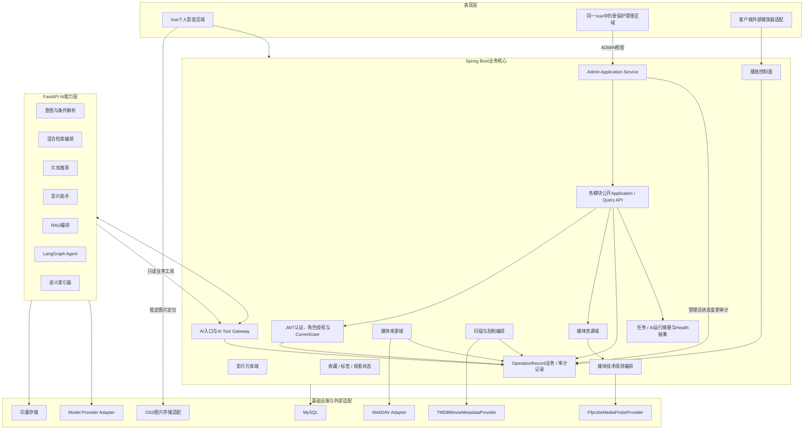

### 6.1 逻辑调用规则

1. Vue不得直接访问MySQL、FastAPI、WebDAV凭据、TMDB API凭据或ffprobe。
2. FastAPI不得直接访问MySQL或媒体来源凭据。
3. AI需要业务事实时通过Spring Boot的AI Tool Gateway查询。
4. Spring Boot调用FastAPI时不得保持数据库事务或锁。
5. mpv只接收经过解析和校验的播放定位，不参与片库业务。
6. 用户身份只由JWT经Spring Security建立的CurrentUser提供；对象归属由Spring Boot Application Service再次校验。
7. 管理员请求必须先验证`ADMIN`，再进入Admin Application Service；Admin只通过其他模块公开Application/Query API取得脱敏聚合数据，不直接访问其他模块Mapper、WebDAV凭据或FastAPI。
8. Vue路由隐藏不是授权边界；`USER`手工构造管理员请求时必须由Spring Boot返回403或等价拒绝。
9. FastAPI AI Tool Gateway、LLM和Agent不得调用Admin Application Service或获得管理员级数据范围。
10. Vue正式运行时不得直接调用TMDB API或把`image.tmdb.org`作为已刮削影片的日常图片来源；Spring Boot负责将选定图片持久化到自有OSS并向Vue提供稳定定位。

---

## 7. 服务职责划分

| 组件 | 负责 | 不负责 | 主要输入 | 主要输出 |
| --- | --- | --- | --- | --- |
| Vue | 普通用户交互、同一工程内的受保护管理区域、状态展示、SSE消费、OSS/CDN图片展示、mpv协议调用 | 业务事实、后端授权、AI推理、视频播放、TMDB图片选取与持久化 | Spring Boot业务/AI/管理结果及稳定图片定位 | 用户/管理员请求、`mpv://`调用 |
| Spring Boot | JWT认证、USER/ADMIN授权、账号状态、CurrentUser归属、片库、来源、资源、观看行为、OperationRecord、轻量管理编排、任务/AI摘要、健康聚合、公共Movie建档与复用、TMDB识别刮削、选定图片下载和OSS上传、ffprobe媒体探测、播放控制面、AI网关 | 内容运营、复杂RBAC、LLM推理、向量检索、视频代理、集中日志平台 | 用户/管理员请求、来源文件事实、TMDB事实/图片来源、ffprobe事实、AI工具请求 | 业务结果、公共Movie与稳定图片定位、脱敏管理DTO、健康摘要、当前播放描述、实时业务事实 |
| FastAPI | 意图解析、Embedding、RAG、AI语义标签、推荐解释、LangGraph Agent、结构化AI输出 | TMDB刮削、ffprobe探测、核心业务读写、媒体凭据管理、管理员能力、视频流 | AI请求、Tool Gateway事实、向量内容 | AI事件流、语义信息、候选排序、依据和解释 |
| MySQL | 核心业务事实和持久任务状态 | 语义相似度、视频存储 | Spring Boot业务操作 | 一致的结构化事实 |
| 向量存储 | AI语义索引和近似相似检索 | 权威业务状态、用户鉴权 | FastAPI索引文档、查询向量 | 语义候选ID和分数 |
| 自有OSS/CDN | 长期保存并分发系统已选定的主Poster和主Backdrop | 影片事实、视频文件、用户片库归属、动态选图 | Spring Boot上传的图片对象 | 稳定Object Key对应的图片资源 |
| mpv | 读取和播放实际影片 | 资源管理、推荐、业务状态判断 | 文件路径或HTTP(S) URL | 本机影音播放 |

### 7.1 避免职责重叠

- 影片是否属于用户片库由Spring Boot判断，FastAPI只消费结果。
- 影片是否满足时长、观看状态等硬条件由Spring Boot最终执行。
- 影片是否“压抑、治愈、节奏快”等语义条件由FastAPI辅助评分。
- 资源是否当前可用由Spring Boot调用媒体来源适配层判断，不由LLM推测。
- 影片解释由FastAPI生成；演员、导演、年份和Movie.runtime等TMDB事实，以及MediaResource.duration等文件事实，均由Spring Boot按来源提供。
- Movie.runtime等影片事实来自TMDB，MediaResource.duration等实际文件事实来自MediaSource/ffprobe；FastAPI只能消费并解释，不能改写两者。
- Movie可作为共享影片事实；用户可见性通过其有权访问的MediaSource/MediaResource和个人状态建立，不能给Movie简单附加用户归属以复制事实。

---

## 8. Vue职责

Vue作为第一版唯一产品交互层，承担以下职责：

1. 提供登录、来源管理、片库、影片详情、收藏、标签、观看状态和本人操作记录界面；业务请求使用`Authorization: Bearer <JWT>`。
2. 发起扫描、刮削、传统搜索、AI搜索、推荐、影片助手和Agent请求。
3. 消费Spring Boot返回的REST结果和SSE事件流。
4. 展示AI执行阶段、生成文本、引用依据、不确定性和错误状态。
5. 展示逻辑影片的主Poster、详情页主Backdrop及其多个媒体资源版本，并在存在时展示MediaResource的Edition/Cut标签。
6. 接收Spring Boot生成的受控播放描述，并通过Vue内统一的`MpvUrlProtocolBuilder`按照Technical Spike锁定的已验证兼容格式构造`mpv://`链接。
7. 在发起外部协议前提示用户浏览器可能请求确认。
8. 在无法确认mpv是否被唤起时，只显示“已请求打开mpv”，并提供复制播放地址的降级入口。
9. 在同一Vue项目中为`ADMIN`提供系统概览、用户管理、任务监控、AI调用监控、日志中心和系统状态/配置摘要区域；概念上可以使用独立受保护路由区，但本架构不锁定最终URL。
10. 根据已认证角色改善导航可见性，并对403、账号禁用、依赖降级和敏感字段脱敏状态提供明确展示。
11. 根据Spring Boot返回的稳定图片定位，从自有OSS/CDN展示已持久化的主Poster和主Backdrop；不得在正常片库浏览时临时调用TMDB选图或依赖TMDB图片CDN。
12. 开发期可由与页面解耦的Frontend Mock提供同契约数据，但切换到真实Spring Boot后，浏览器公共业务入口仍只有Spring Boot。

Vue不应：

- 直接持有WebDAV认证凭据或模型密钥。
- 自行判定影片归属、资源可用性或观看状态。
- 接受任意输入并直接拼接为mpv命令参数。
- 绕过Spring Boot直接调用FastAPI内部服务。
- 直接调用TMDB API、持有TMDB凭据，或把TMDB图片CDN URL硬编码为正式日常展示链路。
- 把路由隐藏当作管理员安全边界，或直接连接MySQL、读取服务端日志文件、展示用户凭据/完整AI私人内容。

`MpvUrlProtocolBuilder`只是Vue播放模块中对已验证href规则的统一构造入口，不是Windows本地程序，不解码本地协议，也不直接启动mpv.exe；它只把固定格式的href交给浏览器发起调用。

---

## 9. Spring Boot职责

Spring Boot是系统业务核心和唯一公共后端入口，承担以下职责：

1. 提供用户自主注册，使用Spring Security完成用户名/密码认证，解析并验证JWT签名与过期状态，建立可信SecurityContext和CurrentUser；新用户初始片库为空。
2. 维护应用内部`USER/ADMIN`两级角色与账号允许访问状态；新注册用户只能获得`USER`，普通注册和P0产品功能不能授予`ADMIN`。
3. 管理Movie、MediaResource和MediaSource等核心领域对象。
4. 管理收藏、用户标签、AI标签状态、观看状态和播放启动记录。
5. 编排媒体来源扫描、Edition Label确定性提取、文件名解析、TMDB候选匹配、置信度计算和人工修正。
6. 通过TMDBMovieMetadataProvider取得Movie身份、基本资料、Genre、导演、前20名主要演员、主Poster、一个主Backdrop和TMDB评分等事实。
7. 通过Media Source Adapter测试来源、浏览目录、获取文件事实、检查资源状态和解析播放定位。
8. 通过FfprobeMediaProbeProvider探测实际媒体文件的时长、容器、视频和主要音轨技术事实。
9. 对WebDAV媒体探测执行best-effort策略，探测失败不阻塞MediaResource入库和TMDB刮削。
10. 生成播放控制面结果，但不代理影片数据流。
11. 作为Vue访问AI能力的入口，负责鉴权、请求关联和SSE转发。
12. 向FastAPI提供只读AI Tool Gateway，返回当前普通用户范围内的TMDB事实、MediaResource事实和用户业务事实，绝不开放管理员能力。
13. 管理向AI索引器提供的规范化可索引内容及版本信息。
14. 在外部AI故障时继续提供传统片库、精确搜索、基础播放及Java核心管理/健康能力。
15. 校验MediaSource归属，并通过MediaSource归属约束MediaResource可见范围、个人片库、收藏、观看状态、播放历史、AI/RAG数据和会话；按对象ID访问时防止IDOR。
16. 通过Admin Application Service编排系统概览、普通用户账号启停、任务与AI运行摘要、脱敏审计、健康和只读配置摘要；只调用各模块公开能力。
17. 在认证成功并确定真实User后记录登录成功，以及来源、扫描、人工识别、AI和播放等关键用户业务操作；记录管理员登录成功和账号启停等状态变更，并标明`ADMIN` actor。认证失败因尚无可信CurrentUser，只写脱敏安全/技术日志，不创建用户OperationRecord。
18. 在TMDB Movie ID确认后优先查询并复用公共Movie；缺失时通过统一公共Movie建档用例获取规范化事实、按系统规则选图、下载图片、上传OSS、保存稳定定位并创建Movie。
19. 以数据库唯一约束保证同一TMDB Movie ID最终只形成一条Movie；遇到并发唯一约束冲突时重新查询并复用胜出的Movie，而不是把冲突直接作为系统异常返回。
20. 保留TMDB来源追踪与原始`poster_path`/`backdrop_path`语义，并保证普通扫描、登录和浏览不会自动替换已经持久化的公共图片。

Spring Boot不应：

- 承担LLM对话编排、Embedding或向量相似检索。
- 使用LLM生成TMDB影片事实或代替ffprobe猜测文件技术参数。
- 把媒体文件上传给FastAPI。
- 代理4K电影数据流、转码或解码。
- 在服务器上启动用户Windows本机mpv。
- 建设影视内容运营后台、复杂权限体系、第二套管理服务或集中技术日志平台。
- 把TMDB图片URL直接下发为正式长期图片链路，或在普通访问中隐式刷新公共Movie图片。
- 允许Admin Controller直接访问其他模块Mapper、FastAPI、用户WebDAV凭据、原始日志文件或数据库DO。

### 9.1 Admin Application Service边界

`admin`是Spring Boot模块化单体中的上层管理查询/编排模块，不拥有新的业务事实。其P0职责包括系统统计聚合、普通用户基础账号状态管理、跨用户扫描/索引任务监控、AI调用运行统计、OperationRecord管理员审计查询、系统健康聚合和脱敏配置摘要。

管理调用链固定为：

> ADMIN Browser / 同一Vue应用 → Spring Security → Admin Controller → Admin Application Service → 各业务模块公开Application/Query API → 各模块自身持久化边界 → MySQL

明确禁止`Vue Admin → MySQL`、`Vue Admin → FastAPI`、`Admin Controller/Application Service → 其他模块Mapper`、`Admin → 用户WebDAV凭据`和`FastAPI → Admin能力`。Admin Controller只接收管理请求、验证`ADMIN`、调用Admin Application Service并返回脱敏DTO；跨用户读取必须是显式管理员use case，不能复用普通CurrentUser接口后绕过范围校验。

`admin`可依赖`user`、`media`、`operationlog`、`ai`公开的运行状态/统计能力和`common`中的精简health抽象；下层模块不得依赖`admin`。为避免循环，统计与页面组合留在`admin`，各事实模块只返回有界、最小、脱敏的批量Query结果。

---

## 10. FastAPI职责

FastAPI是独立AI能力服务，承担以下职责：

1. 通过统一模型Provider调用LLM和Embedding能力。
2. 使用结构化输出解析自然语言意图、硬条件和语义条件。
3. 编排结构化查询与向量检索形成混合搜索。
4. 构建RAG上下文、生成带依据的影片助手回答。
5. 基于片库候选、观看历史摘要和资源事实生成推荐排序与解释。
6. 使用LangGraph执行P0只读Agent工作流。
7. 管理AI语义索引的构建、更新和删除。
8. 产生面向前端的AI阶段事件、文本片段、依据和终态。
9. 在工具或模型失败时返回明确、可降级的错误，而不是伪造结果。
10. 基于Spring Boot提供的TMDB事实和可靠RAG资料生成明确标识的情绪、节奏、氛围、观看场景、AI语义标签和推荐解释。

FastAPI可以持有：

- 向量语义索引。
- Prompt模板和AI工作流定义。
- 单实例P0所需的短时会话/Agent状态。
- 模型Provider配置和AI侧可观察信息。

FastAPI不得持有或维护：

- 用户、影片、资源、来源、收藏、观看状态和播放记录的第二套权威数据。
- 媒体来源访问凭据和临时播放URL。
- 直接写入核心MySQL的能力。
- 调用TMDB完成影片事实刮削，或调用ffprobe分析实际媒体文件的职责。
- `ADMIN`授权上下文、管理员账号管理、跨用户统计、系统级OperationRecord查询或其他Admin Application Service能力。
- 用于监控的完整Prompt、完整对话、完整RAG上下文、API Key、完整文件路径或PlaybackLocator。

---

## 11. Spring Boot与FastAPI通信方案

### 11.1 明确结论

- **普通AI调用**：Spring Boot与FastAPI之间使用内部HTTP REST + JSON。
- **流式AI回答和Agent阶段事件**：FastAPI以SSE输出，Spring Boot进行身份绑定、事件过滤和SSE透传，Vue只连接Spring Boot。
- **AI调用业务事实**：FastAPI通过Spring Boot内部只读AI Tool Gateway进行REST调用。
- **不采用**：WebSocket、消息队列、服务注册中心、共享业务数据库或Vue直连FastAPI。

选择REST和SSE的原因：

1. 两种技术跨Java/Python实现成熟、调试直观，适合本科项目。
2. AI输出主要是服务器单向推送，SSE比WebSocket更简单。
3. Agent工具调用本质是短请求/响应，REST足够。
4. Vue只访问Spring Boot，可统一JWT认证、权限、操作记录和错误格式。

### 11.2 普通AI调用路径

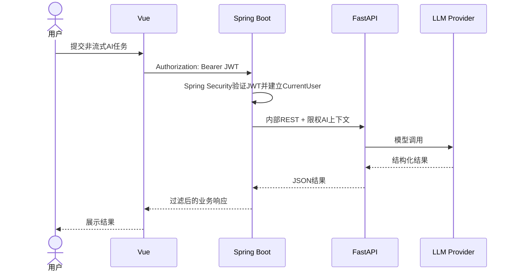

### 11.3 流式AI调用路径

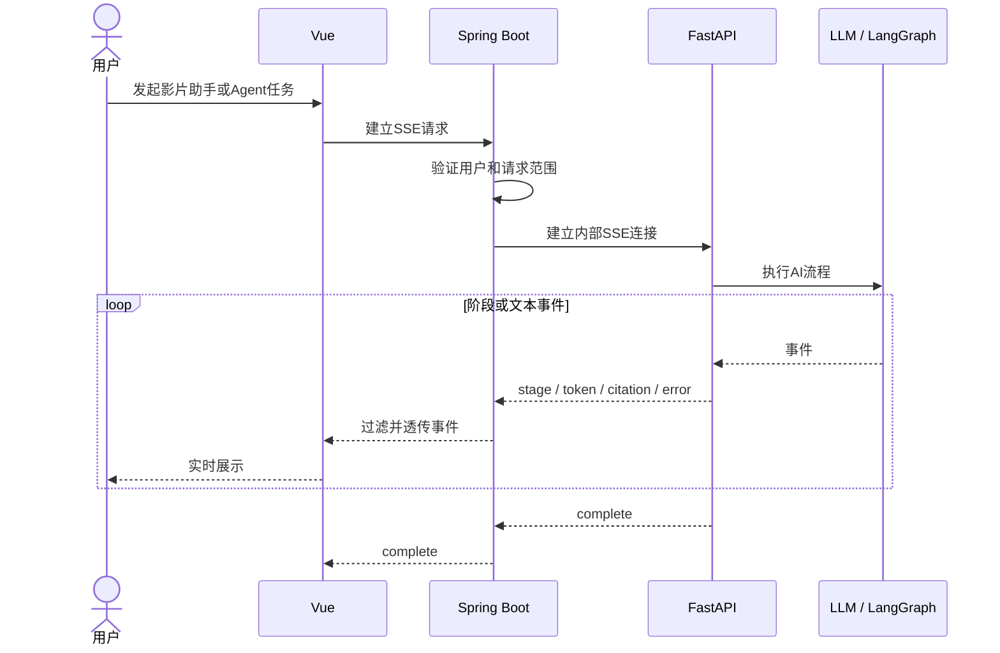

### 11.4 AI Tool Gateway

AI Tool Gateway是Spring Boot内部提供给FastAPI的受控业务能力边界，不是对LLM开放的任意HTTP客户端。

其能力按领域分组，P0只读，包括：

- 查询当前用户片库候选。
- 获取影片可靠元数据。
- 获取观看状态、收藏和历史摘要。
- 获取影片关联的媒体资源版本。
- 检查一个受控资源集合的当前状态。
- 获取用于RAG的规范化业务事实。

本阶段不定义具体接口路径和完整报文。

### 11.5 用户上下文与服务认证

采用“双重认证 + 限权委托”方案：

1. Vue登录成功后取得Spring Boot签发的JWT，后续通过`Authorization: Bearer <JWT>`访问Spring Boot；Spring Security负责Token解析、签名验证、过期校验和SecurityContext建立，FastAPI不接受浏览器JWT。
2. Spring Boot调用FastAPI时携带服务身份和短时AI上下文令牌。
3. 上下文令牌由Spring Boot签发，包含用户标识、请求标识、允许工具范围和短有效期，不包含来源凭据。
4. FastAPI回调AI Tool Gateway时同时提供自身服务身份和原始限权上下文令牌。
5. Spring Boot从令牌建立用户范围，不信任LLM或工具参数中自行传入的用户标识。
6. Gateway再次执行数据归属、参数白名单、数量上限和只读权限检查。
7. AI上下文即使由具有`ADMIN`角色的账号发起，也只能绑定普通个人AI用例所需的当前用户范围，不携带或映射任何管理员scope；FastAPI不得调用Admin Application Service。

浏览器JWT只证明“当前是谁”，不能证明可以访问任意对象。MediaSource、MediaResource、Favorite、PersonalState、History和AI/Playback普通入口仍须根据CurrentUser执行用户范围与归属校验；OperationRecord普通入口也只返回本人记录，只有独立Admin审计入口在验证`ADMIN`后可查询系统级脱敏记录。Controller不得信任前端传入的`userId`。

P0可采用应用级共享密钥进行服务身份验证，并要求FastAPI仅暴露在内部网络；未来如部署环境具备条件可升级为双向TLS。Spring Security只设置`USER/ADMIN`两级应用角色：新注册用户只能得到`USER`，管理员账号通过后续安全/部署详细设计确定的部署初始化或安全种子方式建立，普通注册和P0管理功能均不授予`ADMIN`。管理端请求必须额外校验`ADMIN`；每次受保护请求还应复核当前账号仍处于允许访问状态，使被禁用用户不能仅凭尚未过期的JWT继续访问。内部令牌格式、管理员初始化和JWT过期/Refresh/禁用后失效策略在API与安全详细设计中确定，P0不引入OAuth2 Authorization Server、Keycloak、Redis黑名单或分布式Session。

### 11.6 超时和调用约束

- 普通AI调用设置明确超时，不无限等待。
- SSE连接具有总执行时限和心跳事件。
- Spring Boot调用FastAPI时不得持有数据库事务。
- Tool Gateway对单次返回数量、资源检查数量和调用频率设置上限。
- 每次调用携带统一请求标识，用于跨服务日志关联。

---

## 12. 媒体来源适配架构

### 12.1 架构目标

核心业务不直接依赖WebDAV协议细节，而是依赖统一`MediaSourceAdapter`端口。第一版P0只实现`WebDavMediaSourceAdapter`；保留端口、Registry和统一能力是为了未来扩展FileSystem、SMB或其他来源，不代表P0需要第二个实际Adapter。AList、NAS WebDAV和Nextcloud是同层WebDAV Provider，不形成`ALIST`等来源类型或独立Adapter。

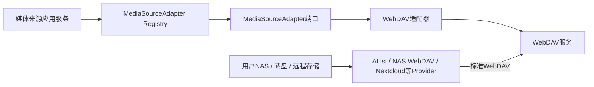

### 12.2 统一能力

Media Source Adapter从架构上提供以下能力：

1. **测试连接**：验证来源配置和基本访问权限。
2. **浏览目录**：在授权根目录内列出子目录和文件。
3. **扫描文件**：以分页或流式枚举方式发现媒体文件。
4. **获取文件信息**：返回文件名、稳定资源标识、相对位置、ResourceLocator、大小、修改时间，以及来源支持时的稳定资源ID。
5. **检查资源状态**：判断服务端是否仍可定位资源。
6. **解析播放定位**：将稳定资源定位转换为当前客户端可能使用的播放描述。

适配器返回统一结果和错误分类，例如认证失败、来源不可达、路径不存在、资源不存在、暂时超时和不可直接播放。核心业务不解析各来源特有异常文本。

### 12.3 适配器边界

- 适配器负责与来源通信，不负责创建Movie。
- 适配器返回文件事实，不调用LLM。
- 适配器不负责生成Movie事实或媒体流技术参数；Movie事实交给TMDBMovieMetadataProvider，媒体内容技术参数交给FfprobeMediaProbeProvider。
- 适配器不得把影片数据流转发给Spring Boot。
- 来源认证信息只在Spring Boot基础设施层使用，不进入FastAPI或Vue。
- 资源状态是带检查时间的观察结果，不被视为永久状态。

---

## 13. 未来本地资源接入架构（非P0）

### 13.1 本地部署扩展

未来本地部署可以在统一`MediaSourceAdapter`端口下增加`FileSystemMediaSourceAdapter`，直接访问本地硬盘或宿主系统已经挂载的NAS。该Adapter届时仍需遵守授权根、路径规范化、只读扫描和来源级用户归属等安全边界。

### 13.2 云部署扩展

未来云部署可以通过Local Agent/本地助手连接用户本地硬盘和仅局域网可达NAS。Local Agent可以承担本地扫描、ffprobe、目录监听以及本机播放器联动，但其身份认证、通信协议、离线状态和安全模型必须另行设计。

### 13.3 P0范围约束

`FileSystemMediaSourceAdapter`、SMB/NFS协议接入、Local Agent、服务端到Windows路径映射、本地目录探测和播放器联动均不属于本科毕设第一版P0，不进入当前开发顺序、测试、验收、部署或演示流程。保留本节仅用于说明统一媒体来源抽象的未来演进方向。

---

## 14. WebDAV资源架构

### 14.1 稳定定位与临时定位

WebDAV资源以MediaSource标识和规范化相对路径等形成稳定ResourceLocator，用于扫描、去重和再次定位；不永久保存本次播放解析出的PlaybackLocator。

原因如下：

- 当前播放定位可能具有有效期。
- URL、认证方式或重定向结果可能随WebDAV服务配置变化。
- URL中可能包含可直接访问资源的敏感令牌。
- 永久保存并复用会造成过期、泄露和错误播放。

### 14.2 WebDAV控制面

```mermaid
flowchart LR
    Stable["稳定WebDAV ResourceLocator"] --> Adapter["WebDavMediaSourceAdapter"]
    Adapter --> Check["认证与资源状态检查"]
    Check --> Resolve["解析当前PlaybackLocator"]
    Resolve --> Descriptor["短时PlaybackDescriptor"]
    Descriptor --> Web["Vue MpvUrlProtocolBuilder"]
    Web --> Protocol["mpv://"]
    Protocol --> MPV["Windows mpv"]
    MPV -->|"视频数据直读"| WebDAV["WebDAV服务 / 背后存储"]
```

### 14.3 播放定位策略

- PlaybackLocator只在用户选择具体资源并点击播放时动态解析。
- Spring Boot返回的播放描述包含目标类型、当前目标、可选过期时间和显示信息，不包含WebDAV凭据。
- 若已知有效期过短或地址解析失败，不生成`mpv://`调用。
- P0不把临时播放定位写入持久业务数据；仅允许在本次请求内短暂存在。
- 日志不得记录完整敏感URL或临时播放凭据。
- mpv直接访问WebDAV服务或其当前可播放目标，Spring Boot不代理HTTP Range和影片内容。

### 14.4 WebDAV兼容边界

`WebDavMediaSourceAdapter`面向WebDAV协议，不在业务层判断AList或具体网盘厂商。HTTP方法、DAV XML、Depth Header、认证、超时、URL构造和错误映射全部封装在基础设施Adapter内。AList、NAS WebDAV或其他标准服务可用于兼容性测试，但P0不承诺兼容所有服务器扩展行为。具体认证与服务器兼容范围属于外部集成详细设计输入。

### 14.5 WebDAV媒体探测边界

- WebDavMediaSourceAdapter首先区分文件/目录，并提供文件名、大小、相对路径、ResourceLocator、修改时间及可用的稳定资源ID。
- TMDB影片识别和MediaResource入库不得依赖远程ffprobe。
- 只有能够取得当前可访问HTTP URL，且满足后续详细设计规定的超时、请求和成本预算时，才把该URL临时交给FfprobeMediaProbeProvider进行best-effort探测。
- 远程ffprobe不得要求完整下载影片；失败、超时、地址失效或被策略跳过时，技术字段保持UNKNOWN或空。
- 远程探测使用的完整敏感URL或临时凭据不得写入日志、AI上下文、向量存储或长期业务数据。

### 14.6 WebDAV播放Technical Spike边界

P0只确定“按当前用户和资源归属校验 → 检查资源状态 → 解析PlaybackLocator → 形成PlaybackDescriptor → Vue发起`mpv://`或复制定位”的控制链路。不得在验证前写死永久HTTP直链、Basic Auth、账号密码入URL、固定Header传递方式或AList签名URL。Technical Spike需验证目标WebDAV服务与mpv在认证、重定向、URL编码、特殊字符、长URL和失败降级方面的行为。

---

## 15. Movie / MediaResource / MediaSource领域关系

### 15.1 领域模型

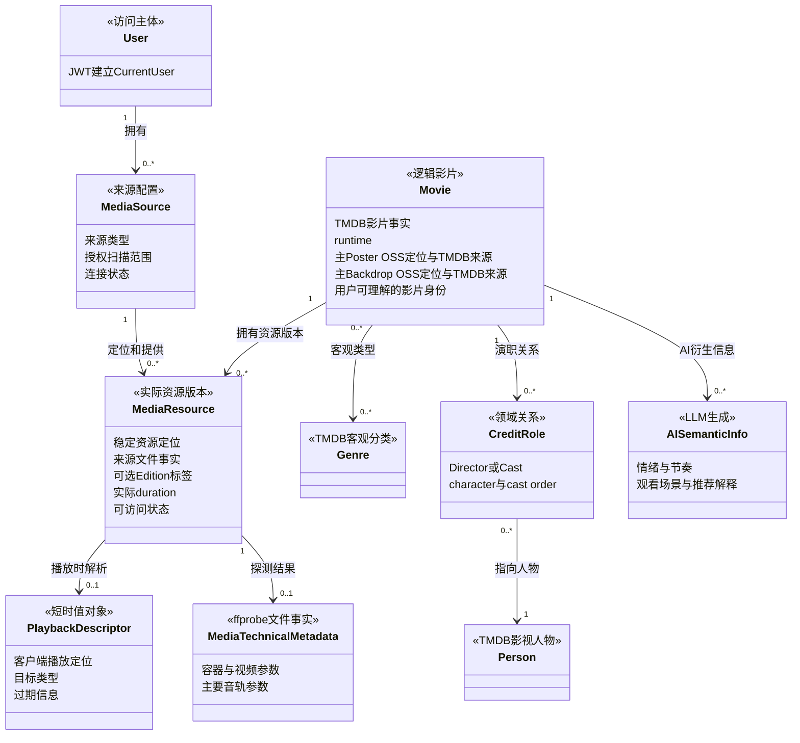

### 15.2 关系说明

- **Movie**表示“这是什么影片”，保存TMDB提供的身份、基本资料、Genre、演职员、主Poster、一个主Backdrop、外部评分、Provider和同步时间等事实。主Poster与主Backdrop是两个用途独立的展示图片定位概念。
- **Movie图片**保存已选定图片的稳定OSS资源定位及TMDB来源追踪信息；图片二进制在OSS中，MySQL不保存JPG/PNG本体。不同用户关联同一Movie时看到同一套公共主Poster和主Backdrop。
- **MediaResource**表示“实际拥有哪一个文件版本”，保存MediaSource直接提供的文件定位与状态事实、从文件名/目录名确定性提取的可选Edition/Cut语义，并关联ffprobe探测出的实际文件技术事实。
- **MediaSource**表示“如何访问一组资源”，保存来源类型、授权范围和连接能力。
- **PlaybackDescriptor**表示“当前客户端现在如何播放该资源”，是临时解析结果，不是永久影片实体。
- **Person/CreditRole**表达可搜索的导演和演员关系；P0保存所有主要Director与按TMDB cast order排序的前20名主要演员，具体持久化模型由03数据库设计确定。
- **Genre**是TMDB客观类型；**AISemanticInfo**是LLM生成的情绪、节奏和场景等信息，两者不得合并。
- **MediaTechnicalMetadata**属于MediaResource，不属于Movie。
- Edition/Cut同样属于MediaResource，但来源是文件名/目录名的确定性解析，不属于MediaTechnicalMetadata，也不由ffprobe负责识别。

### 15.3 必须拆分的原因

1. 同一影片可以来自不同WebDAV来源/目录并具有4K、1080P或不同Edition等多个版本。
2. 影片元数据变化不等于视频文件变化，文件失效也不应删除影片收藏和观看历史。
3. 搜索和推荐面向Movie，资源可用性和播放选择面向MediaResource。
4. 不同MediaSource具有完全不同的连接、状态检查和播放定位方式。
5. 临时WebDAV播放定位不能污染稳定资源身份。
6. Movie.runtime与MediaResource.duration可能因剪辑版本不同而不同，必须独立表达。
7. TMDB评分是外部影片事实，不是用户评分；P0不存在用户评分领域能力。
8. 同一Movie可以关联Theatrical Cut、Director's Cut、Extended Cut或Final Cut等不同MediaResource；Edition差异不产生重复Movie。

### 15.4 核心不变量

- MediaResource必须隶属于一个MediaSource。
- 已确认入库的MediaResource最多关联一个Movie。
- Movie可以暂时没有可用MediaResource，但必须明确显示不可播放。
- 同一MediaResource不得因重复扫描重复创建。
- 删除或失联资源不得自动删除Movie级收藏、观看状态和历史。
- Movie.runtime不得覆盖MediaResource.duration，反向亦然。
- TMDB Genre不得与AI语义标签共用同一领域含义。
- ResourceLocator不得被临时PlaybackLocator或WebDAV播放URL替代。
- MediaResource的Edition标签允许为空；不得由LLM猜测、由ffprobe识别或用Movie级TMDB资料代填。
- Movie只表达一个主Poster和一个主Backdrop定位；两者用途独立，且不扩展为完整图片图库。
- P0以TMDB Movie ID作为公共Movie最核心的外部影片唯一标识之一；后续数据库必须对其设置唯一约束。
- 公共Movie元数据可以在没有任何用户MediaResource关联时存在，但不会自动进入任一用户个人片库；只有当前用户拥有可访问MediaResource并建立关联后才可见。

### 15.5 用户归属与共享Movie

- 每个MediaSource属于一个明确用户，MediaResource通过所属MediaSource进入用户访问边界。
- 个人片库、收藏、用户标签、观看状态、播放历史、推荐偏好和AI会话均按CurrentUser隔离；OperationRecord普通用户查询同样按CurrentUser，只有`ADMIN`受控审计用例具有系统级脱敏查询例外。
- 访问任何来源、资源或个人对象标识时都必须执行“当前用户范围 + 对象归属”校验，不能使用无范围`selectById`结果直接响应请求。
- Movie继续作为TMDB确认后的共享事实模型，不增加每用户Movie副本；公共Movie存在不等于平台提供公共影视资源，也不会自动进入新用户片库。用户是否可见某个Movie由本人可访问MediaResource与该Movie的关系及个人状态决定。
- 向量检索必须使用用户范围过滤，但最终授权不能依赖向量存储；所有AI结果在返回前由Spring Boot Tool Gateway复核。

---

## 16. 资源扫描与刮削架构

### 16.1 扫描流水线

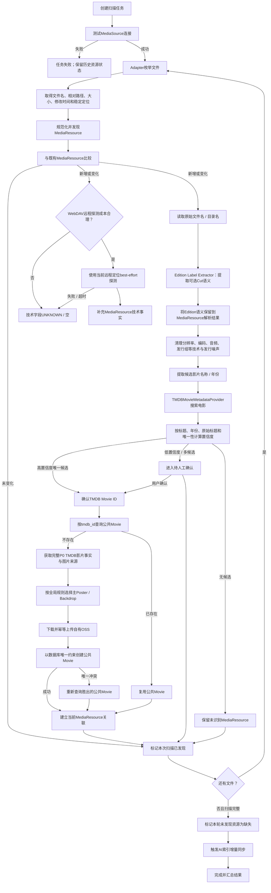

### 16.2 任务执行方式

P0采用Spring Boot进程内的有界后台任务执行器，扫描任务状态和关键进度持久化到MySQL。Vue通过定时查询任务状态展示进度，不为扫描引入消息队列或Redis。

选择理由：

- 单实例、低并发个人系统无需分布式任务平台。
- 请求可在2秒内得到“任务已接受”，扫描在后台继续。
- 关键状态持久化后，服务重启不会把任务误显示为仍在运行；重启后的恢复策略在扫描详细设计中确定。

### 16.3 重复扫描与增量发现

- 使用“来源 + 稳定相对定位”识别同一个MediaResource。
- 结合文件大小、修改时间或来源版本信息判断是否变化，避免重复解析未变化文件。
- 路径移动在P0可表现为“发现新资源 + 原资源缺失”，不引入内容哈希全盘迁移识别。
- 只有一次来源扫描成功完整结束后，才可把本轮未发现的历史资源标记为缺失。
- 来源整体不可达、认证失败或扫描中断时，不得批量把该来源全部资源标记为已删除。

### 16.4 识别与置信度

候选匹配使用文件名/目录解析结果与TMDB搜索结果进行确定性比对。解析阶段必须先由`Edition Label Extractor`从原始文件名和目录名中提取Theatrical Cut、Director's Cut、Extended Cut、Final Cut、IMAX、Special Edition、Unrated或Anniversary Edition等明显标签，并把结果作为可选MediaResource语义保留；Edition标签不是命名噪声。随后才去除分辨率、视频编码、音频格式、字幕组、发行组、BDRip、WEB-DL、Remux、HDR和Dolby Vision等技术与发行噪声，并提取候选片名与年份。置信度至少考虑标题匹配程度、年份、原始标题和候选唯一性。匹配分为：

- 高置信度：自动关联Movie。
- 低置信度或多候选：进入人工确认。
- 无候选：保留未识别MediaResource。

具体评分公式和阈值在扫描与刮削详细设计中确定。LLM不得成为事实元数据来源、置信度计算的最终裁决者或自动确认依据；AI未来最多辅助用户理解候选差异。

若文件名和目录名没有明确Edition标签，解析结果保持为空。P0不建立Edition实体或标准化版本知识库，不让ffprobe识别Edition，也不使用Movie级TMDB资料或LLM推测具体媒体文件的剪辑版本。

### 16.5 人工修正保护

- 用户确认后的Movie关联具有人工锁定语义。
- 普通重复扫描和自动刮削不得覆盖人工确认。
- 用户主动选择“重新匹配”时，系统才可解除原关联并重新候选。
- TMDB元数据刷新只更新Movie及关联的TMDB事实，不改变MediaResource来源、定位和ffprobe探测结果。

### 16.6 索引联动

Movie元数据、AI语义标签或用户片库关系变化后，Spring Boot使对应“可索引内容版本”发生变化。FastAPI索引器通过受控增量同步取得变化内容并更新向量存储。索引失败不回滚已完成的业务入库，而是记录为待重试状态。

### 16.7 TMDB元数据获取架构

Spring Boot定义`MovieMetadataProvider`端口，P0唯一实现为`TMDBMovieMetadataProvider`。Provider使用TMDB官方API完成电影搜索和已确认电影详情获取，不抓取网页HTML，也不同时调用其他影视数据库。

确认TMDB Movie ID后，Provider向Movie领域返回以下规范化事实：

- TMDB Movie ID、Provider标识和最近成功同步时间。
- 中文优先片名、原始片名、上映日期及可派生年份。
- 中文优先简介、TMDB标准runtime、原始语言和一个或多个国家/地区。
- 一个或多个Genre。
- 所有主要Director的TMDB Person ID、姓名和可用的原始姓名。
- 按TMDB cast order排序的前20名主要演员，包括TMDB Person ID、姓名、可用原始姓名、character和cast order。
- 支持系统级固定规则选择主Poster所需的规范化图片来源信息；最终只持久化一个选定结果。
- 支持系统级固定规则选择主Backdrop所需的规范化图片来源信息；最终只持久化一个选定结果，无可用图片时允许为空。
- 可用时的TMDB vote_average和vote_count，并保留“TMDB评分”来源语义。

Provider不返回或核心业务不接收01明确排除的完整Backdrop图库、Logo图库、演员头像图库及其他完整图片库，也不接收制作公司、完整Crew/Cast、预算票房、Trailer、Certification、完整关键词、完整Alternative Titles、Release Events、Collection业务、推荐和相似电影等P0外数据。单个主Backdrop不等于完整Backdrop图库。

中文`language`、`region`、fallback、系统级选图优先级及TMDB配额策略由TMDB Provider详细设计锁定；中文缺失时只使用TMDB可用语言降级，不能调用LLM翻译后冒充TMDB数据。Provider返回TMDB来源事实和候选图片来源，公共Movie建档用例负责复用判断、统一选图、图片持久化和Movie创建，避免把外部调用与业务一致性散落到多个入口。

### 16.8 公共Movie首次建档与复用

Movie是全体用户共享的影片客观事实，不按用户复制。任一普通用户的MediaResource确认TMDB Movie ID后，都进入同一套公共Movie建档用例；概念上可称为`MovieIngestionService`或`MovieScrapeService`，正式类名由编码阶段决定，本架构不锁死命名。

统一流程如下：

1. 根据已确认的TMDB Movie ID查询公共Movie。
2. 若Movie已经存在，立即复用已有记录，只建立当前用户MediaResource、个人片库关系及后续收藏/观看状态等个人数据；不得再次获取完整TMDB详情、下载相同Poster/Backdrop或重复上传OSS。
3. 若Movie不存在，调用TMDB取得规范化事实以及原始`poster_path`、`backdrop_path`等来源信息。
4. 按全系统统一规则各选定一个主Poster和一个主Backdrop，下载需要的图片并以稳定Object Key幂等上传自有OSS。
5. 创建公共Movie，保存TMDB来源追踪、OSS稳定定位及其他规范化事实，再把当前MediaResource关联到该Movie。

公共Movie存在与个人拥有关系相互独立：公共Movie可以早于用户资源存在，但只有当前用户本人可访问的MediaResource与之建立关系后，才进入该用户个人片库。公共Movie元数据与OSS图片都不是公共可播放影视资源。

### 16.9 公共Movie并发一致性

P0把TMDB Movie ID作为公共Movie最核心的外部影片唯一标识之一。后续数据库设计必须建立等价于`UNIQUE(tmdb_id)`的唯一约束；具体表名、字段名、索引名和空值策略留给03数据库设计。

当请求A与请求B同时查询到Movie似乎不存在时，允许两者在应用层发生竞争，但最终语义固定为：

> 应用层先查询 → 尝试创建 → 数据库唯一约束裁决 → 唯一冲突的一方重新查询已创建Movie并复用

唯一约束冲突是可预期的并发复用分支，不得直接转换成通用系统异常。未来可在确有高并发和重复外部调用成本时增加例如`lock:scrape:tmdb:{tmdbId}`的Redis/Redisson分布式锁，以减少重复TMDB请求、图片下载和OSS上传；锁不是P0依赖，也不能替代数据库唯一约束。即使未来加锁，MySQL仍是最终一致性保证。

### 16.10 Poster / Backdrop持久化与刷新

正式图片链路固定为：

> 确认TMDB Movie ID → Spring Boot调用TMDB取得影片事实和原始图片路径 → 按全局规则选定主Poster/主Backdrop → Spring Boot下载图片 → 上传自有OSS → MySQL保存TMDB来源追踪与OSS稳定定位 → Vue日常从自有OSS/CDN加载

图片职责与规则如下：

- TMDB是影片元数据与图片来源；OSS是已选定图片的长期持久存储和日常分发来源。Vue正常浏览不得依赖`image.tmdb.org`，普通用户浏览已刮削片库时不再访问TMDB。
- 每个Movie在P0只维护一张主Poster和一张主Backdrop，所有关联用户共享同一套图片。全局选图规则可按“系统首选语言（例如zh-CN）→ 无语言 → 英文 → TMDB默认主图”等顺序实现，具体优先级允许后续调整，但同一系统必须统一。
- 不实现多Poster/Backdrop图库、用户级选图、用户锁定海报、图片收藏或图片运营后台。
- MySQL保存TMDB Movie ID、`metadata_source = TMDB`语义、原始`poster_path`/`backdrop_path`及OSS Object Key或其他稳定资源定位，不保存图片二进制；具体字段名留给03数据库设计。
- P0图片去重以`provider + source_path`作为来源身份，Spring Boot据此生成稳定OSS Object Key。同一TMDB图片重复遇到时不得产生多份对象；当前不做SHA-256内容级去重，多图片Provider与内容Hash留待真实需求出现后再设计。
- 普通扫描、登录、浏览不得比较TMDB默认图并自动覆盖现有OSS图片。只有显式“重新刮削”“刷新元数据”或“重新同步影片”操作才允许更新；更新后所有关联用户统一看到新图片。
- 显式刷新仍应复用稳定来源标识和Object Key，避免每次刷新都向OSS写入重复对象；刷新时的覆盖、版本与失效清理细节留给后续数据库/对象存储详细设计。
- TMDB暂时不可达时，已有Movie继续从MySQL查询，已有Poster/Backdrop继续从OSS展示，只有新增电影、首次建档或显式刷新受影响。

未来管理员手动公共Movie预建档与热门Movie批量预热可以作为非P0轻量扩展，用于提前搜索/确认热门电影、完成公共Movie及图片持久化，提高普通用户首次扫描时的命中率并减少即时TMDB请求和图片下载压力。两者必须调用与普通用户首次扫描完全相同的公共Movie建档Application Service，只提前创建公共Movie及图片，不创建公共MediaResource、不替用户加片、不改变新用户空片库、不提供复杂图片选择，也不得形成内容运营后台或第二套刮削逻辑。

### 16.11 媒体技术探测架构

Spring Boot定义`MediaProbeProvider`端口，P0唯一实现为`FfprobeMediaProbeProvider`。ffprobe作为Spring Boot运行环境中的基础设施工具进程使用，不独立建设微服务，不由FastAPI调用。

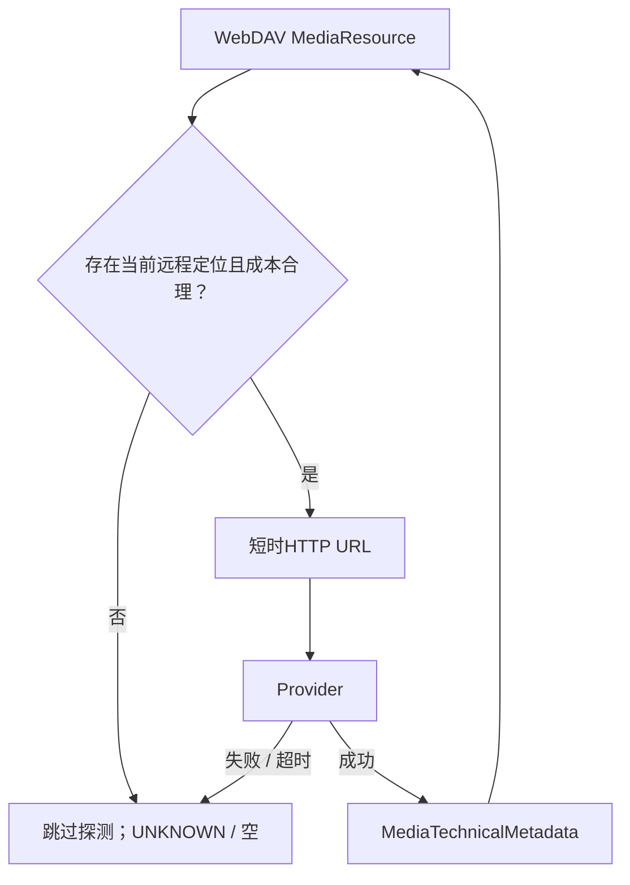

FfprobeMediaProbeProvider尝试规范化以下P0文件事实：

- 实际媒体duration。
- 容器格式。
- 视频编码、width和height。
- 可可靠取得时的bit depth。
- 可可靠判定时的HDR10、HLG、Dolby Vision等HDR类型，否则UNKNOWN。
- 主要音轨编码、声道数和语言。

主要音轨选择、ffprobe兼容版本、bit depth/HDR判定规则、进程超时和WebDAV探测成本预算由媒体探测详细设计确定。P0不把ffprobe完整原始JSON直接映射为核心业务模型，也不结构化复制全部流、全部Tag或全部高级参数。

### 16.12 三类数据链路与责任矩阵

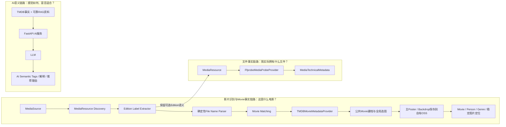

| 数据类别 | 权威来源 | Spring Boot职责 | FastAPI职责 | 不变量 |
| --- | --- | --- | --- | --- |
| Movie / Person / Genre影片事实与展示图片 | TMDB官方API + 自有OSS | 通过TMDBMovieMetadataProvider获取事实与图片来源，经统一建档用例选图、下载、上传OSS并保存稳定定位 | 只读消费、检索和解释 | LLM与ffprobe不得覆盖；每个Movie一套公共主图；Vue日常不直连TMDB图片CDN |
| MediaResource文件事实与Edition语义 | P0 WebDAV + 确定性命名解析 + best-effort ffprobe | 通过WebDavMediaSourceAdapter发现，通过Edition Label Extractor保留可选Cut语义，通过FfprobeMediaProbeProvider尽力探测技术事实 | 只读消费资源摘要，不接触原始文件或播放凭据 | 探测失败不阻塞入库/TMDB刮削；TMDB不得替代具体文件Edition/技术事实；ffprobe与LLM不得猜测Edition |
| AI生成语义信息 | LLM基于可靠上下文 | 提供规范化事实、保存明确标识的AI结果 | 生成情绪、节奏、场景、语义标签和解释 | 不得冒充或覆盖前两类事实 |

### 16.13 时长、评分、标签与定位的不变量

- `Movie.runtime`是TMDB标准影片时长；`MediaResource.duration`是ffprobe对具体文件的实测时长，两者允许不同且互不覆盖。
- TMDB `vote_average`/`vote_count`是外部评分事实；P0没有用户评分能力。
- Genre是TMDB客观分类；AI Semantic Tag是LLM衍生信息。
- Movie主Poster与主Backdrop是用途独立、全体关联用户共享的图片定位信息：Poster服务于海报墙、搜索结果、推荐卡片和列表，Backdrop服务于详情页宽幅Hero背景；图片二进制存OSS，MySQL只保存来源追踪与稳定定位。
- MediaResource Edition是从文件名/目录名先行提取的可选资源版本语义，不属于Movie，不属于ffprobe技术事实；不同Edition仍关联同一逻辑Movie。
- ResourceLocator是稳定管理定位；PlaybackLocator/PlaybackDescriptor是播放时解析结果，WebDAV临时播放定位不永久保存。

---

## 17. 播放架构

### 17.1 控制面与数据面

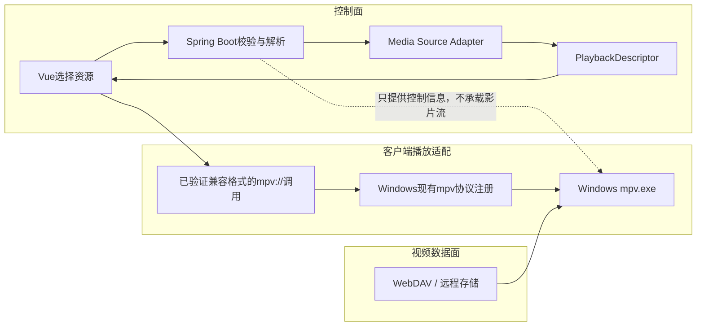

### 17.2 播放职责

- Vue负责用户选择和发起外部协议调用。
- Spring Boot负责鉴权、资源归属校验、状态检查、播放定位解析和“已请求播放”记录。
- Media Source Adapter负责把稳定管理定位解析为当前播放定位。
- 浏览器负责向Windows提交自定义协议请求，但不能可靠确认最终启动结果。
- Windows使用用户环境中已经存在并验证可用的mpv URL协议注册关联启动mpv.exe；项目P0不增加本地协议解析器、解码器或launcher。
- mpv负责直接读取媒体数据并完成播放。

### 17.3 为什么Spring Boot不代理4K视频

1. 代理会使几十GB媒体数据经过业务服务，显著增加带宽、内存、连接和Range请求处理压力。
2. 业务服务将被迫承担视频数据面的稳定性和性能责任，违背项目边界。
3. 已验证mpv能够直读代表性远程HTTP媒体定位，不需要业务服务中间代理；不同WebDAV Provider的具体兼容性仍由Technical Spike确认。
4. 直连保留mpv处理高码率、跳转、缓存、HDR和音频的成熟能力。
5. 代理或转码不会增加P0产品价值，反而扩大项目风险。

---

## 18. `mpv://`调用流程

### 18.1 协议位置

`mpv://`位于表现层与Windows客户端播放环境之间，是“客户端外部播放器适配协议”，不是服务间协议，也不是媒体来源协议。

### 18.2 P0协议复用决策

P0不自行定义新的`mpv://`协议载荷格式，也不假定mpv.exe原生支持项目自定义的`play?v=1&target=...`格式。已有AList网页播放验证仅作为WebDAV Provider场景的可行性证据，正式方案需通过WebDAV Playback Technical Spike锁定兼容调用方式：

> Vue取得经Spring Boot校验的PlaybackDescriptor → 按Technical Spike验证的固定规则构造`mpv://`调用 → 浏览器交给Windows现有mpv协议注册 → 启动mpv.exe → mpv读取媒体资源

该决策意味着：

- P0不开发Windows客户端。
- P0不开发launcher.exe、桌面播放桥接程序或本地协议解析器。
- P0不要求Windows端进行项目自定义的Base64URL解码。
- Windows端只需要浏览器、mpv和正确注册且已验证可用的mpv URL协议关联。
- 项目不在当前架构文档中凭空定义实际href格式。

### 18.3 播放模块Technical Spike

虽然代表性远程播放链路已经验证成功，但不同WebDAV服务的认证、重定向和可播放定位行为并不必然一致。因此，在正式开发播放模块前必须完成一次小型Technical Spike，并形成可复现的验证记录。

Technical Spike必须完成：

1. 选取答辩环境实际使用的WebDAV Provider（可为AList）取得真实可播放定位和完整href。
2. 记录媒体HTTP(S)地址在`mpv://`中的实际嵌入方式，以及是否进行整体编码或分段编码。
3. 验证查询参数中的`&`、`?`、`=`、`#`等字符能否完整传递。
4. 验证中文名称、空格及常见特殊字符。
5. 验证目标浏览器的首次确认、用户取消、协议未注册和URL长度边界。
6. 将真实成功格式、适用浏览器、限制条件和复制地址降级规则写入后续播放模块详细设计。

在Technical Spike完成前，本架构只承诺“复用已验证的mpv兼容URL协议调用方式”，不承诺某个尚未取证的具体href模板。

### 18.4 安全约束

- 播放目标必须来自Spring Boot完成用户、资源归属、资源状态和目标类型校验后的PlaybackDescriptor。
- Vue只能通过统一`MpvUrlProtocolBuilder`使用Technical Spike锁定的固定规则构造调用，不得把搜索框、标签或其他用户输入直接拼接进`mpv://`。
- 只允许Technical Spike确认兼容的WebDAV媒体定位类型；P0候选范围限定为`http`和`https`。
- P0协议调用只表达媒体播放目标，不附加任意mpv命令行参数。
- 明确禁止把`--script`、`--config`、`--input-ipc-server`等用户输入或任意播放器选项放入协议调用。
- WebDAV完整敏感URL和临时播放凭据不得进入日志、AI上下文或长期数据库。
- 若目标超出已验证的编码、字符或长度边界，系统不尝试构造未经验证的变体，直接提供复制播放地址降级。
- Windows现有协议注册不是项目的安全校验器；项目安全责任由Spring Boot受控播放描述和Vue固定构造入口承担。

### 18.5 播放时序

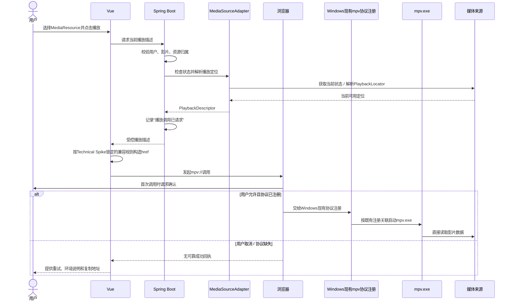

### 18.6 本地环境检测与降级

主流浏览器通常不能可靠告知网页“自定义协议未注册”或“用户取消”。因此P0不声称自动检测成功，而采用以下交互：

1. 首次播放前展示mpv和协议注册要求。
2. 发起协议后显示“已请求打开mpv”，不显示“播放成功”。
3. 提供“没有打开？”帮助入口。
4. 始终提供复制播放定位能力，并提示远程定位可能临时有效或需要认证。

如果Technical Spike最终证明某个Provider产生的复杂签名URL无法通过现有mpv协议稳定传递，P0仍以复制播放地址作为降级方案；签名URL只是部分Provider的实现情况，不是WebDAV统一行为。“自研轻量mpv Launcher”只能作为P1备选技术方案，并且需要先经过正式需求变更，不能作为P0的隐含依赖。

---

## 19. WebDAV资源定位与播放定位架构

### 19.1 两类定位

- **ResourceLocator（资源管理定位）**：稳定标识媒体来源中的资源，服务于扫描、去重、状态检查和重新解析。
- **PlaybackLocator（客户端播放定位）**：由当前用户的WebDAV来源在播放时解析、供Windows本机mpv当前使用的HTTP(S)地址。

两者不得混用，也不得假设字符串相同。

### 19.2 P0解析流程

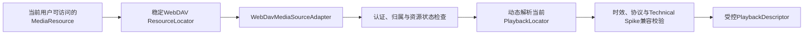

解析失败、定位已过期、认证失败或不符合已验证的`mpv://`兼容边界时，不生成一键播放调用，改为明确错误或复制播放定位降级。稳定ResourceLocator和临时PlaybackLocator不得混用。

### 19.3 未来本地定位扩展（非P0）

未来FileSystem或Local Agent接入后，才需要设计本地路径、UNC、服务端扫描根到Windows播放根映射，以及Agent与本机播放器联动。P0不实现、不配置、不测试这些定位类型，也不通过Spring Boot代理本地影片数据。

---

## 20. AI总体架构

### 20.1 四个核心AI方向

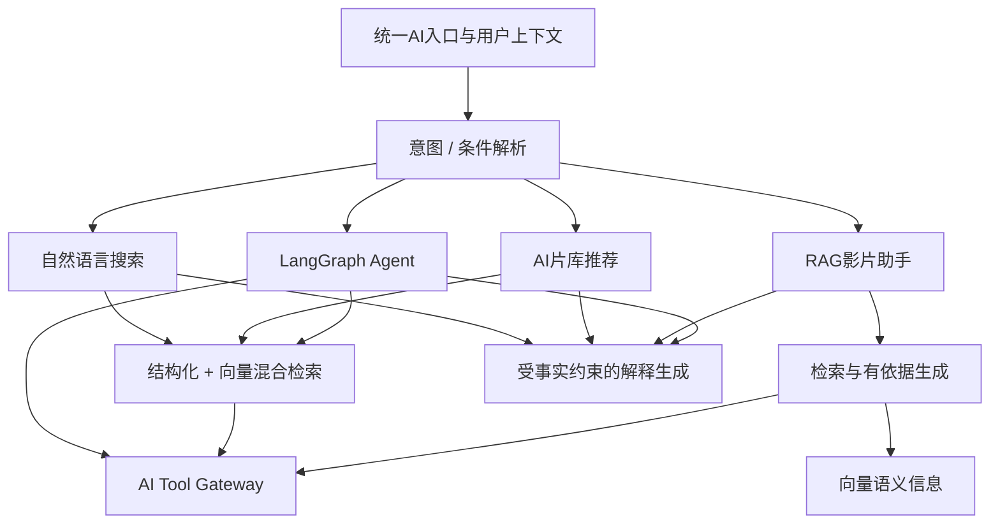

### 20.2 能力边界

- **自然语言搜索**：把一句查询转换成硬条件和语义条件，返回片库内候选。
- **AI推荐**：在候选基础上结合观看历史摘要、偏好、可用版本和即时情境排序解释。
- **RAG影片助手**：绑定当前Movie，检索语义资料，在生成前补充Spring Boot当前业务事实，并管理剧透模式。
- **LangGraph Agent**：执行需要多个工具步骤、状态检查和中间决策的复合任务。

四个核心方向共享模型Provider、向量检索、AI Tool Gateway、结构化输出校验和依据表达，但不共享业务数据库；P0不继续横向增加AI功能数量。

### 20.3 AI会话状态

P0采用FastAPI单实例内的短时会话状态，保存当前对话引用、上一轮条件、剧透许可和Agent执行状态；设置闲置过期时间，用户开始新会话或清除会话时立即移除。长期AI聊天历史不属于P0。

用户偏好和观看历史属于业务事实，仍保存在Spring Boot。剧透许可仅限当前影片助手会话，不跨影片、不写入长期偏好。

该决策使P0无需Redis。若未来要求多FastAPI实例、服务重启后恢复会话或长时Agent检查点，再引入共享状态存储。

### 20.4 P0 AI效果评价边界

P0必须为论文实验和系统验收评价AI搜索、推荐、RAG和Agent四类能力，但不建设面向用户的评测后台。评价使用真实FastAPI、模型和向量检索链路，Mock仅用于契约与联调。测试集、评分方法和通过阈值由AI详细设计确定，不在架构阶段虚构百分比；P1再考虑自动回归、指标可视化、测试集管理和模型对比平台。

---

## 21. 自然语言搜索架构

### 21.1 查询解析结果

LLM必须输出受约束的结构化意图，概念上包含：

- 查询目标和结果数量。
- 硬条件：观看状态、TMDB Genre、年份范围、默认使用Movie.runtime的时长上限、来源等；用户明确指定文件版本时可解析MediaResource.duration和技术参数条件。
- 语义条件：情绪、节奏、氛围、观看场景等。
- 软排序偏好：优先本地、优先未看等。
- 需要澄清的歧义和解析置信度。

具体JSON Schema在AI模块详细设计中确定。

### 21.2 处理流程

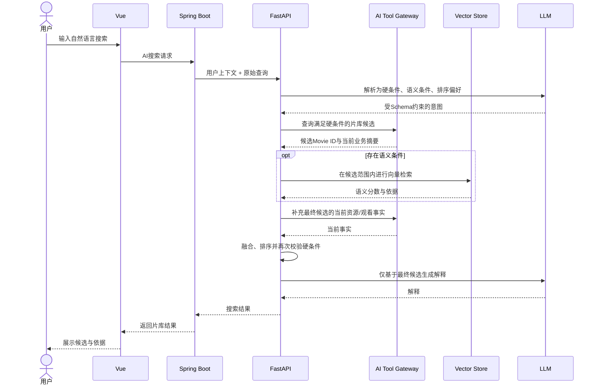

### 21.3 硬条件保护

- LLM只解析条件，不直接从模型记忆选择电影。
- Spring Boot根据白名单字段执行硬条件查询。
- FastAPI不得把硬条件查询之外的向量候选重新加入结果。
- 最终解释前再次用当前事实校验时长、观看状态、片库归属和资源可用性。
- 无结果时返回实际无结果，不让LLM为了凑数放宽条件。

---

## 22. 混合检索架构

### 22.1 职责划分

| 检索类型 | 负责内容 | 权威性 |
| --- | --- | --- |
| MySQL结构化查询 | 用户归属、片库存在性、TMDB Genre、上映年份、Movie.runtime、观看状态、收藏、来源，以及用户明确指定时的MediaResource.duration/技术参数 | 硬条件权威来源 |
| 向量检索 | 情绪、节奏、氛围、风格、观看场景和自然语言相似性 | 语义相关度辅助 |
| 确定性排序 | 可访问性、来源优先级、硬条件复核、去重 | 业务规则权威 |
| LLM解释 | 解释候选为何匹配用户需求 | 生成层，不改变候选集合 |

### 22.2 融合策略

P0采用“结构化先过滤、向量后排序、业务事实再校验”的串行融合策略，而不是让两套检索各自返回影片后无约束混合。

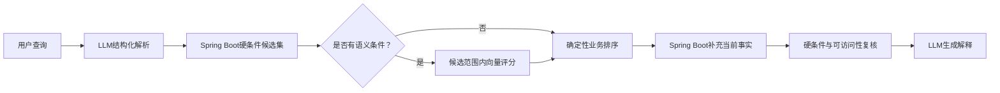

### 22.3 排序原则

1. 硬条件不参与加权，必须先满足。
2. 无可访问资源的Movie默认不进入“当前可看”推荐。
3. 语义分数用于候选内部排序，不覆盖硬条件。
4. P0不设置“优先本地/NAS”规则；版本排序只使用当前用户可访问性、用户明确条件和可靠WebDAV资源事实。
5. LLM只接收最终候选及其依据，不得重新替换候选。
6. “两个小时以内”等未限定版本的时长条件默认查询Movie.runtime；只有用户明确询问文件版本实际时长时才查询MediaResource.duration。

具体权重、候选数量和最低语义阈值在AI详细设计和测试集评估后确定。

---

## 23. RAG架构

### 23.1 可索引内容

P0按照01需求建立以下语义文档：

- TMDB影片身份、基本资料和简介。
- TMDB Genre、Director和前20名主要演员资料。
- 已存在且来源可靠的系列关联信息；不要求TMDB Collection完整业务。
- AI语义标签。
- 用户片库中该影片的存在关系。
- 经过最小化处理的观看历史摘要。

MediaResource技术摘要可作为检索辅助上下文，但资源实时可访问性、临时播放URL、当前观看状态和可能变化的文件事实不作为可信向量终态使用，回答前必须从Spring Boot补充。

### 23.2 索引数据流

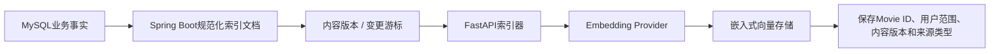

### 23.3 索引同步决策

采用“增量拉取 + 变更后触发”的简单最终一致方案：

1. Spring Boot生成规范化、无敏感凭据的索引文档和单调内容版本。
2. 业务变更提交后，Spring Boot可触发FastAPI进行一次增量同步。
3. FastAPI也按固定间隔从AI Tool Gateway拉取上次游标之后的变化，以弥补触发失败。
4. FastAPI按稳定文档标识幂等更新或删除向量文档。
5. 同步失败不回滚业务事务，下次增量同步重试。

不为索引同步引入消息队列。具体同步间隔、批量大小和重试次数在AI详细设计中确定。

### 23.4 查询数据流

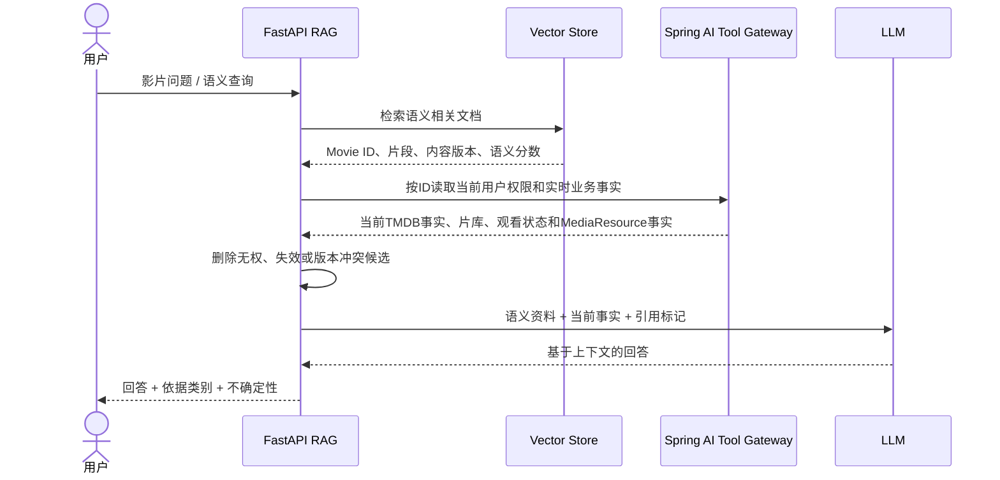

### 23.5 避免过期业务状态

- 向量检索只负责“语义上相关的是谁”，不负责“现在是否拥有、是否看过、是否可播放”。
- 每次生成最终结果前必须通过AI Tool Gateway按Movie ID补充当前事实。
- Tool Gateway拒绝无权或已删除对象，FastAPI必须移除对应向量候选。
- 内容版本不一致时，以Spring Boot事实覆盖向量文档中的旧展示信息，并触发异步重建。
- 即使向量删除暂时失败，实时权限与事实补充仍阻止旧数据进入最终回答。
- FastAPI必须保留事实来源标记：TMDB影片事实、MediaResource文件事实与AI生成内容不能在Prompt或回答依据中混为同一类别。

### 23.6 依据展示

P0采用“依据类别 + 对象名称”的轻量引用形式，例如：

- 影片元数据：《星际穿越》
- 你的片库：存在当前用户可访问的WebDAV 4K版本
- 观看历史摘要：近期偏好科幻题材
- AI语义标签：宏大、情绪浓度中等

不要求学术脚注式全文引用，也不暴露内部向量分数、文件路径或敏感URL。

---

## 24. LangGraph Agent架构

### 24.1 P0工作流

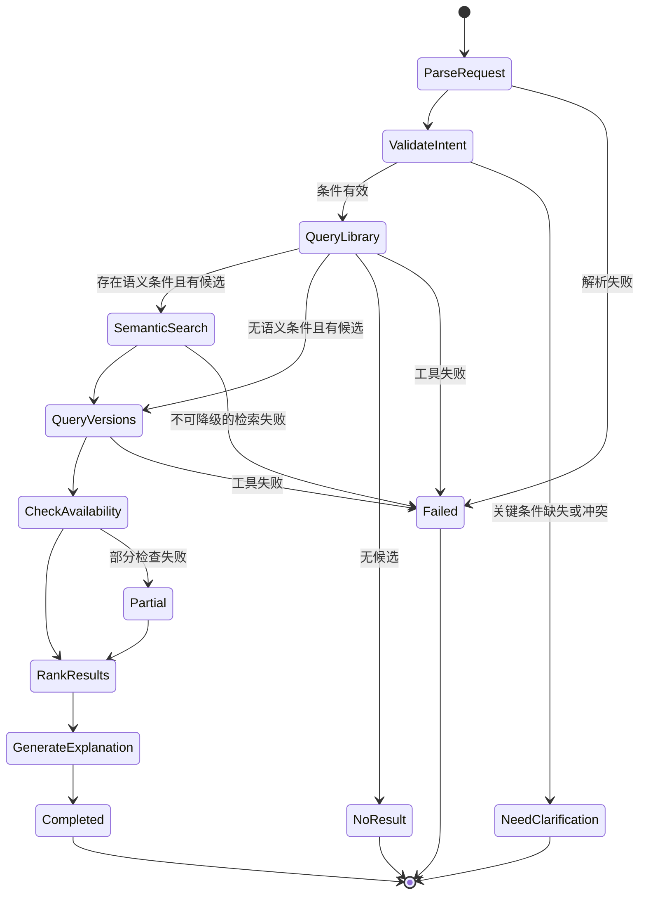

### 24.2 Agent状态

AgentState在P0概念上包含：

- 请求标识和可信用户上下文引用。
- 原始用户目标。
- 已解析硬条件、语义条件和排序偏好。
- 候选Movie ID集合。
- 语义分数和证据。
- 媒体资源版本摘要。
- 资源状态检查结果及检查时间。
- 当前步骤、已执行步骤数、错误和降级标记。
- 最终候选与解释依据。

Agent状态只保存执行需要的最小信息，不保存WebDAV凭据、完整敏感URL或临时播放定位。

### 24.3 工具调用路径

```mermaid
sequenceDiagram
    participant G as LangGraph
    participant T as FastAPI Tool Adapter
    participant S as Spring AI Tool Gateway
    participant D as Spring业务域
    participant A as MediaSourceAdapter

    G->>T: 调用只读工具 + 结构化参数
    T->>T: Schema校验、数量限制、超时设置
    T->>S: 服务身份 + 限权上下文令牌
    S->>S: 验证用户、scope和参数白名单
    S->>D: 执行业务查询
    opt 资源状态工具
        D->>A: 检查受控MediaResource集合
        A-->>D: 当前观察结果
    end
    D-->>S: 最小必要业务结果
    S-->>T: 结构化工具结果
    T-->>G: 成功 / 部分成功 / 明确错误
```

### 24.4 执行限制决策

P0采用以下明确限制：

- 单次Agent任务最多12个图节点转换。
- 同一工具最多重试1次，且只对超时或暂时性外部错误重试。
- 总执行目标时限30秒；达到30秒仍未完成时向前端报告超时并终止后续工具调用。
- 单个业务工具默认超时5秒；模型调用可使用独立但受总时限约束的超时。
- 禁止无条件回边，所有循环都必须消耗重试计数。
- P0工具全部只读，不提供删除、修改用户或批量写入工具。

具体超时可在性能实测后微调，但“有界步骤、有界重试、有界总时长”不变。

### 24.5 工具失败策略

| 失败 | 处理 |
| --- | --- |
| 意图解析失败 | 返回无法理解或请求澄清，不执行宽泛查询 |
| 片库查询失败 | 终止任务，不能凭模型记忆推荐 |
| 向量检索失败 | 若硬条件候选可用，降级为结构化结果并明确缺少语义评分 |
| 版本查询失败 | 终止“当前可播放推荐”，不伪造版本 |
| 部分资源状态失败 | 排除未确认资源或标记未检查，只推荐已确认可用项 |
| LLM解释失败 | 可返回结构化候选和事实，不丢弃已完成的真实查询结果 |

### 24.6 执行阶段展示

FastAPI通过SSE发送有限的业务阶段事件：理解需求、查询片库、语义匹配、查询版本、检查状态、排序、生成解释、完成或失败。前端不展示模型内部思维过程，只展示用户可理解的任务进度和工具结果摘要。

---

## 25. Agent Tool设计原则

1. **业务能力而非数据库能力**：工具表达“查询片库候选”“检查资源状态”，不表达“执行SQL”。
2. **只读白名单**：P0只注册需求明确的查询和检查工具。
3. **可信用户上下文外置**：用户标识来自Spring签发令牌，不来自LLM参数。
4. **严格结构化输入**：每个工具使用有限字段、枚举、范围和数量上限。
5. **最小结果**：只返回当前任务所需数据，不返回凭据、完整路径或临时PlaybackLocator。
6. **服务端复核**：Spring Boot重新校验权限和硬条件，不信任FastAPI已校验。
7. **幂等查询**：相同只读请求可安全重试。
8. **错误可分类**：明确区分无结果、无权、无效参数、来源不可达和系统错误。
9. **可观察**：记录工具名、请求标识、耗时、结果数量和错误类别，敏感数据脱敏。
10. **结果带时效**：资源状态结果包含检查时间，避免被长期当作实时事实。

P0 Agent不获得解析实际PlaybackLocator的工具，因为选片状态检查不需要向LLM暴露敏感播放定位；真正播放仍由用户点击后走Spring Boot播放控制面。

---

## 26. MySQL职责

MySQL是核心结构化业务事实和P0持久任务状态的唯一持久来源，负责保存概念上的：

- 用户、`USER/ADMIN`角色、账号状态、注册与最近成功登录等账号事实。
- Movie及TMDB影片事实，包括Provider、外部影片ID、同步时间、Genre和可检索演职关系；P0对TMDB Movie ID建立数据库唯一约束，保证公共Movie最终只有一条。
- 主Poster/Backdrop的TMDB来源路径、OSS Object Key或其他稳定定位；同一Movie只保留一套公共主Poster/Backdrop。
- MediaSource配置和非明文敏感配置引用。
- MediaResource的来源文件事实、稳定定位、ffprobe技术事实和最近观察状态。
- MediaResource从文件名/目录名确定性解析出的可选Edition/Cut语义；该语义与ffprobe技术事实分离。
- 与TMDB事实分离且明确标识来源的AI语义标签或AI生成信息。
- 收藏、标签、观看状态和播放启动记录。
- 扫描、刮削与索引同步任务的持久状态及管理员监控所需最小运行摘要。
- 人工匹配确认与保护语义。
- 关键普通用户与管理员OperationRecord及其actor/target语义和查询范围。
- 管理员概览与AI调用统计所需的最小可持久运行事实；不保存完整AI Prompt、对话或RAG上下文。

MySQL不负责：

- 影片视频文件。
- LLM推理和Prompt。
- 向量相似度检索。
- WebDAV临时播放定位的永久保存。
- Poster或Backdrop的JPG/PNG二进制本体。
- ffprobe完整原始JSON作为核心事实模型。

FastAPI不得直接连接核心MySQL。数据库结构、事务边界和索引设计留给03数据库设计文档。

### 26.1 轻量OperationRecord架构

`OperationRecord`是Spring Boot/MySQL中的轻量业务与审计记录，服务于关键业务行为追溯。概念上可表达`actorUserId`、`actorRole`、`operationType`、`targetType`、`targetId`、`result`、`request_id`、适用时的`task_id`与`duration`、`timestamp`和脱敏`summary`；最终字段由03数据库设计决定。

普通用户行为覆盖：认证成功并确定真实User后的登录成功，MediaSource新增/修改/删除/启停/连接测试，扫描开始/完成/失败，TMDB人工确认/修正，AI请求/失败/降级，播放请求和PlaybackLocator获取成功/失败。普通登录失败尚未建立可信CurrentUser，只进入脱敏安全/技术日志，不得依据输入username伪造User ID或创建用户OperationRecord。不得把浏览器发出`mpv://`误记为播放完成。

管理员行为覆盖：管理员登录成功、禁用用户、启用用户及其他真正影响系统状态的操作，并明确标识actor为`ADMIN`。查看关键管理页面仅在确有审计必要时记录，不为每个普通GET制造OperationRecord。

普通用户只通过本人查询用例访问自己的OperationRecord；`ADMIN`只通过独立、受Spring Security保护的Admin审计用例查询系统范围内的脱敏OperationRecord。部署维护者不因环境职责自动取得应用审计查询权。OperationRecord不是通用技术日志数据库、企业审计中心、事件溯源系统或ELK类平台，管理员统计与页面编排归`admin`模块。

主业务提交后以简单的事务后回调或有界进程内任务写入操作记录；记录失败只写技术错误并允许有限补偿，不得回滚已经成功的收藏、来源修改、扫描、AI请求或播放请求。具体表结构和失败补偿方式留给数据库与API详细设计。

### 26.2 三层日志与可观察信息

日志体系分为三层，不能相互替代：

1. **A层：业务/审计记录**。即OperationRecord，持久化关键普通用户与管理员行为，支持本人查询和受控管理员脱敏审计。
2. **B层：技术运行日志**。Spring Boot与FastAPI分别输出结构化日志，用于排障、异常定位、跨服务追踪、外部依赖故障、性能和降级分析；原始日志文件或标准输出由部署维护者使用。
3. **C层：任务与AI可观察信息**。扫描/索引任务和AI调用保留可聚合的最小状态、阶段、耗时、错误类别、依赖、降级与关联ID，供管理端展示运行摘要。

Spring Boot和FastAPI技术日志至少应在适用时包含`timestamp`、`level`、`service`、`module`、`request_id`、`task_id`、已建立可信身份且确有必要时的`user_id`、operation/use case、`duration`、`result`、`error_category`、`degraded`、`dependency`和`retryable`。`request_id`由Vue入口经Spring Boot传递到FastAPI；扫描、索引等任务使用稳定`task_id`。系统异常可在内部日志保存必要stack trace，但绝不直接返回前端。

认证失败日志只记录`request_id`、时间、认证结果、失败类别、脱敏用户名标识及安全设计允许时的IP/User-Agent摘要，绝不记录密码，也不伪造CurrentUser。任务与AI摘要优先记录标识、状态、阶段、耗时、结果数量、错误类别和脱敏摘要；Provider可靠返回时可预留Token Usage，但费用统计不属于P0。

任何一层、管理页面、错误响应、Actuator或健康接口都不得输出明文密码、作为后台页面数据的password hash、完整JWT/Refresh Token、WebDAV密码/Token、TMDB Token、LLM/Embedding API Key、FastAPI内部密钥、完整敏感URL、临时PlaybackLocator、带签名的完整播放URL、完整AI Prompt、完整私人对话、完整RAG敏感上下文或未脱敏厂商请求/响应。

### 26.3 P0日志中心边界

P0管理端日志中心只组合可持久化OperationRecord、管理员审计记录、扫描/索引任务摘要、AI调用运行摘要和必要的近期异常摘要。Admin Application Service通过各模块公开Query API获得这些内容，不直接读取日志文件，也不把全部INFO日志写入MySQL。

原始Spring Boot/FastAPI技术日志继续保存在结构化服务端日志文件或标准输出中，由部署维护者排障。P0不引入Elasticsearch、Logstash、Kibana、Loki、Splunk、Kafka、RabbitMQ或独立日志数据库；未来集中技术日志检索、复杂告警和大盘属于P1/P2，不能成为P0前提。

### 26.4 系统健康与只读配置摘要

Spring Boot聚合自身、MySQL、FastAPI、Chat Model Provider、Embedding Provider、嵌入式向量存储、TMDBMovieMetadataProvider和ffprobe的轻量健康/降级状态。可以采用Spring Boot Actuator思想及FastAPI/Provider轻量health能力，但只定义职责与脱敏边界，不在本架构锁定具体URL，也不将健康页扩展为APM、分布式追踪、Prometheus/Grafana或Kubernetes项目。

管理员只能看到状态、检查时间、非敏感Provider/模型标识、错误类别和必要脱敏摘要。WebDAV属于用户私人来源，健康页最多显示来源失败聚合，不得让管理员读取凭据/完整URL，或以全局管理员身份逐个访问用户来源。

配置摘要只读且脱敏，可表示TMDB、FastAPI、Chat/Embedding Provider和ffprobe是否配置/可用以及运行环境非敏感信息。API Key、WebDAV/数据库密码、内部服务密钥和JWT签名密钥既不可查看也不可在线编辑；P0继续以配置文件、环境变量和部署密钥注入为主，不建设动态配置中心。

---

## 27. Redis是否采用及理由

### 27.1 明确结论

**Redis不进入P0。**

第一阶段不引入Redis、Redisson、Redis分布式锁、Redis Cluster、Sentinel、Redis Streams、复杂Lua、布隆过滤器、多级缓存或复杂缓存一致性系统。扫描继续使用Spring Boot进程内有界任务执行器与MySQL持久任务状态；公共Movie并发首次建档继续依赖应用层查询、MySQL唯一约束和冲突后重新查询保证正确性。

理由如下：

1. 第一版是单Spring Boot实例、单FastAPI实例和低并发个人系统。
2. 核心任务状态可由MySQL持久化，短时AI会话可由FastAPI进程内TTL状态管理。
3. REST与SSE不需要Redis才能工作。
4. 引入Redis会增加部署、配置、故障排查和数据一致性成本，但不直接补全P0业务闭环。

### 27.2 P0替代方案

- 短时非关键缓存：使用进程内有界TTL缓存。
- 扫描与索引任务状态：持久化到MySQL。
- AI会话/Agent临时状态：FastAPI单实例内TTL状态。
- 限流：在Spring Boot和FastAPI进程内执行简单限制。

### 27.3 未来引入条件

只有出现以下需求时再引入Redis：

- 公共电影元数据、高频业务查询或部分AI搜索/推荐结果存在明确的短期缓存收益。
- 需要验证码、TTL临时状态、临时Token/黑名单或短期任务进度缓存。
- 多个Spring Boot或FastAPI实例需要共享状态、会话或限流信息。
- 高并发首次公共Movie建档造成明显重复TMDB请求、图片下载和OSS上传，需要可选分布式锁优化。

未来若使用例如`lock:scrape:tmdb:{tmdbId}`的Redis/Redisson锁，它只能减少重复外部调用与上传，不能提供公共Movie最终唯一性。MySQL `UNIQUE(tmdb_id)`及唯一冲突后的重新查询始终是最终一致性保证。未来也不因引入Redis而默认采用Cluster、Sentinel、Streams、复杂Lua、布隆过滤器或多级缓存；各能力必须由真实需求单独证明。

---

## 28. 向量存储职责

### 28.1 P0部署决策

P0不单独部署向量数据库服务，采用FastAPI侧的**嵌入式Chroma持久模式**，将索引目录挂载为独立持久卷，并通过内部`VectorStorePort`封装。

选择理由：

- 目标规模为不超过10,000部电影和30,000个资源版本，P0语义文档规模适中。
- 与Python、LangChain和Embedding工作流集成简单。
- 减少一个网络服务和一套鉴权、备份、监控配置。
- 通过端口抽象可在未来切换为独立向量数据库而不改写RAG业务流程。

### 28.2 职责边界

向量存储保存：

- 语义文本的向量表示。
- 稳定文档标识。
- Movie标识、用户范围、内容版本和资料类型等过滤元信息。
- 检索所需的短文本片段。

向量存储不保存或决定：

- 当前收藏、观看状态和播放次数。
- 资源当前是否可访问。
- WebDAV凭据、完整敏感URL或临时播放定位。
- 用户鉴权事实。

### 28.3 可用性边界

嵌入式模式意味着P0 FastAPI保持单实例写入同一索引目录。若未来需要多实例、并行写入、远程备份或更强过滤能力，再迁移到独立向量服务。

---

## 29. TMDB影片元数据集成边界

### 29.1 Provider决策

Spring Boot保留`MovieMetadataProvider`端口以避免Movie领域永久绑定供应商，P0唯一实际实现固定为`TMDBMovieMetadataProvider`，通过TMDB官方API获取电影事实。

P0不同时接入IMDb、豆瓣、OMDb、TVDB或其他影视数据库，不抓取TMDB或其他网站HTML，也不使用LLM替代TMDB。未来更换数据源时新增Provider Adapter，不改写Movie与MediaResource核心关系。

```mermaid
flowchart LR
    Raw["原始文件名 / 目录名"] --> Edition["Edition Label Extractor"]
    Edition --> Parser["清噪并提取片名 / 年份"]
    Parser --> Port["MovieMetadataProvider"]
    Port --> P0["TMDBMovieMetadataProvider"]
    P0 --> API["TMDB官方API"]
    API --> Candidate["电影候选"]
    Candidate --> Match["确定性置信度 / 人工确认"]
    Match --> Details["P0完整影片事实"]
    Future["未来其他Provider"] -. "非P0" .-> Port
```

### 29.2 Provider职责

TMDBMovieMetadataProvider负责：

- 根据确定性解析出的片名和年份搜索TMDB电影候选。
- 返回候选的TMDB Movie ID、标题、原始标题、上映日期等匹配所需事实。
- 在TMDB Movie ID确认后获取01定义的完整P0影片事实。
- 优先请求中文本地化资料，并在中文缺失时按已配置的TMDB fallback规则降级。
- 返回选择主Poster和一个主Backdrop所需的规范化来源信息，以及所有主要Director和cast order前20名演员；统一建档用例按系统级规则确定最终图片。
- 返回原始`poster_path`、`backdrop_path`及选择图片所需的来源信息；Provider本身不把TMDB CDN URL当作Movie的长期日常图片定位。
- 返回可用时的vote_average与vote_count，并保留TMDB来源属性。
- 返回Provider标识、外部影片ID、资料语言、最近成功同步时间和缺失项。
- 将TMDB认证、限流、超时、无结果和服务错误转换为统一错误类别。

Provider不负责：

- 扫描媒体来源、访问WebDAV或执行ffprobe。
- 使用LLM决定最终候选。
- 绕过置信度或人工确认建立Movie关联。
- 生成AI语义标签、推荐理由或个性化简介。
- 保存用户片库、观看记录或用户评分。
- 创建公共Movie、处理数据库唯一冲突、把图片上传OSS或决定用户是否拥有影片；这些由Spring Boot统一公共Movie建档用例编排。

### 29.3 P0数据范围约束

P0只获取01确定的影片身份、基本资料、Genre、导演、前20名主要演员、主要Poster、一个主Backdrop、TMDB评分和同步来源信息。不获取除该主Backdrop外的完整Backdrop图库，也不获取Logo图库、制作公司、完整Crew/Cast、预算票房、网站社交信息、获奖记录、完整关键词、Trailer、Certification、完整Alternative Titles、Release Events、Collection完整体系、推荐或相似电影。

### 29.4 待详细设计参数

TMDB供应商选择已经完成，不再列为待定。后续TMDB Provider详细设计只需锁定API凭据管理、language、region、fallback、系统级选图优先级、图片来源定位标准化、请求配额、重试、缓存边界和字段缺失策略；OSS Object Key与持久化由公共Movie建档边界处理。

---

## 30. 模型Provider抽象

### 30.1 Provider端口

FastAPI定义两个独立抽象：

- **ChatModelProvider**：普通生成、流式生成、结构化输出和健康检查。
- **EmbeddingProvider**：单文本/批量Embedding、向量维度信息和健康检查。

LangChain和LangGraph只依赖上述端口，不在业务流程中直接实例化具体厂商SDK。

```mermaid
flowchart LR
    AI["RAG / Search / Agent"] --> ChatPort["ChatModelProvider"]
    AI --> EmbedPort["EmbeddingProvider"]
    ChatPort --> P0Chat["P0：OpenAI兼容Chat适配器"]
    EmbedPort --> P0Embed["P0：OpenAI兼容Embedding适配器"]
    ChatPort -. "未来" .-> OllamaChat["Ollama / 其他适配器"]
    EmbedPort -. "未来" .-> LocalEmbed["本地Embedding适配器"]
```

### 30.2 P0接入决策

P0实际实现一个可配置基础地址、模型标识和密钥的OpenAI兼容接口适配器，不绑定具体模型名称或厂商。Embedding同样先实现一个兼容适配器，但Chat和Embedding配置彼此独立，允许使用不同服务。

### 30.3 模型能力校验

- 用于意图解析的模型必须稳定支持受约束结构化输出。
- 用于流式助手的Provider必须支持增量文本事件。
- Embedding模型一旦切换维度或语义空间，必须重建对应向量索引。
- Provider切换不得改变Spring Boot业务事实或核心领域模型。
- 密钥只存在于AI服务配置，不进入Vue、日志或RAG上下文。

---

## 31. 安全边界

### 31.1 入口安全

- 服务器端唯一对浏览器公开的业务入口是Spring Boot；FastAPI、MySQL和向量存储不直接暴露给用户网络。
- Spring Boot使用Spring Security验证JWT并管理可信CurrentUser与SecurityContext。
- Spring Boot提供自主注册入口；新User只能获得`USER`且不关联任何MediaSource或MediaResource，首次登录片库为空。`ADMIN`不通过普通注册或P0后台授权获得，其初始化留给后续安全/部署详细设计。用户名/密码认证成功后由Spring Boot签发JWT；Vue后续使用`Authorization: Bearer <JWT>`访问，P0不以Cookie/Session作为正式登录态。
- 所有来源、影片、资源和AI入口均在Spring Boot执行用户范围校验。
- Controller不接受前端`userId`作为可信身份；Application Service负责MediaSource、MediaResource及其他用户对象的归属和IDOR防护。
- 管理员入口在Spring Security层验证`ADMIN`，并由Admin Application Service限定明确跨用户use case；`USER`访问时返回403或等价拒绝。Vue管理路由可见性不构成安全边界。
- 受保护请求在JWT验证后还应确认账号仍允许访问，被禁用账号不得依靠尚未过期的JWT继续请求；具体Token失效策略留给安全/API设计，P0不引入Redis黑名单。

### 31.2 内部服务安全

- Spring Boot与FastAPI部署在受控内部网络。
- 双方使用服务身份认证，AI请求另外携带短时限权上下文令牌。
- Tool Gateway只开放白名单只读能力，拒绝未知工具和超范围参数。
- FastAPI不获得MySQL账号和媒体来源凭据。
- FastAPI服务身份和AI限权上下文不能映射为`ADMIN`，Tool Gateway不得路由到Admin Application Service。

### 31.3 凭据与隐私

- WebDAV凭据、TMDB API凭据和模型密钥使用应用主密钥保护后持久保存或通过部署密钥注入；具体加密载体在安全详细设计中确定。
- OSS访问密钥只存在于Spring Boot/部署环境的受控配置中；Vue只取得可公开读取的图片URL或经Spring Boot规范化的稳定资源定位，不得获得上传凭据。
- 如果某个WebDAV Provider产生临时签名URL，该URL仅存在于受控播放请求链路，不写入普通日志、向量存储和AI Prompt；这不是WebDAV协议的统一行为。
- 发送云端模型的数据采用最小必要原则，文件路径、来源凭据和临时PlaybackLocator（包括某些Provider产生的签名URL）不发送。
- 用户隔离信息同时进入结构化查询和向量元数据过滤，最终还需Spring Boot实时鉴权复核。
- WebDAV远程ffprobe使用的短时播放定位只在Spring Boot媒体探测基础设施内传递；进程日志、错误消息和可观察数据必须脱敏，且不得发送给FastAPI或LLM。
- 管理端默认只返回聚合信息和必要脱敏审计字段，不返回用户具体收藏/观影内容、完整观看历史、MediaSource凭据、完整文件路径、PlaybackLocator、完整Prompt、私人对话或RAG敏感上下文。
- “个人数据私有”表示产品业务授权隔离，不表示数据库所有者在物理层面绝对无法访问；应用管理员与部署维护者仍应遵守最小权限，且二者职责不能混同。

### 31.4 管理能力信任边界

Admin Controller只负责接收管理请求、从SecurityContext验证`ADMIN`、调用Admin Application Service并返回脱敏DTO。它不得直接查MySQL、访问其他模块Mapper、读取原始日志文件、调用FastAPI、读取用户WebDAV凭据、返回数据库DO或异常堆栈。

Admin Application Service只在明确管理员用例中执行跨用户聚合或账号状态变更，通过`user`、`media`、`operationlog`、`ai`运行摘要和health抽象的公开Application/Query API获取最小数据。普通业务路径继续以CurrentUser限定个人范围，不能增加“传任意`userId`即可查询”的旁路。管理员也不能修改用户收藏、观看记录、播放进度、个人片库或私人AI内容，不能冒充用户或任意授予`ADMIN`。

### 31.5 `mpv://`安全

- P0复用Technical Spike确认的现有mpv兼容URL协议格式，不设计项目专属协议载荷。
- Spring Boot只为用户有权访问且状态有效的MediaResource生成PlaybackDescriptor，并限制媒体定位类型。
- Vue只能从PlaybackDescriptor通过固定构造入口生成调用，不从搜索框、用户标签或任意文本构造。
- 禁止在协议中透传`--script`、`--config`、`--input-ipc-server`等任意mpv选项、shell片段或额外命令。
- WebDAV临时播放定位只用于本次播放调用，不进入日志、AI上下文或长期数据库。
- 目标不符合Technical Spike确认的编码、字符或长度范围时，停止一键调用并降级为复制播放地址。
- Windows端只复用现有协议注册关联，不要求项目本地程序承担解码或安全校验。

### 31.6 SSRF与来源边界

WebDAV和模型服务属于可配置远程地址，服务器端应限制协议为预期的HTTP(S)，阻止非预期协议、明显危险目标和SSRF。家庭NAS或AList可能使用RFC1918私网地址，因此不能简单禁止全部私网；允许网段、DNS重绑定防护、重定向复核和部署白名单由部署配置与安全详细设计确定。

---

## 32. 故障隔离和降级

```mermaid
flowchart TB
    Fault{"故障组件"}
    Fault -->|"LLM"| D1["禁用AI生成；传统片库和精确搜索可用"]
    Fault -->|"Embedding / 向量存储"| D2["语义检索降级；结构化搜索可用"]
    Fault -->|"WebDAV来源"| D3["对应WebDAV资源不可用；其他来源可用"]
    Fault -->|"TMDB API"| D4["停止新识别/首次建档/显式同步；MySQL事实与OSS图片继续可用"]
    Fault -->|"ffprobe"| D8["技术字段UNKNOWN；资源识别和入库继续"]
    Fault -->|"mpv / 协议"| D5["片库与AI可用；提供复制播放地址"]
    Fault -->|"FastAPI"| D6["AI入口不可用；Java核心业务和管理状态仍可用"]
    Fault -->|"MySQL"| D7["核心业务不可用；返回维护错误，不伪造数据"]
```

### 32.1 组件降级矩阵

| 故障 | 保留能力 | 暂停能力 | 处理原则 |
| --- | --- | --- | --- |
| LLM不可用 | 片库、传统搜索、收藏、手动选版播放 | 意图解析、AI解释、Agent | 快速失败并提示重试 |
| Embedding不可用 | 结构化条件查询 | 语义评分、RAG语义召回 | 标明已降级，不声称满足语义条件 |
| 向量存储损坏 | 核心业务事实 | 语义能力 | 停用索引并允许重建 |
| WebDAV来源不可达 | 其他来源片库和播放 | 对应WebDAV扫描、状态解析、播放 | 按来源隔离，不扩大为全局故障 |
| TMDB API不可达、限流或超时 | 已有Movie查询、OSS主Poster/Backdrop展示、片库与播放 | 新识别候选、首次公共Movie建档、显式元数据刷新 | 保留MediaResource并稍后重试，不由LLM补事实，不回退到TMDB图片直链 |
| OSS暂时不可达 | Movie、MediaResource、个人状态和播放控制面事实 | 未被客户端缓存的图片展示、新Movie图片持久化 | 已有事实不回滚；首次建档记录可重试状态，不将TMDB CDN改成长期替代链路 |
| WebDAV ffprobe失败或跳过 | WebDAV资源发现、TMDB匹配、入库和播放定位解析 | 对应远程文件技术信息 | best-effort失败不升级为入库失败 |
| mpv未安装/协议缺失 | 全部管理和AI能力 | 一键本机播放 | 提供环境说明和复制地址 |
| FastAPI不可达 | Spring Boot全部传统业务、用户/任务/审计等Java核心管理查询与Spring自身健康 | AI搜索、助手、推荐、Agent及AI服务实时探测 | Vue与管理端显示AI不可用/降级，不拖垮后台 |
| Spring Boot不可达 | 无核心业务 | 全部业务和AI工具 | FastAPI不得绕过Spring独立回答业务问题 |

### 32.2 关键隔离规则

- 外部调用使用独立超时和有限重试，避免线程长期占用。
- 来源状态按MediaSource隔离，一个来源失败不改变其他来源状态。
- 索引失败不回滚影片入库。
- AI失败不回滚用户收藏或播放记录。
- ffprobe失败不回滚MediaResource发现或Movie关联，尤其不得阻塞WebDAV资源入库。
- OperationRecord写入失败不回滚已经成功的主业务事务，只记录技术错误并按简单补偿策略处理。
- 管理端健康聚合对外部依赖设置独立超时；FastAPI、模型、TMDB或ffprobe状态检查失败只形成对应不可用/降级结果，不能阻塞其他管理摘要。
- TMDB与OSS分别隔离：TMDB不可达不影响读取已持久化图片，OSS短时故障也不删除Movie或改写其来源事实。
- 不使用熔断框架作为P0前置条件；采用超时、有限重试和明确降级即可。

---

## 33. 开发/答辩环境部署架构

### 33.1 方案A

```mermaid
flowchart LR
    subgraph Windows["Windows答辩电脑"]
        Browser["浏览器（USER / ADMIN）"]
        Protocol["现有mpv URL协议注册"]
        MPV["mpv.exe"]
        Browser --> Protocol --> MPV
    end

    subgraph Linux["Linux虚拟机 / Docker宿主"]
        Nginx["Nginx + Vue静态资源"]
        Spring["Spring Boot"]
        FastAPI["FastAPI"]
        MySQL["MySQL"]
        Vector["FastAPI持久向量卷"]
        Ffprobe["ffprobe（Spring基础设施工具）"]
        WebDAV["WebDAV Provider（可为AList）"]

        Nginx --> Spring
        Spring <--> FastAPI
        Spring --> MySQL
        Spring --> Ffprobe
        FastAPI --> Vector
        Spring --> WebDAV
        Ffprobe -. "best-effort远程探测" .-> WebDAV
    end

    OSS["自有OSS / 图片CDN"]

    Browser -->|"HTTP(S)"| Nginx
    Browser -->|"Poster / Backdrop"| OSS
    MPV -->|"直读当前PlaybackLocator"| WebDAV
```

### 33.2 部署说明

- Vue静态资源可由Nginx提供，业务与AI请求统一转发至Spring Boot入口。
- Spring Boot、FastAPI、MySQL和FastAPI向量持久卷部署在Linux虚拟机或Docker环境；Spring Boot运行环境同时提供ffprobe可执行能力，但ffprobe不是独立服务。
- WebDAV Provider可部署在同一Linux环境，也可使用已有独立服务；AList只是可选实现之一。
- 云端模型位于外部；若使用本地模型，其服务地址仍通过Provider配置接入，但不改变架构。
- Windows只需要浏览器、mpv.exe和正确注册且已验证可用的mpv URL协议；不部署项目自研launcher、解码器或桌面客户端。
- 主Poster和主Backdrop由Spring Boot在建档时上传自有OSS，浏览器日常按稳定定位读取；答辩环境不依赖实时TMDB图片CDN。
- `ADMIN`与`USER`均通过同一Vue/Spring Boot入口访问；`ADMIN`不会获得到MySQL、FastAPI、WebDAV用户凭据或原始日志文件的浏览器直连。
- 部署维护者负责Docker/宿主环境、配置和密钥注入、备份及原始结构化日志排障；该环境职责与应用`ADMIN`授权分离。

---

## 34. 云服务器/NAS托管部署架构

### 34.1 方案B

```mermaid
flowchart LR
    subgraph NAS["家庭NAS / Linux服务器"]
        Web["Nginx + Vue"]
        Spring["Spring Boot"]
        FastAPI["FastAPI"]
        MySQL["MySQL"]
        Vector["持久向量卷"]
        Ffprobe["ffprobe（Spring基础设施工具）"]
        WebDAV["WebDAV Provider（可为AList）"]

        Web --> Spring
        Spring <--> FastAPI
        Spring --> MySQL
        Spring --> Ffprobe
        FastAPI --> Vector
        Spring --> WebDAV
        Ffprobe -. "best-effort远程探测" .-> WebDAV
    end

    subgraph Client["Windows播放电脑"]
        Browser["浏览器（USER / ADMIN）"]
        Protocol["现有mpv URL协议注册"]
        MPV["mpv.exe"]
        Browser --> Protocol --> MPV
    end

    OSS["阿里云OSS / 可选图片CDN"]

    Browser -->|"HTTPS"| Web
    Browser -->|"Poster / Backdrop"| OSS
    MPV -->|"当前播放定位直读"| WebDAV
```

### 34.2 为什么mpv永远在客户端

- 播放画面、音频设备、HDR显示器和用户输入均位于Windows客户端。
- 在Docker服务器内启动mpv无法把本地影音体验自然交付给用户。
- 服务器只负责生成播放定位，不需要显卡、声卡或播放器窗口。
- 视频直连客户端避免服务器业务服务承担高码率中转。

### 34.3 P0服务器组件

- Nginx/Vue静态资源。
- Spring Boot。
- FastAPI。
- MySQL。
- FastAPI向量持久卷。
- Spring Boot运行环境内的ffprobe工具能力（非独立微服务）。
- 作为外部依赖或同宿主部署的WebDAV Provider（可为AList）。
- 自有OSS图片存储（当前倾向阿里云OSS，可按稳定URL或CDN分发）。

Redis不属于P0服务器组件。

Kafka、RabbitMQ、Elasticsearch/Logstash/Kibana、Loki、Prometheus/Grafana和Kubernetes同样不属于P0强制服务器组件；轻量管理、日志摘要和健康状态复用现有Vue、Spring Boot、FastAPI与MySQL边界完成。

### 34.4 正式部署与配置边界

当前生产部署倾向为：Cloudflare只做DNS托管，香港AWS Lightsail承载源站，Nginx提供HTTPS入口及Vue静态资源并反向代理Spring Boot；FastAPI、MySQL和其他后端组件位于服务器内部网络。DNS-only模式下浏览器直接连接Lightsail源站，因此源站Nginx应使用浏览器信任的Let's Encrypt证书，不以Cloudflare Origin CA作为浏览器直连所依赖的证书。当前不把Cloudflare橙色云代理/CDN作为中国大陆用户主要访问链路。

Vue日常直接访问阿里云OSS/CDN上的影片展示图片，但所有业务与AI请求仍只进入Spring Boot。域名、上游地址、HTTPS证书路径、服务器地域、OSS端点和各服务密钥都属于配置/基础设施事实，不得写入核心业务代码；本地开发也不得因这些生产参数尚未最终锁定而改变业务边界。

---

## 35. 关键时序图

### 35.1 扫描、刮削与索引

```mermaid
sequenceDiagram
    actor U as 用户
    participant V as Vue
    participant S as Spring Boot扫描服务
    participant A as MediaSourceAdapter
    participant T as TMDBMovieMetadataProvider
    participant O as 自有OSS
    participant P as FfprobeMediaProbeProvider
    participant DB as MySQL
    participant F as FastAPI索引器
    participant X as Vector Store

    U->>V: 启动来源扫描
    V->>S: 创建扫描任务
    S-->>V: 返回任务已接受
    S->>A: 测试并枚举来源
    loop 每个新增或变化资源
        A-->>S: 文件名、相对路径、大小、修改时间和稳定定位
        S->>S: 从原始名称先提取并保留可选Edition标签
        S->>S: 清理技术/发行噪声并提取片名、年份
        S->>T: 使用片名和年份查询TMDB候选
        T-->>S: TMDB候选事实
        alt 高置信度
            S->>DB: 按已确认tmdb_id查询公共Movie
            alt 公共Movie已存在
                DB-->>S: 返回已有Movie与OSS图片定位
                S->>DB: 只关联当前MediaResource
            else 公共Movie不存在
                S->>T: 获取P0完整事实与原始图片路径
                T-->>S: Movie事实、poster_path、backdrop_path
                S->>S: 按全局规则选定主Poster / Backdrop
                S->>O: 按稳定Object Key幂等上传图片
                O-->>S: OSS稳定定位
                S->>DB: 依赖UNIQUE(tmdb_id)创建Movie并关联资源
                alt 唯一约束竞争失败
                    S->>DB: 重新查询胜出的Movie并复用关联
                end
            end
        else 低置信度
            S->>DB: 保存待人工确认状态
        end
        alt WebDAV满足best-effort条件
            S->>P: 使用当前短时URL尝试探测
            P-->>S: 技术事实或UNKNOWN/超时
        else 不满足远程探测预算
            S->>S: 跳过探测，技术字段保持UNKNOWN/空
        end
        S->>DB: 探测成功则补充MediaResource；失败不影响入库
    end
    S->>DB: 完成扫描并标记缺失项
    S->>F: 触发增量索引同步
    F->>S: 通过Tool Gateway读取规范化文档
    F->>X: 幂等更新向量索引
    V->>S: 定时查询扫描进度
    S-->>V: 状态与统计
```

显式重新刮削/刷新也复用同一公共Movie建档能力中的TMDB规范化、全局选图和OSS持久化步骤；普通扫描命中已有Movie时不触发图片替换。未来管理员预建档或批量预热仍调用同一Application Service，不复制本时序中的刮削逻辑。

### 35.2 AI影片助手与实时事实补充

```mermaid
sequenceDiagram
    actor U as 用户
    participant V as Vue
    participant S as Spring Boot
    participant F as FastAPI RAG
    participant X as Vector Store
    participant G as AI Tool Gateway
    participant L as LLM

    U->>V: 在Movie详情页提问
    V->>S: 影片上下文 + 问题
    S->>F: SSE请求 + 限权上下文
    F->>F: 检查当前会话剧透许可
    alt 问题可能剧透且未许可
        F-->>S: need_confirmation事件
        S-->>V: 请求用户确认剧透
    else 可继续
        F->>X: 检索影片相关语义资料
        X-->>F: 相关片段和Movie ID
        F->>G: 获取当前影片事实和用户范围
        G-->>F: 权威元数据与当前业务事实
        F->>L: 受约束上下文
        loop 流式输出
            L-->>F: 文本片段
            F-->>S: SSE token/citation
            S-->>V: SSE token/citation
        end
    end
```

### 35.3 Agent选片

```mermaid
sequenceDiagram
    actor U as 用户
    participant V as Vue
    participant S as Spring Boot
    participant G as LangGraph Agent
    participant T as AI Tool Gateway
    participant X as Vector Store
    participant A as MediaSourceAdapter

    U->>V: 提交复合选片任务
    V->>S: 建立Agent SSE
    S->>G: 限权请求
    G-->>S: “理解需求”阶段事件
    S-->>V: 透传阶段事件
    G->>T: 查询未看、科幻、时长<120候选
    T-->>G: 硬条件候选
    G->>X: 检索“不太压抑”语义分数
    X-->>G: 语义候选和依据
    G->>T: 查询候选资源版本
    T-->>G: 当前用户可访问的WebDAV版本
    G->>T: 检查受控候选资源状态
    T->>A: 按来源检查
    A-->>T: 状态观察结果
    T-->>G: 当前状态
    G->>G: 排序并生成解释
    G-->>S: 完成事件和结果
    S-->>V: SSE完成
    V-->>U: 展示三部或实际可用数量
```

### 35.4 轻量管理员查询与账号禁用

```mermaid
sequenceDiagram
    actor A as 系统管理员 ADMIN
    participant V as 同一Vue管理区域
    participant S as Spring Security / Admin Controller
    participant M as Admin Application Service
    participant Q as 各模块公开Query / Application API
    participant O as operationlog
    participant D as MySQL

    A->>V: 查看概览或禁用普通用户
    V->>S: Bearer JWT + 管理请求
    S->>S: 验证JWT、账号状态与ADMIN角色
    S->>M: 脱敏管理Query / Command
    M->>Q: 有界聚合查询或明确账号状态变更
    Q->>D: 通过各模块自身持久化边界访问
    D-->>Q: 最小必要事实
    Q-->>M: 聚合输入 / 状态变更结果
    opt 影响系统状态的管理员操作
        M->>O: 记录ADMIN actor、target、result与request_id
    end
    M-->>S: 脱敏DTO
    S-->>V: 管理结果
```

该链路不允许Admin Controller直接访问Mapper，不允许Vue/FastAPI直连管理能力，也不向管理员返回用户凭据、完整文件路径、PlaybackLocator、完整Prompt或私人对话。

---

## 36. 关键架构决策记录（ADR）摘要

| ADR | 决策 | 选择 | 主要理由 |
| --- | --- | --- | --- |
| ADR-001 | 总体服务形态 | Spring Boot业务核心 + 独立FastAPI AI服务 | Java业务与Python AI生态边界清晰 |
| ADR-002 | 公共入口 | Vue只访问Spring Boot | 统一JWT认证、用户归属、操作记录和错误处理 |
| ADR-003 | 普通服务通信 | 内部REST + JSON | 简单、跨语言、易调试 |
| ADR-004 | AI流式通信 | FastAPI SSE → Spring透传 → Vue | 单向事件满足需求，复杂度低于WebSocket |
| ADR-005 | AI业务访问 | 只读AI Tool Gateway + 短时限权上下文令牌 | 防止LLM和FastAPI绕过业务规则 |
| ADR-006 | 视频数据面 | 媒体来源直达mpv | 避免Spring代理高码率视频 |
| ADR-007 | 客户端播放 | 由WebDAV Playback Technical Spike锁定`mpv://`兼容方式与复制定位降级 | 不引入项目自研本地launcher，保持服务器与播放器解耦 |
| ADR-008 | 资源与播放定位 | 稳定WebDAV ResourceLocator + 播放时动态PlaybackLocator | 避免临时/敏感地址污染永久资源身份 |
| ADR-009 | 媒体来源 | 保留统一MediaSourceAdapter；P0只实现WebDavMediaSourceAdapter | AList、NAS WebDAV和Nextcloud只是Provider；FileSystem/SMB/Local Agent留待未来 |
| ADR-010 | 扫描任务 | Spring进程内有界后台执行 + MySQL持久状态 | 无需消息队列且满足P0进度要求 |
| ADR-011 | 混合检索 | 结构化先过滤、向量后排序、实时事实再校验 | 硬条件不会被语义分数覆盖 |
| ADR-012 | RAG同步 | 增量拉取 + 变更后触发，最终一致 | 无消息队列，失败可补偿 |
| ADR-013 | Agent | LangGraph有界只读工作流 | 真实工具调用且风险可控 |
| ADR-014 | Redis | P0不采用 | 单实例低并发，没有足够收益 |
| ADR-015 | 向量存储 | FastAPI侧嵌入式Chroma持久模式 | 个人规模足够，减少独立服务 |
| ADR-016 | 模型接入 | Chat/Embedding Provider抽象，P0实现OpenAI兼容适配器 | 不绑定厂商且实现范围可控 |
| ADR-017 | 影片事实元数据 | Spring侧保留MovieMetadataProvider，P0只实现TMDBMovieMetadataProvider | 固定可靠P0来源，同时保留未来替换能力 |
| ADR-018 | 剧透状态 | 当前影片助手会话内显式许可 | 默认无剧透且不形成长期偏好 |
| ADR-019 | 媒体文件探测 | Spring侧MediaProbeProvider，P0只实现FfprobeMediaProbeProvider | 文件技术事实来自实际媒体，不由TMDB或LLM猜测 |
| ADR-020 | 远程媒体探测 | WebDAV ffprobe为非阻塞best-effort | 避免远程探测成本阻塞资源入库和TMDB刮削 |
| ADR-021 | 三类数据边界 | TMDB影片事实、MediaSource/ffprobe文件事实、LLM语义信息分离 | 为数据库设计和AI可靠性建立稳定边界 |
| ADR-022 | 资源Edition语义 | 从原始文件名/目录名先行确定性提取一个可选MediaResource Edition标签 | 保留剪辑版本差异，同时避免Edition实体、LLM猜测和重复Movie |
| ADR-023 | Movie展示图片 | Movie分别表达一个主Poster与一个主Backdrop定位 | 支撑海报墙与详情Hero两种用途，不扩展为图片图库 |
| ADR-024 | 用户认证 | Spring Security + JWT Bearer | 统一浏览器身份入口并建立可信CurrentUser |
| ADR-025 | 用户隔离 | MediaSource归属 + MediaResource继承访问范围 + Application Service复核 | 防止IDOR并约束普通业务与AI入口 |
| ADR-026 | 操作记录 | Spring Boot/MySQL轻量OperationRecord；USER查本人，ADMIN经受控入口查系统级脱敏记录 | 区分业务/审计追溯与技术日志，不引入消息中间件或企业审计平台 |
| ADR-027 | P0 AI评价 | 真实评价AI搜索、推荐、RAG和Agent | 服务论文实验与验收，工程化评测平台留P1 |
| ADR-028 | 用户初始片库 | 开放自主注册；新用户默认空片库 | 公共Movie元数据不等于公共可播放影视资源，个人片库只由当前用户资源关系建立 |
| ADR-029 | 本地资源扩展 | FileSystem与Local Agent均不进入P0 | 保留未来本地部署/云端连接能力，不扩大毕设实现范围 |
| ADR-030 | 角色与产品结构 | 应用内仅USER/ADMIN两级角色；弱后台、强个人端 | 需要基础系统维护能力，但不建设内容运营和企业级RBAC |
| ADR-031 | 管理端形态 | 同一Vue应用 + Spring Boot `admin`上层编排模块 | 不新增第二前端/服务；Admin只调用模块公开API，不拥有业务事实 |
| ADR-032 | 账号禁用 | 每个受保护请求在JWT验证后复核账号允许状态 | 禁用及时生效且不引入Redis Token黑名单，细节留给安全设计 |
| ADR-033 | 日志与可观察性 | OperationRecord、技术运行日志、任务/AI摘要三层分离 | 可追踪、可审计、可定位，同时最小化敏感数据和基础设施复杂度 |
| ADR-034 | 日志中心 | P0只展示持久审计、任务/AI与近期异常摘要 | 原始技术日志由部署维护者使用，不引入ELK/Loki/Splunk |
| ADR-035 | 系统健康与配置 | Spring轻量聚合health + 只读脱敏配置摘要 | 支持排障与答辩，不引入APM、Prometheus/Grafana或动态配置中心 |
| ADR-036 | 管理与AI隔离 | FastAPI Tool Gateway、LLM和Agent不得调用Admin能力 | 管理权限不能成为AI跨用户读取通道 |
| ADR-037 | TMDB图片持久化与分发 | Spring Boot统一选图并下载到自有OSS，Vue日常从OSS/CDN加载 | TMDB负责来源，OSS负责长期保存和稳定展示；TMDB故障不影响已有图片 |
| ADR-038 | 公共Movie唯一性 | P0以TMDB Movie ID识别共享Movie，并以数据库`UNIQUE(tmdb_id)`裁决并发创建 | 应用查询与可选锁不能替代数据库最终一致性；冲突后重新查询复用 |
| ADR-039 | 公共Movie建档能力 | 普通首次扫描、未来管理员预建和批量预热复用同一Application Service；普通访问不自动刷新图片 | 避免多套刮削逻辑和用户级图片分叉，保持一Movie一套公共图片 |

---

## 37. 后续数据库/API/AI详细设计的输入

### 37.1 数据库设计输入

后续03数据库设计至少需要表达以下概念及不变量，但不得改变本架构边界：

- User、Movie、MediaResource、MediaSource；User需要表达`USER/ADMIN`角色、账号允许/禁用状态、注册时间和可提供时的最近成功登录信息。具体字段、表名与索引由03决定，不建立企业级权限表体系。
- 公共Movie与用户个人数据必须分离；Movie保存全体用户共享的影片事实，公共Movie存在本身不代表任何用户拥有该影片。
- Movie必须表达TMDB事实基线、Provider/外部影片ID和最近成功同步时间，但领域模型不能永久写死只能使用TMDB；P0的`tmdb_id`必须具有数据库唯一约束。
- Person与Movie之间必须表达可搜索的Director和Cast关系；P0 Cast只保留TMDB cast order前20名，并保留character与cast order。
- Genre必须支持Movie多值关系，且与AI Semantic Tag分离。
- Movie需要分别表达一个主Poster定位和一个主Backdrop定位，同一公共Movie只保留一套；两者用途独立，图片文件存OSS，数据库不保存JPG/PNG二进制本体。
- 公共图片需要持久化TMDB来源追踪（包括原始Poster/Backdrop路径语义）和OSS Object Key或其他稳定定位；具体字段名由03决定。
- TMDB vote_average/vote_count必须保持“TMDB外部评分”语义，不增加user rating概念。
- 收藏、标签、观看状态和播放启动记录。
- 扫描任务、匹配候选、人工确认和索引同步状态；任务信息应足以支持`task_id`、用户标识、任务类型、状态、开始/结束/耗时、发现/成功/失败数量、错误类别和降级语义。
- 一对多Movie—MediaResource关系；同一影片的不同Edition/Cut仍关联同一个Movie，不创建重复Movie。
- MediaResource必须表达MediaSource直接提供的文件事实、一个可选Edition Label、ffprobe P0核心技术事实、探测状态和最近状态观察；Edition Label不要求独立Edition实体。
- Movie.runtime与MediaResource.duration是两个独立概念，不建立相等约束。
- bit depth、HDR、音轨语言等无法可靠探测的事实必须允许UNKNOWN/空。
- ffprobe完整原始JSON不得替代核心结构化技术事实；少量扩展信息是否保留由03决定。
- MediaResource的ResourceLocator与临时PlaybackLocator必须分离，WebDAV临时播放定位不永久保存。
- 来源级Windows播放映射。
- 人工修正保护和资源缺失但不自动删除语义。
- AI生成语义信息必须保存生成来源/标识，且不能覆盖Movie、Person、Genre或MediaResource事实。
- MediaSource必须归属用户，MediaResource通过MediaSource进入访问范围；Movie保持共享事实模型。
- MediaResource属于MediaSource并关联公共Movie；只有当前用户可访问的MediaResource建立关联后，Movie才进入该用户个人片库。
- 收藏、观看状态、用户标签和历史等属于用户与Movie和/或MediaResource之间的个人关系，不得写入共享Movie事实。
- 并发首次建档采用“应用查询 + 数据库唯一约束 + 冲突后重新查询”的正确性语义；事务范围、冲突映射、索引和外键细节由03设计，Redis锁不得成为正确性前提。
- OperationRecord的`actor`/`actorRole`/`target`、结果、时间、`request_id`、适用的`task_id`/耗时、脱敏摘要、USER本人查询与ADMIN受控审计语义，以及主业务非阻塞写入语义。
- 管理员操作审计，尤其是普通用户账号启用/禁用及管理员登录成功。
- AI调用统计所需的最小运行数据，包括任务类型、成功/失败/降级、耗时、错误类别、非敏感Provider/模型标识和`request_id`；不得保存完整Prompt、对话或RAG上下文。
- 注册用户、新增用户、活跃用户、MediaSource/MediaResource和片库关系规模等聚合统计所需的最小事实；统计口径、字段和索引由03决定。

### 37.2 API设计输入

后续API文档应按真实页面/用例逐步确认并按能力分组，而不是在开发开始前凭空设计完整接口清单或暴露数据库结构：

- 用户与登录能力。
- JWT签发/过期错误、可信CurrentUser和用户范围校验能力。
- 片库和个人行为能力。
- 来源、扫描和刮削能力。
- TMDB候选搜索、人工确认、公共Movie复用/首次建档和显式影片事实同步能力；普通命中不触发图片刷新。
- ffprobe媒体探测、探测状态与重试/跳过能力。
- 播放描述解析能力。
- AI搜索、助手、推荐和Agent入口。
- Spring与FastAPI内部AI调用能力。
- 只读AI Tool Gateway能力。
- 索引文档增量同步能力。
- 本人OperationRecord查询与受控记录能力。
- `ADMIN`认证/授权和账号允许状态复核能力。
- 系统概览与简单趋势查询能力。
- 普通用户基础信息、聚合使用统计和账号启用/禁用能力。
- 系统范围扫描/索引任务监控能力。
- AI调用运行统计与近期错误摘要能力。
- `ADMIN`受控的系统级脱敏OperationRecord审计查询能力。
- 核心服务/依赖健康查询与只读脱敏系统配置摘要能力。

API详细设计必须保留：同源公共入口、REST/SSE分工、统一`request_id`/`task_id`、明确错误分类、数量上限、限权用户上下文、USER与ADMIN路径分离以及管理DTO脱敏。02架构不定义最终URL；普通业务接口不得通过任意`userId`变成管理员旁路，FastAPI Tool Gateway不得获得任何管理员API能力。

### 37.3 AI详细设计输入

后续AI模块设计需要进一步确定：

- 意图解析结构化Schema和校验规则。
- 硬条件、语义条件和软排序偏好的字段边界。
- 可索引文档模板、切分策略和内容版本规则。
- TMDB事实、MediaResource事实和AI生成信息在Prompt、索引元数据和引用中的来源标记规则。
- Chroma集合组织、用户过滤和索引重建流程。
- 混合排序权重、阈值和候选数量。
- RAG Prompt、依据格式和无资料行为。
- 剧透识别、会话许可和短时状态过期规则。
- LangGraph节点输入输出、12步限制和错误分支。
- Chat/Embedding Provider配置与健康检查。
- AI运行摘要的最小上报/持久语义：任务类型、调用结果、耗时、错误类别、降级、非敏感Provider/模型标识和`request_id`；可靠返回时可预留Token Usage，但P0不做费用统计。
- AI监控严禁记录完整Prompt、私人对话、RAG上下文、API Key、用户敏感文件路径或PlaybackLocator。
- AI搜索、推荐、RAG和Agent四类真实效果评价的测试集、评价指标、评分方法和通过阈值。

### 37.4 外部集成设计输入

- WebDAV目标服务的认证方式、目录枚举、资源状态和播放定位解析行为实测；AList可作为其中一个测试Provider。
- TMDBMovieMetadataProvider的API凭据、language/region/fallback、中文覆盖、主要Poster与单个主Backdrop选择、配额、错误映射和字段缺失策略。
- FfprobeMediaProbeProvider的兼容版本、进程超时、主要音轨选择、bit depth/HDR判定和结果规范化策略。
- Edition Label Extractor的P0标签集合、大小写与分隔符规则、目录名优先级和误识别保护；无明确标签时保持为空。
- WebDAV best-effort探测的成本预算、跳过条件、失败重试和敏感URL脱敏验证。
- 通过目标WebDAV Provider验证真实播放定位、认证、Header、重定向和完整href，并记录编码和目标嵌入规则。
- 目标Windows浏览器对真实`mpv://`格式的中文、特殊字符、长度、确认提示和失败行为实测；若目标Provider产生签名query，同时验证其参数传递。
- 验证Web播放模块只接受Spring Boot的PlaybackDescriptor，且无法附加任意mpv参数。
- 验证Windows现有mpv URL协议注册可直接完成调用，不依赖项目自研本地程序。

---

## 38. 当前仍存在的技术风险

### 38.1 `mpv://`与临时URL兼容风险（高）

项目已经通过AList这一WebDAV Provider验证代表性远程播放入口，但不同WebDAV服务的认证、Header、重定向、临时URL、中文、特殊字符和长度边界可能不同。必须在播放模块开发前完成Technical Spike，以答辩环境目标Provider和浏览器做端到端测试。P0保留复制播放定位降级；如现有协议无法可靠覆盖复杂定位，不改变P0核心架构，也不把凭据塞入URL或隐式增加Launcher。

### 38.2 用户隔离与空片库初始化风险（高）

自主注册扩大了对象级授权面的覆盖范围。任何无CurrentUser范围的MediaSource/MediaResource查询、向量检索或AI Tool Gateway调用都可能造成IDOR或跨用户数据泄露。P0必须用两个独立用户验证新用户空片库、来源归属、资源可见范围、个人状态、历史、AI/RAG数据与会话隔离，并确保Movie共享事实不会反向暴露其他用户资源。

### 38.3 AI正确性与实时事实融合风险（高）

LLM可能错误解析硬条件，向量索引可能滞后，Agent工具可能部分失败。架构已通过结构化硬过滤、Spring实时补充和有界工具流程降低风险，但仍需专门测试集验证“未看、时长、类型”等硬条件零越界，以及语义条件和解释是否有依据。

### 38.4 WebDAV服务兼容风险（中）

WebDAV服务对认证、重定向、属性支持和播放访问的实现存在差异。应锁定P0验证范围，以WebDavMediaSourceAdapter隔离协议细节并避免永久保存临时解析结果；AList仅作为一个测试样本。

### 38.5 嵌入式向量存储运维风险（中）

嵌入式Chroma适合P0单实例，但不适合多实例并发写。部署时必须持久化索引目录、避免多个FastAPI实例共享写入，并提供可从Spring Boot业务内容完全重建索引的能力。

### 38.6 外部模型性能和可达风险（中）

模型响应速度和结构化输出稳定性影响15秒/30秒目标。P0应选定一个经过测试的兼容Provider，并设置超时、结构化校验和降级路径。

### 38.7 TMDB可达性、配额、图片持久化与中文覆盖风险（中）

P0唯一影片事实源固定为TMDB，网络可达、API凭据、请求配额和中文资料缺失会直接影响新影片识别。应在开发早期使用代表性中外影片验证搜索、中文fallback、全局选图、稳定Object Key、OSS上传与重复来源幂等，并确保TMDB故障只暂停新建档/显式刷新，不影响MySQL中已有Movie和OSS中已有图片。OSS故障应独立降级，不得回滚已有业务事实或把TMDB CDN临时变成正式长期链路。

### 38.8 ffprobe兼容性与远程成本风险（中）

不同容器和流信息对bit depth、HDR、主要音轨的表达并不完全一致，WebDAV远程定位还可能触发高延迟或额外流量。应锁定ffprobe版本和判定规则，对WebDAV设置严格best-effort预算；任何探测失败都必须降级为UNKNOWN/空而不是阻塞入库。

### 38.9 管理端越权与可观察数据泄露风险（高）

新增`ADMIN`扩大了跨用户聚合和账号状态变更的授权面。必须通过Spring Security角色校验、账号状态复核、明确Admin use case、模块公开Query API、脱敏DTO和管理员OperationRecord限制风险；重点测试`USER`访问被拒绝、FastAPI不能调用管理能力、Admin不直连Mapper/用户凭据，以及日志/健康/配置摘要不泄露完整Prompt、PlaybackLocator或密钥。

---

## 39. 关键架构结论

1. **Spring Boot与FastAPI主要通信方式是什么？** 采用内部REST + JSON；Vue只访问Spring Boot。
2. **AI流式输出采用什么方式？** FastAPI输出SSE，Spring Boot进行鉴权绑定和事件透传，Vue消费Spring Boot的SSE。
3. **FastAPI怎样安全获取业务事实？** 通过Spring Boot只读AI Tool Gateway，携带服务身份和短时、限权、绑定用户的上下文令牌；不得直连MySQL。
4. **P0如何区分资源定位和播放定位？** MediaResource保存稳定WebDAV ResourceLocator；播放时由WebDavMediaSourceAdapter在CurrentUser归属校验后动态解析PlaybackLocator，不保存历史临时定位。
5. **WebDAV播放定位为什么不能作为永久身份？** 定位可能带时效、敏感能力并随认证或重定向变化；MediaResource永久保存ResourceLocator，播放时动态解析PlaybackLocator。
6. **为什么Spring Boot不代理4K电影数据？** Spring只做控制面；视频代理会造成巨大带宽和Range处理压力，且mpv已经能够直读来源。
7. **`mpv://`位于哪一层？** 位于Vue表现层与Windows客户端播放环境之间；P0复用已验证的现有mpv协议关联，具体href由播放Technical Spike锁定，不设计项目专属协议。
8. **Movie、MediaResource、MediaSource为什么必须拆开？** 三者分别表达影片身份、实际文件版本和访问来源，支持一部影片多版本及独立状态、定位和播放解析。
9. **结构化查询与向量检索分别负责什么？** MySQL/Spring负责用户归属、时长、类型、观看状态等硬条件；向量检索负责情绪、氛围和风格等语义相关度。
10. **RAG怎样避免使用过期业务状态？** 向量只返回语义候选ID，每次生成前通过Tool Gateway补充Spring Boot当前事实，并删除无权、失效或版本冲突候选。
11. **Agent怎样调用真实业务工具？** LangGraph调用FastAPI工具适配器，再通过限权AI Tool Gateway执行Spring Boot只读业务能力；LLM不接触MySQL。
12. **第一版是否需要Redis？** 不需要；P0采用单实例、进程内短时状态和MySQL持久任务状态。
13. **向量存储是否必须独立部署？** 不需要；P0使用FastAPI侧嵌入式Chroma持久模式，未来多实例时再替换为独立服务。
14. **哪些组件属于Docker/Linux服务器？** Vue/Nginx、Spring Boot、FastAPI、MySQL、FastAPI向量持久卷，以及可同宿主部署的WebDAV Provider（例如AList）；Redis不在P0。
15. **哪些组件属于Windows客户端？** 浏览器、mpv.exe和正确注册的现有mpv URL协议关联；不包含项目自研launcher、解码器或桌面客户端，服务器也不得启动客户端mpv。
16. **P0影片事实来自哪里？** MovieMetadataProvider抽象保留，P0只实现TMDBMovieMetadataProvider并调用TMDB官方API。
17. **媒体文件技术事实来自哪里？** MediaSource提供文件定位与大小等事实，Spring Boot内的FfprobeMediaProbeProvider通过ffprobe探测实际媒体内容；FastAPI不参与。
18. **WebDAV远程ffprobe失败怎么办？** 探测是有成本预算的best-effort步骤，失败、超时或跳过只产生UNKNOWN/空技术字段，不阻塞MediaResource入库和TMDB刮削。
19. **三类数据如何分工？** TMDB回答“这是什么电影”，MediaSource/ffprobe回答“实际文件是什么”，LLM回答“影片感觉如何、是否符合当前需求”，三者不可互相覆盖。
20. **两个时长如何区分？** Movie.runtime是TMDB标准时长，MediaResource.duration是具体文件实测时长，允许不同且必须分别表达。
21. **Edition属于哪里、如何取得？** Edition是MediaResource的可选资源版本语义，由文件名/目录名在清噪前确定性提取；不属于Movie，也不由ffprobe、TMDB或LLM猜测。
22. **不同Cut如何归档？** Theatrical Cut、Director's Cut、Extended Cut等不同资源仍通过Movie 1:N MediaResource关联到同一个逻辑Movie，不创建重复Movie。
23. **Movie图片能力是什么？** Movie分别表达一个主Poster定位和一个主Backdrop定位；前者服务海报墙与卡片，后者服务详情页Hero背景，P0不建立完整图片图库。
24. **浏览器正式认证方案是什么？** Vue携带Bearer JWT访问Spring Boot，Spring Security验证后建立CurrentUser；浏览器JWT不交给FastAPI。
25. **用户资源如何隔离？** MediaSource归属用户，MediaResource继承来源访问范围，Application Service对所有对象访问和AI Tool Gateway调用执行归属复核；Movie仍是共享事实。
26. **操作记录如何实现？** 使用Spring Boot + MySQL的轻量OperationRecord，与技术日志分离，主业务提交后尽力写入且失败不回滚主业务。
27. **P0 AI评价覆盖什么？** 覆盖AI搜索、推荐、RAG和Agent的真实论文实验与验收；评测后台和自动化平台属于P1。
28. **新用户首次进入系统看到什么？** 自主注册/登录后默认空片库：没有MediaSource、MediaResource、个人片库关系、其他用户资源或平台赠送的可播放影片。已有公共Movie元数据不会自动进入其片库，必须添加并扫描自己的WebDAV来源后才建立资源关系。
29. **P0是否实现FileSystem或Local Agent？** 不实现。统一MediaSourceAdapter抽象继续保留；FileSystem用于未来本地部署，Local Agent用于未来云部署连接本地硬盘/局域网NAS，均不得形成当前任务。
30. **第一版最终角色模型是什么？** 未登录访问者、普通用户`USER`、系统管理员`ADMIN`和部署维护者；应用内只有USER/ADMIN两级角色，部署维护者是独立运行环境角色。
31. **管理端是否是内容运营后台？** 不是。系统坚持“弱后台、强个人端”，Admin只负责账号状态、聚合统计、任务/AI运行监控、脱敏审计、健康和配置摘要，不维护用户片库内容。
32. **管理员调用链是什么？** 同一Vue管理区域经Spring Security进入Admin Controller/Application Service，再调用各模块公开Application/Query API；禁止Vue/Admin直接访问MySQL、FastAPI、其他模块Mapper或用户WebDAV凭据。
33. **账号禁用后已有JWT怎么办？** 受保护请求除验证JWT外还复核账号允许状态；具体失效策略留给安全/API设计，P0不引入Redis Token黑名单。
34. **OperationRecord与技术日志如何分工？** OperationRecord持久化关键业务/审计行为，USER查本人、ADMIN经受控入口查系统级脱敏记录；技术日志用于排障，任务/AI摘要用于管理监控，三层不混用。
35. **P0日志中心是什么？** 只展示OperationRecord、管理员审计、任务/AI摘要和近期异常摘要；原始Spring/FastAPI结构化日志由部署维护者使用，不引入ELK/Loki/Splunk。
36. **系统健康页是否引入新平台？** 不引入。Spring Boot轻量聚合现有组件health和脱敏配置状态，不增加Redis、消息队列、APM、Prometheus/Grafana或Kubernetes强依赖。
37. **AI是否可以使用管理员权限？** 不可以。FastAPI Tool Gateway、LLM和Agent始终限于普通个人AI业务范围，不能调用Admin Application Service或读取系统级审计/跨用户数据。
38. **公共Movie与新用户空片库冲突吗？** 不冲突。Movie是可复用元数据；只有用户本人可访问的MediaResource与之关联后才进入个人片库，公共Movie存在不等于公共影视资源。
39. **确认TMDB Movie ID后怎样建档？** 先按`tmdb_id`查询并复用；不存在时才取完整TMDB事实、全局选图、下载并幂等上传OSS、创建Movie和关联资源。
40. **两个请求同时首次添加同一电影怎么办？** 以MySQL `UNIQUE(tmdb_id)`保证最终唯一；唯一冲突的一方重新查询并复用，未来Redis锁只能减少重复外部调用。
41. **影片图片日常从哪里读取？** TMDB提供原始来源，Spring Boot选定并保存到自有OSS，MySQL保存来源追踪与稳定定位，Vue日常从OSS/CDN读取而不直连TMDB图片CDN。
42. **公共图片何时变化？** 普通扫描、登录和浏览不自动更换；只有显式重新刮削/刷新/同步才更新，并对所有关联用户统一生效。
43. **管理员能否预建公共Movie？** 仅作为未来非P0轻量扩展，且必须复用同一公共Movie建档Application Service；不创建MediaResource、不替用户加片、不成为内容运营后台。

---

## 40. 架构基线结语

本架构以个人影音P0闭环为唯一优先目标，通过TMDB影片事实、MediaSource/ffprobe文件事实和LLM语义信息三条独立数据链路，以及公共Movie复用、TMDB图片OSS持久化、媒体来源适配、双定位模型、REST/SSE通信、实时事实增强RAG和有界只读Agent，形成一套能够实际开发和答辩演示的个人智能影音平台方案。轻量系统管理与可观察性作为辅助能力嵌入同一Vue和Spring Boot模块化单体，保持“弱后台、强个人端”。

后续设计必须继续遵守：Spring Boot是业务事实源，FastAPI是AI能力层，`mpv://`是客户端播放桥梁，媒体来源到mpv是视频数据面。未经需求基线变更，不得引入新的P0产品范围。
