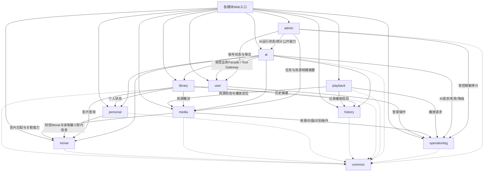
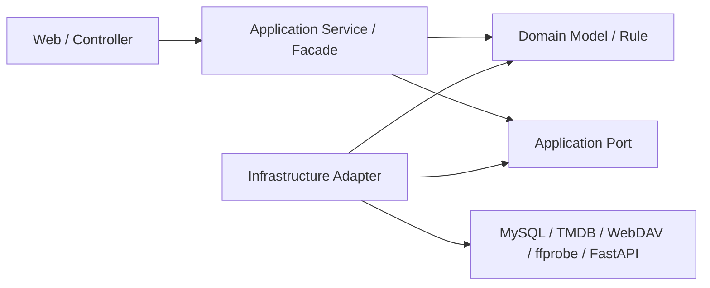
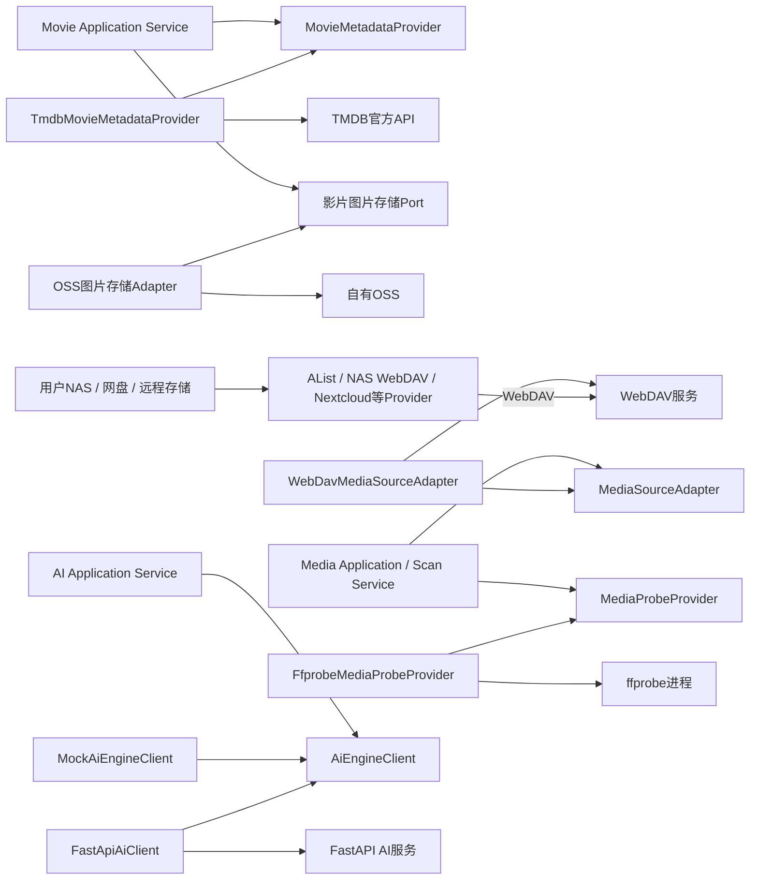
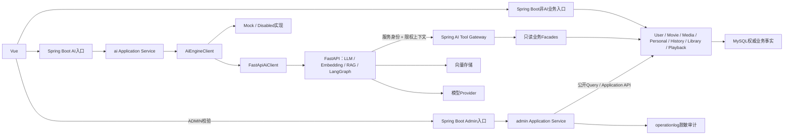

# 《基于大语言模型的个人智能影音平台设计与实现》开发规范与模块边界

## 文档信息

| 项目 | 内容 |
| --- | --- |
| 文档名称 | 开发规范与模块边界 |
| 上游需求基线 | `docs/01-项目需求文档.md` |
| 上游架构基线 | `docs/02-系统架构设计文档.md` |
| 适用范围 | Spring Boot、Vue、FastAPI、API设计、代码生成、重构、测试与Code Review |
| 架构形态 | 模块化单体Spring Boot + 独立FastAPI AI服务 |
| 正式前端 | Vue 3 + Vite + TypeScript |
| P0媒体来源实现 | 仅WebDavMediaSourceAdapter；统一MediaSourceAdapter抽象保留 |
| P0用户入口 | 自主注册/登录，注册后默认空片库，全部用户数据按CurrentUser隔离 |
| P0角色与产品结构 | 应用内仅USER/ADMIN两级角色；弱后台、强个人端；部署维护者为独立运行环境角色 |
| 文档性质 | 后续开发必须遵守的工程约束 |
| 文档状态 | 已完成“前端优先垂直切片 + 公共Movie图片OSS”增量修订的开发规范基线 |

> 本文档只规定模块边界、分层方式、依赖方向、外部系统抽象和开发纪律，不创建数据库表，不定义完整API，不编写Java、Python或Vue业务代码。若本文档与01需求基线或02架构基线冲突，必须停止实现并先澄清；不得以开发便利为理由改变P0范围。

---

## 1. 文档目的

本文档用于保证项目在逐步开发过程中仍保持清晰、可测试和可演进的结构，重点解决以下问题：

1. Spring Boot如何在FastAPI尚未实现或完全不可用时独立开发、运行和验收核心业务。
2. Spring Boot内部如何按业务模块组织，避免全局`controller/service/mapper/entity`目录逐渐失控。
3. Controller、应用Service、领域模型、数据访问和基础设施各自负责什么。
4. TMDB、WebDAV、ffprobe和FastAPI如何通过稳定边界接入，以及如何保留但不提前实现未来FileSystem/Local Agent扩展。
5. Java与Python如何协作，又如何避免FastAPI成为第二套业务后端。
6. 后续Codex生成代码和人工Code Review应依据什么规则判断实现是否越界。
7. 轻量`admin`上层编排模块如何在不直连其他模块Mapper、不接触用户敏感凭据的前提下提供系统管理与可观察性。
8. Vue 3、Vite、TypeScript、Frontend Mock和统一API层如何支持前端优先的垂直切片开发，同时保持正式运行时只有Spring Boot一个公共后端入口。
9. 公共Movie首次建档、TMDB图片下载、OSS上传与并发复用应遵守哪些实现纪律。

本文档中的“模块”首先指同一个Spring Boot应用内的逻辑业务包，不代表独立进程、独立部署单元或必须拆分成多个Maven/Gradle工程。P0保持单一Spring Boot部署制品。

---

## 2. 开发核心原则

### 2.1 第一核心规则

> **AI是增强层，不是Spring Boot核心业务成立的前提。**

即使Python、FastAPI、LangChain、LangGraph、模型服务和向量存储均未完成或不可用，Spring Boot仍必须能够独立提供以下P0能力：

- 用户自主注册、Spring Security + JWT登录、默认空片库、用户设置和用户偏好管理。
- MediaSource管理、连接测试和扫描任务管理。
- WebDAV媒体资源发现；AList、NAS WebDAV和Nextcloud等仅作为Provider。
- 确定性文件名解析、Edition/Cut提取和影片匹配流程。
- TMDB影片识别、人工确认和事实元数据刮削。
- ffprobe媒体探测及失败降级。
- Movie、Genre、Person、Credit、Poster和Backdrop管理。
- MediaResource、ResourceLocator、资源状态和多版本管理。
- 片库浏览、传统搜索和结构化筛选。
- 收藏、用户标签、未看/在看/已看状态。
- 播放启动记录、最近播放和观看次数。
- 资源选择、PlaybackDescriptor、WebDAV动态PlaybackLocator和mpv播放入口。
- 关键用户业务操作的轻量OperationRecord。
- `USER/ADMIN`两级授权、普通用户账号状态管理和受保护的轻量系统管理查询。
- OperationRecord管理员脱敏审计、扫描/索引与AI运行摘要、系统健康和只读脱敏配置摘要。

只有以下明确属于AI的能力允许在FastAPI不可用时暂停：

- 自然语言片库搜索。
- AI语义标签生成。
- AI推荐及推荐解释。
- AI影片助手。
- RAG。
- LangGraph Agent。
- 其他经需求基线明确归类为AI的能力。

### 2.2 其他核心规则

1. **单一业务事实源**：用户、Movie、MediaResource、MediaSource、收藏、观看状态和播放记录的权威状态只在Spring Boot/MySQL中维护。
2. **确定性逻辑优先**：能用确定性Java业务逻辑解决的问题，不交给LLM。
3. **模块优先于技术分层**：先按业务模块分包，再在模块内部划分Web、应用、领域和基础设施层。
4. **依赖指向业务核心**：基础设施实现依赖业务定义的Port，不允许业务核心反向依赖厂商DTO或具体客户端。
5. **跨模块只调用业务能力**：模块之间通过有限Facade/Application API协作，不访问对方Mapper、DO或内部Service。
6. **外部调用不占用数据库事务**：TMDB、WebDAV、ffprobe、FastAPI和LLM调用不得被长事务包围。
7. **失败按边界隔离**：AI失败不影响非AI功能；单个来源、单个文件或单个Provider失败不扩大成全局故障。
8. **适度抽象**：只为真实外部边界、真实替换点或显著测试价值创建接口，不套用完整DDD或无用途设计模式。
9. **配置与密钥外置**：外部地址、路径和密钥不得散落或硬编码在业务代码中。
10. **范围服从基线**：工程设计不得自行引入P1/P2功能，也不得借重构扩大P0。
11. **用户隔离贯穿全链路**：MediaSource、MediaResource可见范围、个人片库、收藏、观看状态、播放历史、AI/RAG数据和会话均由可信CurrentUser限定；新用户不得继承公共或他人片库。
12. **弱后台、强个人端**：`admin`只做账号状态、聚合统计、任务/AI监控、脱敏审计和健康摘要，不管理影视内容、不代用户维护个人片库、不形成第二业务事实源。
13. **管理与运行环境分离**：`ADMIN`是应用内角色，部署维护者负责服务器、Docker、配置、备份和原始技术日志；同一人可兼任，但两种职责和访问边界不得混用。
14. **后台可以轻，日志不能轻**：OperationRecord、技术运行日志、任务/AI可观察信息分层，关键请求和任务通过`request_id`、`task_id`可定位，同时严格脱敏。
15. **前端优先、垂直切片、尽早联调**：从已有页面设计和真实交互出发，以Mock先明确状态和TypeScript契约，再让Spring Boot、持久化与测试跟进；不等待全部后端或全部前端一次性完成。
16. **公共Movie复用优先**：确认TMDB Movie ID后先查询公共Movie，缺失时才通过唯一的建档Application Service取得完整事实、持久化图片并创建；数据库唯一约束保证最终正确。

第一版完整角色模型为：未登录访问者、普通用户`USER`、系统管理员`ADMIN`和部署维护者。其中只有USER与ADMIN进入Spring Security应用授权模型；未登录访问者仅能访问注册/登录等公开入口，部署维护者属于运行环境角色。

---

## 3. 总体工程形态

项目采用以下形态：

- 一个模块化单体Spring Boot业务应用。
- 一个独立FastAPI AI服务。
- 一个Vue 3 + Vite + TypeScript Web前端。
- 一个MySQL核心业务数据库。
- FastAPI侧按02架构使用P0向量存储和模型Provider。
- Windows浏览器与本机mpv构成客户端播放环境。

Spring Boot内部模块是代码组织和依赖治理边界，不是微服务。P0不引入服务注册中心、API Gateway产品、Kafka、RabbitMQ、Redis/Redisson、分布式事务或Kubernetes，也不引入Redis Cluster、Sentinel、Streams、复杂Lua、布隆过滤器、多级缓存或复杂缓存一致性系统。

轻量系统管理中心复用同一个Vue Web应用、同一个Spring Boot部署制品和MySQL既有持久边界；P0不新增第二套管理前端、独立Admin服务、集中日志平台、APM平台或Prometheus/Grafana强依赖。

---

## 4. Spring Boot总体模块划分

### 4.1 最终模块方案

| 模块 | 核心职责 | 明确不负责 |
| --- | --- | --- |
| `user` | 自主注册、登录、USER/ADMIN角色、账号允许状态、默认空片库初始化语义、个人设置、用户级偏好、可信用户上下文及受控账号启停能力 | 收藏、观看状态、影片事实、复杂RBAC、AI推理 |
| `movie` | 公共Movie、Genre、Person、Credit、TMDB影片事实、主Poster/Backdrop来源追踪与OSS稳定定位、影片匹配确认、公共建档复用与显式元数据同步 | 媒体文件、用户收藏、播放地址、LLM能力、用户级图片版本 |
| `media` | MediaSource、MediaResource、来源适配、扫描、确定性命名解析、Edition/Cut、ffprobe探测、ResourceLocator、资源状态 | Movie事实生成、个人观看状态、真正视频播放 |
| `personal` | 用户与Movie之间的收藏、用户标签、未看/在看/已看状态 | 用户认证、TMDB Genre、AI语义标签、播放启动记录 |
| `history` | 播放启动记录、最近播放时间、观看次数及对应查询 | 精确播放进度、播放器控制、观看状态自动推断 |
| `library` | 个人片库浏览、传统搜索、筛选和跨Movie/Media/Personal/History的只读聚合 | 核心事实所有权、外部Provider调用、AI语义推理 |
| `playback` | 选择MediaResource、校验资源归属与状态、取得PlaybackDescriptor、触发历史记录、提供mpv播放控制面 | 视频代理、转码、解码、直接启动客户端mpv、AI推荐 |
| `ai` | Spring侧AI入口、AI用例编排、FastAPI客户端、AI Tool Gateway、AI DTO、Mock/禁用/真实实现切换、AI故障降级，以及需要落库时对AI生成结果及其来源标识的生命周期管理 | LLM、Embedding、向量检索、RAG实现、LangGraph实现、Movie或MediaResource客观事实所有权 |
| `operationlog` | 持久化关键业务/审计OperationRecord并提供脱敏、非阻塞记录边界；支持USER本人查询和ADMIN受控系统级审计查询 | 通用技术日志平台、企业级审计中心、事件溯源、系统统计与管理页面编排 |
| `admin` | 系统统计聚合、普通用户基础管理、跨用户任务监控、AI运行统计、OperationRecord管理员审计查询、系统健康聚合、只读脱敏配置摘要 | Movie/MediaResource事实、收藏/历史、AI推理、MediaSource凭据、原始技术日志、内容运营 |
| `common` | 少量跨模块技术约定，如统一错误模型、请求关联信息、分页基础类型和通用安全上下文接口 | 业务实体、业务Service、厂商客户端和“暂时不知道放哪”的代码 |

AI语义标签等生成结果如需由Spring持久化，应归`ai`模块管理并明确保留“AI生成”来源、版本和可删除/纠正状态；它们不得写入或覆盖Movie的TMDB事实字段，也不得使Movie、Media或Library核心查询反向依赖AI服务可用性。

### 4.2 `library`是否独立

**结论：保留独立`library`模块。**

理由如下：

1. 片库页面和传统搜索天然需要组合Movie事实、MediaResource概况、个人收藏/观看状态和历史摘要。
2. 如果把这些聚合逻辑放入`movie`，Movie模块将反向依赖Media、Personal和History，容易形成循环依赖。
3. `library`只承担查询和展示聚合，不拥有Movie、资源或个人状态的写入权，因此不会形成第二套事实。
4. P0不为`library`建立复杂CQRS、独立事件流或独立数据库；它只是轻量的应用查询编排层。

`library`必须通过各模块的批量Query API/Facade取得数据，避免逐条查询和N+1调用。它不得直接访问其他模块Mapper。

### 4.3 `personal`归属结论

**结论：收藏、用户标签和未看/在看/已看状态放入独立`personal`模块。**

这些数据表达“某个用户与某部Movie的关系”，既不属于用户身份本身，也不属于所有用户共享的Movie事实。独立模块能够避免：

- `user`因了解Movie而膨胀。
- `movie`因了解每个用户状态而失去纯粹的影片事实边界。
- 收藏、标签和观看状态散落在多个Service中。

### 4.4 `history`是否独立

**结论：保留轻量独立`history`模块。**

播放启动记录具有独立生命周期、查询方式和统计语义。`playback`只负责发起播放控制面并调用History公开能力记录启动行为；History不得反向调用Playback。P0不把History发展为事件溯源系统，也不承担mpv精确进度同步。

### 4.5 `metadata`是否独立

**结论：不建立独立`metadata`业务模块。**

`MovieMetadataProvider`是Movie领域需要的外部能力Port，P0实现`TmdbMovieMetadataProvider`应位于`movie`模块内部基础设施层，例如`movie.infrastructure.tmdb`。原因是：

- 元数据的业务归宿是Movie、Genre、Person和Credit。
- P0只有TMDB一个实际Provider，独立模块会增加无收益的跨模块调用。
- Provider抽象已经满足未来替换数据源的需要。

TMDB DTO、HTTP客户端、字段映射和错误转换均留在该基础设施包内，不泄漏到Movie Service或Controller。

### 4.6 `admin`模块边界

**结论：增加轻量`admin`上层管理查询/编排模块。**

`admin`负责系统统计聚合、普通用户基础账号查询与启停、扫描/索引任务跨用户监控、AI调用运行统计、OperationRecord管理员脱敏审计查询、系统健康聚合和只读配置摘要。它不拥有Movie/MediaResource事实、用户收藏/观看历史、AI推理、MediaSource凭据或原始技术日志，也不建立独立数据库或第二套后台服务。

`admin`必须通过`user`、`media`、`operationlog`、`ai`公开的运行状态/统计Application API和`common`中的精简health抽象取得数据；禁止直接访问其他模块Mapper/DO/infrastructure。管理员统计与页面组合留在`admin`，下层模块不得依赖`admin`，以此维持单向依赖并避免循环。

系统管理员是应用内部`ADMIN`角色；部署维护者是运行环境角色。两者可以由同一人承担，但`admin`模块不提供服务器、数据库或原始日志文件访问能力，部署维护者也不会因环境权限自动成为产品管理员。

开发语义中的“管理员”专指上述系统管理员，不是影视内容运营管理员。项目不实现内容审核、公共资源运营或替用户维护个人片库的后台能力。

---

## 5. Spring Boot模块依赖关系

### 5.1 业务模块依赖图



### 5.2 单向依赖规则

- `movie`不依赖`media`、`personal`、`history`、`playback`或`ai`。
- `media`可以通过Movie公开Application API完成影片候选确认和资源关联，但Movie不得回调Media。
- `personal`可以通过Movie Query API校验Movie存在，不得读取Movie Mapper。
- `history`保存已经由调用方验证的用户、Movie和MediaResource标识，不反向依赖Playback。
- `playback`依赖Media公开的资源与播放定位能力，并单向调用History记录启动行为。
- `library`是只读聚合上层，可以依赖Movie、Media、Personal和History；这些下层模块不得依赖Library。
- `ai`是增强层和最外侧编排模块，可以调用受控业务Facade；任何核心业务模块都不得依赖`ai`。
- `operationlog`是轻量支撑业务模块，通过最小记录API接收已脱敏的操作结果；它不得反向调用业务模块，也不得成为主业务成功的事务前置条件。
- `admin`是最外侧管理查询/编排模块，可依赖`user`、`media`、`operationlog`、`ai`公开的运行摘要能力和`common`中的health抽象；这些下层模块不得依赖`admin`。管理员统计和页面组合归`admin`，事实所有权仍在原模块。
- 所有模块可依赖精简的`common`，但`common`不得依赖任何业务模块。

运行时Spring Boot与FastAPI存在双向HTTP交互，但Java代码的编译依赖仍保持单向：`ai`模块的FastAPI客户端向外调用；`ai`模块的Tool Gateway作为受控入站入口调用业务Facade。FastAPI回调不意味着Movie或Media代码依赖AI。

### 5.3 禁止循环依赖

发现“A调用B、B又调用A”时，不得通过延迟注入、`@Lazy`或从Spring容器动态取Bean掩盖。应优先采用以下方式消除：

1. 将用例编排上移到`library`、`playback`、`ai`或`admin`等天然上层模块。
2. 让下层模块返回稳定标识或只读结果，由上层完成组合。
3. 缩小并重定义模块Application API，而不是共享Mapper。
4. 若两个职责始终共同变化且无法形成单向关系，重新评估是否应属于同一模块。

---

## 6. 模块内部标准分层

### 6.1 统一结构

每个业务模块内部采用四层轻量结构：

```text
<module>/
├── web/
│   ├── controller/
│   └── dto/
├── application/
│   ├── service/
│   ├── api/
│   └── port/
├── domain/
│   ├── model/
│   └── service/
└── infrastructure/
    ├── persistence/
    └── <external-adapter>/
```

并非每个模块都必须机械创建全部空目录。只有存在相应职责时才创建。例如`library`可能没有领域实体和持久化实现，便不需要空的`domain/model`或`infrastructure/persistence`。

### 6.2 各层职责

| 层 | 负责 | 不负责 |
| --- | --- | --- |
| `web` | HTTP请求/响应、基础参数校验、用户上下文获取、调用应用Service、协议状态码映射 | 业务规则、Mapper、厂商客户端、外部进程 |
| `application` | 用例编排、事务边界、权限/归属规则、跨领域协调、模块公开Facade、出站Port定义 | 厂商JSON、HTTP细节、命令行输出细节 |
| `domain` | 业务对象、不变量、值对象和不依赖框架的确定性规则 | Controller DTO、数据库SQL、外部客户端 |
| `infrastructure` | MyBatis/数据库实现、HTTP客户端、TMDB/WebDAV/FastAPI适配、ffprobe进程与配置绑定 | 决定产品业务规则、绕过Application Service写业务数据；在P0偷加FileSystem或Local Agent实现 |

### 6.3 层内依赖方向



Application默认依赖Port接口，Infrastructure实现Port。第9.1节允许本模块简单数据访问使用模块私有Mapper这一轻量例外，但不得让Application直接依赖`TmdbClient`、`WebDavResponse`、`ProcessBuilder`或`FastApiResponse`等外部基础设施细节。

---

## 7. Controller规范

Controller只负责：

- 接收HTTP请求。
- 执行格式、必填项、长度、枚举和范围等基础校验。
- 从可信安全上下文取得当前用户，不接受前端任意指定用户身份。
- 将请求DTO转换为应用命令/查询对象。
- 调用本模块Application Service。
- 返回统一响应和适当HTTP状态。

Controller禁止：

- 直接注入或调用Mapper、Repository实现或MySQL客户端。
- 直接调用TMDB、WebDAV、ffprobe、FastAPI或其他外部系统。
- 编写匹配置信度、资源归属、播放可用性等复杂业务判断。
- 开启数据库事务。
- 在请求线程内执行完整媒体扫描或长时间ffprobe任务。
- 构造领域对象的大量状态变化。
- 直接返回数据库DO、厂商DTO或异常堆栈。

正确依赖方向是：

> `MovieController → MovieApplicationService → MovieMetadataProvider`

禁止依赖方向是：

> `MovieController → TmdbHttpClient`

AI Controller也只能调用`ai`模块Application Service，不得直接调用FastAPI客户端。

Admin Controller只能接收管理请求、从SecurityContext验证`ADMIN`、调用`admin`模块Application Service并返回脱敏DTO。禁止Admin Controller直接访问任何Mapper/MySQL、读取原始日志文件、直接调用FastAPI、读取用户WebDAV凭据、返回数据库DO或异常堆栈。Vue管理路由隐藏不是授权；即使`USER`手工构造请求，后端也必须返回403或等价拒绝。

### 7.1 Spring Security JWT入口规范

- P0必须提供自主注册入口；注册成功只创建User及必要默认设置，不得关联公共MediaSource、公共MediaResource或其他用户片库数据。
- 注册成功默认且只能授予`USER`；`ADMIN`不允许通过普通注册、个人设置或P0后台任意授予，其安全初始化方式留给后续安全/部署详细设计。
- 用户名/密码只提交给Spring Boot认证入口；认证成功后由Spring Boot签发JWT。
- Vue通过`Authorization: Bearer <JWT>`调用业务接口；Spring Security负责Token解析、签名验证、过期校验并建立SecurityContext。
- Controller从可信SecurityContext取得CurrentUser，不得将请求体、查询参数或路径中的`userId`当作身份。
- 普通业务入口接受已授权`USER/ADMIN`身份时仍必须按CurrentUser限制个人数据；管理员入口必须额外验证`ADMIN`，且只有Admin Application Service可以执行明确的跨用户管理use case。
- 受保护请求在JWT签名/过期验证后必须复核账号仍处于允许访问状态；禁用账号的已有JWT不得继续访问。具体失效策略留给安全/API设计，P0不引入Redis Token黑名单。
- 浏览器JWT不得直接透传给FastAPI。Spring Boot调用FastAPI使用服务身份和短时限权AI上下文令牌，两个令牌体系不得混用。
- JWT过期/Refresh策略留给安全详细设计；P0不引入OAuth2 Authorization Server、Keycloak、Redis Token黑名单、分布式Session或SSO。
- 注册、登录和后续对象访问必须使用同一用户身份模型；任何“默认演示用户共享片库”实现均禁止进入正式P0路径。

---

## 8. Application Service规范

Application Service负责：

- 表达一个清晰业务用例，例如“确认影片匹配”“扫描来源”“收藏影片”“生成播放描述”。
- 执行用户权限、对象归属、状态流转和幂等性检查。
- 协调本模块领域对象、数据访问边界和外部Port。
- 确定短事务的开始和结束。
- 调用其他模块公开Application API完成跨模块协作。
- 将基础设施错误转换为稳定的应用错误或降级结果。
- 根据CurrentUser执行MediaSource归属、MediaResource经来源继承的访问范围、个人状态、历史、播放、AI和普通OperationRecord查询的越权检查；系统级OperationRecord查询只允许独立ADMIN审计用例。
- 对Admin use case先验证`ADMIN`，再通过下层模块公开Application/Query API执行有界跨用户聚合或普通用户账号启停，并保证输出脱敏。

Application Service不得：

- 拼接TMDB、WebDAV或FastAPI的外部HTTP请求。
- 解析TMDB厂商JSON或WebDAV XML。
- 使用`ProcessBuilder`或解析ffprobe原始JSON。
- 持有LLM、LangChain或LangGraph概念。
- 直接操作其他模块Mapper。
- 复用普通CurrentUser接口后通过特殊参数、线程变量或隐藏开关绕过用户范围；管理员跨用户读取必须是具名Admin use case。
- 通过大量`if sourceType == ...`处理来源差异。
- 在一个超长方法中混合扫描、外部调用、持久化和响应组装。

应用Service可以编排多个步骤，但每一步必须通过具名领域能力、Port或模块Facade表达。只有真实业务用例需要时才拆分辅助Service，禁止为了分层形式创建大量无职责的`Manager`。

---

## 9. Mapper / Repository规范

### 9.1 模块内数据访问

P0不强制为每张表同时创建Mapper接口、Repository接口和Repository实现三层包装。

允许Application Service直接使用本模块Mapper、并省略额外Repository包装的条件是：

1. Mapper接口、实现和DO完全由本模块拥有，位于明确的内部数据访问边界；这是模块内轻量实现选择，不形成跨模块公开API。
2. 用例是简单CRUD或简单查询，没有替换存储实现的现实需求。
3. Mapper不被其他模块引用，DO不离开本模块。
4. Service仍负责业务规则和事务，Mapper只负责数据访问。

以下情况应定义Repository Port，由基础设施实现：

- 持久化涉及领域聚合或多表一致性，SQL结构不应影响应用层。
- 需要在单元测试中方便替换复杂持久化行为。
- 数据访问语义是稳定业务能力，而不是单表CRUD。
- 未来确有替换存储实现的现实可能。

### 9.2 跨模块数据访问

无论是否使用Repository抽象，跨模块都禁止直接访问Mapper、DO或表级数据访问对象。

例如：

- `MovieService`不得注入`PersonalStateMapper`取得观看状态。
- `PlaybackService`不得注入`MovieMapper`取得影片标题。
- `AiToolGateway`不得注入`MovieMapper`执行自由查询。
- `LibraryQueryService`不得绕过模块Facade随意联表修改其他模块数据。

跨模块必须调用对方`application.api`中的Facade/Query API。为控制性能，Query API应优先支持有界批量查询，而不是让调用方逐条循环。

### 9.3 用户范围查询规范

- 用户级资源查询必须显式携带可信CurrentUser范围，禁止`selectById(id)`后未经归属校验直接返回给请求用户。
- 可采用`user_id + id`联合查询，或查询后由Application Service校验MediaSource归属；具体方式由数据库设计决定，但安全语义不可省略。
- MediaResource的访问范围通过所属MediaSource归属建立；Movie保持共享事实，不应简单添加`Movie.user_id`并为每个用户复制影片。
- 收藏、个人状态、历史、播放、AI和OperationRecord查询均须使用相同用户范围语义。
- 普通用户不得通过修改`userId`、`mediaSourceId`、`mediaResourceId`、`movieId`、`historyId`、`operationRecordId`或`taskId`访问其他用户数据。
- `ADMIN`跨用户聚合或审计只能由`admin`模块的明确用例发起，并调用提供方专门公开、脱敏且有界的管理Query API；不能把普通Mapper或普通用户查询开放成“可选userId”。
- OperationRecord查询边界为USER本人查询与ADMIN受控系统级脱敏审计两类，不存在部署维护者自动应用授权。
- 无权与不存在的对外错误表达应避免泄露其他用户对象的敏感存在性。

---

## 10. 跨模块调用与Facade规范

### 10.1 公开面最小化

每个模块只将`application.api`视为跨模块公开面。Controller、内部Service、Mapper、DO、基础设施Client和外部DTO均视为模块私有实现。

模块公开能力应使用业务语言，例如：

- Movie：取得Movie、搜索Movie、取得可靠影片事实、确认匹配。
- Media：取得某Movie的资源版本、检查资源状态、解析受控播放定位。
- Personal：取得或更新当前用户的收藏、用户标签和观看状态。
- History：记录播放启动、查询最近播放和观看次数摘要。
- Library：按当前用户浏览、传统搜索和聚合片库结果。
- Admin：通过各模块公开管理Query API取得系统聚合、普通用户基础状态、任务/AI运行摘要、脱敏审计和健康配置摘要；不暴露任意查询或Mapper。

本文档不锁定具体Java方法签名。后续设计应保证能力有限、参数受控、返回最小必要数据。

### 10.2 Facade规则

- Facade返回模块定义的只读View/Result，不返回数据库DO。
- Facade不暴露“执行任意SQL”“按任意表字段查询”等数据访问能力。
- 跨模块写操作必须表达明确业务动作，不能暴露通用`save()`给其他模块。
- Facade调用链应保持有界，禁止层层回调形成隐式循环。
- 一个模块不得为了方便直接扫描另一个模块的包或反射调用内部类。
- 能由上层编排模块组合的数据，不要求下层模块彼此互相依赖。

本项目不建立完整CQRS体系；`Query API`仅表示只读业务Facade，不代表独立读库、事件总线或复杂读模型同步。

---

## 11. 外部Provider / Adapter规范

### 11.1 总体关系图



图中Port由业务/应用侧定义，Adapter实现Port并处理厂商细节。Adapter依赖Port，而不是Port依赖Adapter。

### 11.2 接口抽象判定

值得创建接口的情况：

- 外部系统或进程需要被隔离，如TMDB、WebDAV、ffprobe和FastAPI；未来FileSystem或Local Agent接入时仍复用同一判定原则。
- 存在明确P0实现与测试替身，例如真实Provider与Fake/Mock Provider。
- 业务端口具有明确的协议隔离、测试替身或未来替换价值；`MediaSourceAdapter`即使P0只有WebDAV一个实际实现也必须保留。
- 接口能够阻止厂商DTO、协议或SDK污染业务代码。

不值得创建接口的情况：

- 只有一个简单、稳定且纯内部的Service，没有替换或隔离需求。
- 接口与实现一一对应，仅为“看起来像架构”而存在。
- 接口只转发同名方法，没有形成边界或测试价值。

---

## 12. TMDB开发边界

- 业务Port固定使用`MovieMetadataProvider`语义。
- P0基础设施实现为`TmdbMovieMetadataProvider`，位于`movie.infrastructure.tmdb`。
- Movie Application Service只接收规范化候选和影片事实，不识别TMDB字段名、URL或鉴权方式。
- TMDB Base URL、Token、language、region、fallback、配额和超时全部通过配置管理。
- `TmdbMovieResponse`等厂商DTO只能存在于TMDB Adapter内部。
- Adapter负责把TMDB错误转换为认证失败、限流、超时、无结果、数据缺失或服务异常等稳定错误类别。
- LLM不得替代TMDB生成影片事实，TMDB Adapter也不得生成AI语义标签。
- P0只取得01定义的数据范围，不因API返回额外字段而扩大保存范围。
- Adapter应保留TMDB Movie ID、元数据Provider、原始`poster_path`和`backdrop_path`等来源追踪语义；不得把临时拼出的`image.tmdb.org` URL当作Movie长期图片定位。
- 确认TMDB Movie ID后必须先查询公共Movie。已存在时只复用并关联当前MediaResource，不重复获取完整详情、下载相同图片或上传OSS。
- 公共Movie不存在时，由一个统一Application Service编排TMDB规范化事实、系统级固定选图、图片下载、OSS上传、Movie创建与MediaResource关联。概念名可用`MovieIngestionService`或`MovieScrapeService`，正式命名按代码实际确定；普通扫描、未来管理员预建和未来批量预热不得各写一套逻辑。
- 系统级选图在同一部署内必须一致，P0每个Movie只维护一个主Poster和一个主Backdrop；不实现用户级选图、锁图、多候选图库或图片运营后台。
- 图片来源去重以`provider + source_path`为主，稳定来源标识生成稳定OSS Object Key。同一TMDB图片重复遇到时必须幂等，不做SHA-256内容级去重。
- 图片二进制只存OSS，MySQL只保存TMDB来源追踪与OSS Object Key/稳定定位。Vue正式日常浏览只使用OSS/CDN定位，不直接引用TMDB图片CDN。
- 普通扫描、登录和浏览不得自动替换已经持久化的公共图片；只有显式重新刮削、刷新元数据或重新同步影片才允许更新，并使所有关联用户看到同一新图片。
- 公共Movie创建最终依赖数据库`UNIQUE(tmdb_id)`。并发唯一冲突必须转换为“重新查询并复用已创建Movie”的正常竞争分支，不得直接返回系统异常。
- 未来Redis/Redisson锁只可减少重复TMDB请求、图片下载和OSS上传，不能替代数据库唯一约束，也不是P0依赖。

Movie Service禁止直接拼接TMDB HTTP请求，也不得在多个业务模块中重复实现TMDB调用。

---

## 13. WebDAV与媒体来源开发边界

- 业务代码依赖`MediaSourceAdapter`，P0只实现`WebDavMediaSourceAdapter`；不得创建P0 `FileSystemMediaSourceAdapter`、SMB Adapter或Local Agent实现任务。
- 来源类型选择集中在Adapter Registry/Factory的单一装配位置；扫描业务流程中不得散落Provider/厂商分支，更不得出现`sourceType == ALIST`或按AList、Nextcloud、迅雷、阿里云盘等厂商判断的业务逻辑。
- `media.infrastructure.webdav`负责HTTP/WebDAV方法、DAV XML解析、Depth Header、URL构造、认证、超时、连接测试、重定向约束和错误映射；这些协议细节不得泄漏给Application Service。
- Adapter负责连接测试、文件/目录区分、文件枚举、文件事实读取、状态检查和当前播放定位解析，并返回统一资源事实与错误类别。
- WebDAV凭据只在Spring Boot基础设施边界使用，不进入Vue、FastAPI、LLM、向量存储、普通日志或跨模块DTO。
- 完整敏感URL和临时PlaybackLocator只在探测或播放控制链路中短暂存在，不持久化、不写日志、不进入AI上下文。
- Playback模块通过Media公开能力取得当前PlaybackDescriptor，不得直接注入`WebDavMediaSourceAdapter`。
- WebDAV Adapter不负责创建Movie、不调用LLM，也不解析ffprobe技术事实；来源发现后的文件名解析和TMDB识别流程必须保持来源无关，以便未来其他Adapter复用。
- AList仅是WebDAV Provider示例。Adapter不得为AList建立业务类型，也不得把AList特有行为传播到领域或Application层。
- 统一`MediaSource`/`MediaSourceAdapter`抽象不得因P0只有一个实际Adapter而删除。未来本地部署可增加FileSystem Adapter，云部署可增加负责本地扫描、ffprobe、目录监听和播放器联动的Local Agent，但这些均为非P0扩展说明。

---

## 14. ffprobe开发边界

- 业务Port固定使用`MediaProbeProvider`。
- P0实现`FfprobeMediaProbeProvider`，位于`media.infrastructure.probe`。
- Media Application Service不直接创建进程、不拼接命令行、不解析ffprobe原始JSON。
- Adapter负责进程参数白名单、执行超时、退出码、标准输出/错误输出限制、JSON解析和结果规范化。
- ffprobe失败返回明确探测状态或媒体探测异常，不得导致整个来源扫描回滚。
- WebDAV远程探测保持best-effort，不能为了探测要求完整下载影片。
- 无法可靠判断的bit depth、HDR或语言保持UNKNOWN/空，不猜测。
- ffprobe不负责Edition识别、Movie匹配或TMDB事实生成。

---

## 15. Spring Boot与FastAPI开发边界

### 15.1 边界图



### 15.2 Spring Boot负责的确定性业务事实

- 当前用户是谁以及其权限范围。
- 用户片库中有哪些Movie。
- Movie、Genre、Person、Credit及TMDB事实是什么。
- Movie.runtime、主Poster和主Backdrop是什么。
- MediaSource和MediaResource是什么、来自哪里。
- MediaResource.duration、技术参数和Edition/Cut是什么。
- 用户是否收藏、是否未看/在看/已看。
- 资源是否存在、是否可访问。
- 播放哪个MediaResource以及当前PlaybackDescriptor是什么。
- 播放启动记录、最近播放和观看次数。
- `USER/ADMIN`角色、账号允许状态、管理员账号启停结果和Admin use case授权。
- 系统级任务/AI运行摘要、OperationRecord审计和核心依赖健康/配置摘要的Spring侧聚合结果。

### 15.3 FastAPI负责的AI能力

- 自然语言理解和受约束的意图解析。
- 情绪、节奏、氛围等模糊语义条件处理。
- Embedding和向量检索。
- RAG检索与生成编排。
- AI语义标签生成。
- 推荐解释和个性化理由生成。
- 影片问答与剧透会话控制。
- LangGraph Agent工作流。

### 15.4 强制规则

> **能用确定性Java业务逻辑解决的问题，不交给LLM。**

FastAPI只能消费Spring Boot提供的业务事实，不能重新定义或覆盖事实。LLM输出必须被标识为AI生成，并且不能修改Movie事实或MediaResource文件事实。

---

## 16. Java / Python职责矩阵

| 问题或能力 | Spring Boot | FastAPI | 权威结论 |
| --- | --- | --- | --- |
| 用户身份与数据权限 | 认证、授权、用户范围校验 | 使用限权上下文，不自行认证浏览器用户 | Spring Boot |
| Movie事实 | 管理并通过TMDB Provider同步 | 只读使用和解释 | Spring Boot/TMDB事实 |
| MediaResource与资源状态 | 管理、检查和返回当前状态 | 只读使用，不接触来源凭据 | Spring Boot |
| 收藏、标签、观看状态 | 管理和查询 | 通过Tool Gateway读取必要摘要 | Spring Boot |
| 传统搜索与硬条件 | 执行结构化查询和最终复核 | 解析用户语言中的条件 | Spring Boot执行结果 |
| 自然语言与模糊语义 | 提供入口和业务候选 | 理解、向量检索、语义评分 | FastAPI生成，Spring事实约束 |
| 推荐 | 提供真实候选、历史和资源状态 | 排序辅助与生成解释 | 候选事实由Spring决定 |
| RAG与问答 | 提供规范化事实和权限复核 | 检索与生成 | FastAPI生成，Spring事实优先 |
| Agent | 提供只读业务工具 | LangGraph编排工具调用 | FastAPI编排，Spring执行工具 |
| 播放地址 | 校验并动态解析 | 不获取、不生成、不保存 | Spring Boot |
| AI语义内容 | 保存时保留AI来源标识 | 生成 | 不得覆盖客观事实 |
| 管理员认证、账号状态与系统聚合 | Spring Security与Admin Application Service负责 | 不得访问或实现 | Spring Boot |
| OperationRecord管理员审计 | Spring Boot受控脱敏查询 | 不得访问 | Spring Boot |
| 系统健康聚合 | Spring汇总Java核心与FastAPI/Provider轻量health | 只返回自身/AI依赖脱敏状态 | Spring Boot对管理端输出 |

---

## 17. 禁止FastAPI成为第二业务后端

FastAPI禁止：

- 直接连接核心MySQL。
- 直接创建、修改或删除Movie、MediaResource、MediaSource和用户。
- 直接修改收藏、用户标签、观看状态或播放记录。
- 直接读取WebDAV凭据、TMDB凭据或临时PlaybackLocator。
- 直接管理媒体来源或执行ffprobe影片探测。
- 自己维护用户片库副本并把它当作权威事实。
- 绕过Spring Boot判断用户权限、片库归属和资源可用性。
- 将向量索引中的旧数据当作当前业务状态。
- 调用Admin Application Service、管理员接口或系统级审计/跨用户统计能力。
- 因浏览器用户具有`ADMIN`而接受管理员scope；AI上下文永远只表达当前个人AI业务所需的限权用户范围。

FastAPI需要业务数据时，只能通过Spring Boot AI Tool Gateway获取。Tool Gateway必须：

- 验证FastAPI服务身份和短时限权上下文。
- 从可信上下文建立用户范围，不信任LLM参数中的用户ID。
- 只暴露白名单、只读、数量有界的业务能力。
- 调用各业务模块公开Facade，不直接访问Mapper。
- 返回最小必要数据，不返回凭据、完整文件路径或临时PlaybackLocator。
- 对向量检索传递明确用户范围，并在工具返回前再次执行Application Service归属校验；不能把向量过滤当作最终授权。
- 明确拒绝Admin能力、跨用户聚合、账号启停和系统级OperationRecord查询；LLM/Agent不能把这些能力作为工具注册。

---

## 18. FastAPI不可用时的错误隔离

FastAPI未启动、超时、模型不可用、向量存储损坏或RAG失败时：

### 18.1 必须继续可用

- 自主注册、登录、退出、默认空片库和用户设置。
- MediaSource配置、连接测试与扫描。
- TMDB影片识别、刮削和人工确认。
- ffprobe媒体探测及失败降级。
- Movie、MediaResource和MediaSource管理。
- 片库浏览、传统搜索、筛选和详情页基础资料。
- 收藏、用户标签、未看/在看/已看。
- 播放记录、最近播放和观看次数。
- 多资源版本、Edition/Cut、Poster和Backdrop展示。
- 资源状态检查、PlaybackDescriptor和mpv播放入口。
- 用户基础管理、扫描/索引任务摘要、OperationRecord受控审计、Spring核心健康和只读脱敏配置摘要；AI状态可显示不可用/降级。

### 18.2 允许暂停

- AI搜索、AI推荐、AI影片助手、AI语义标签、RAG和Agent。

### 18.3 实现约束

- 非AI Controller和Service不得在启动或请求时探测FastAPI健康状态。
- `GET movies`、详情查询、收藏和播放链路不得注入或调用AI客户端。
- AI调用必须设置连接超时、读取超时和总时限，并转换为稳定的“AI服务暂时不可用”错误。
- AI故障不得回滚已经提交的Movie、收藏、资源或播放记录事务。
- Vue应对AI区域进行局部降级，而不是使整个页面失败。

---

## 19. Python未完成时的Java独立开发与AI Mock策略

### 19.1 推荐接口边界

Spring `ai`模块对Web层提供按用例划分的应用能力，例如：

- AI片库搜索用例。
- AI推荐用例。
- AI影片助手用例。
- AI Agent用例。

这些应用能力内部共同依赖一个面向FastAPI能力边界的出站Port，概念名为`AiEngineClient`。P0先保持一个客户端边界，避免为每个HTTP调用制造一个接口；只有流式与非流式调用在生命周期、错误或测试需求上明显分离时，才进一步拆分。

`AiEngineClient`可具有三种装配实现：

| 模式 | 实现思路 | 用途 |
| --- | --- | --- |
| Disabled | 立即返回稳定的AI不可用结果 | 纯Java开发、非AI测试和生产降级 |
| Mock | 返回固定、可重复、明确标识为Mock的测试结果和阶段事件 | Vue联调、Spring AI入口流程测试、契约演示 |
| FastAPI | 通过内部REST/SSE调用真实FastAPI | AI服务完成后的正式集成 |

具体实现名称可以是`DisabledAiEngineClient`、`MockAiEngineClient`和`FastApiAiClient`，但本文档不锁定Java类签名。

### 19.2 Mock约束

- Mock结果必须确定、可重复，并明确带有Mock/测试标识。
- Mock不得访问核心Mapper拼装“假AI”，需要业务数据时仍通过正常业务Facade准备输入。
- Mock不得被当作AI效果验收结果。
- Mock不得把片库外电影伪装为真实推荐。
- Mock应覆盖成功、无结果、超时、服务不可用和流式阶段事件等联调场景。
- Mock与真实实现通过配置/Profile装配切换，不通过业务代码中的`if debug`散落切换。

### 19.3 后期替换范围

接入FastAPI时原则上只修改或新增：

- `ai.infrastructure.fastapi`中的客户端、厂商DTO映射和SSE适配。
- AI服务地址、服务身份和超时配置。
- Spring/FastAPI契约测试。
- 必要的AI入口编排与错误映射。

Movie、Media、Personal、History、Library和Playback模块原则上无需修改。若FastAPI接入要求这些核心模块大规模重构，说明前期边界设计失败，必须先评审而不是继续堆补丁。

---

## 20. DTO、领域对象、DO与外部DTO边界

### 20.1 适度分离方案

| 对象类型 | 所在边界 | 规则 |
| --- | --- | --- |
| Web请求DTO | `web.dto` | 只表达HTTP输入和基础校验，不承担领域行为 |
| Web响应DTO | `web.dto` | 面向Vue展示，不暴露DO、敏感字段或内部错误 |
| 应用Command/Query/Result | `application` | 表达用例输入输出，可供模块Facade使用 |
| 领域对象/值对象 | `domain` | 表达Movie、MediaResource、ResourceLocator等业务概念和规则 |
| 数据库DO/Entity | `infrastructure.persistence`或模块内部持久化包 | 表达数据库映射，只在本模块使用，不直接返回前端或跨模块共享 |
| 外部系统DTO | 对应Adapter内部 | 只表达TMDB、WebDAV、ffprobe或FastAPI协议，不离开Adapter |
| 跨模块View | 提供方`application.api` | 只读、最小必要、稳定，不包含Mapper/DO引用 |

### 20.2 避免无意义对象爆炸

- 核心领域对象和外部边界默认分离。
- 简单、纯内部、无行为的数据记录可以在模块内适度复用，但不得跨Web、外部协议和数据库三个边界同时复用一个类。
- Movie、MediaResource等具有重要不变量的对象不应直接等同于厂商DTO或前端响应DTO。
- 转换逻辑放在边界附近：Web组装在Web/Application边界，持久化映射在Persistence Adapter，厂商映射在External Adapter。
- 不创建全局万能转换器，不使用反射映射掩盖字段语义差异。

### 20.3 强制禁止

- 将`TmdbMovieResponse`直接保存为Movie DO。
- 将WebDAV XML/响应对象、ffprobe原始JSON或`FastApiResponse`传入领域层。
- 将MyBatis DO原样序列化给Vue。
- 将临时PlaybackLocator包含在跨模块通用Movie DTO中。
- 用一个不带来源标识的`tag`对象混合Genre、用户标签和AI语义标签。

---

## 21. 外部DTO隔离规范

每个Adapter必须在边界内完成“外部协议对象 → 项目规范对象”的转换：

- TMDB Adapter：TMDB候选/详情DTO → Movie候选和规范化影片事实。
- WebDAV Adapter：WebDAV响应/XML/错误 → 统一来源文件事实、状态或PlaybackLocator。
- ffprobe Adapter：原始JSON → MediaTechnicalMetadata规范结果。
- FastAPI Client：FastAPI JSON/SSE事件 → Spring AI应用结果和统一阶段事件。

厂商字段变化只应影响相应Adapter及其契约测试。若厂商字段变更迫使Controller、Movie Service或数据库DO同步修改，说明外部DTO已经泄漏，必须修正边界。

---

## 22. 异常规范

### 22.1 异常分类

| 类别 | 示例 | 处理原则 |
| --- | --- | --- |
| 业务异常 | Movie不存在、资源不属于用户、状态转换无效、候选需人工确认 | 返回稳定业务错误码和用户可行动说明 |
| 外部依赖异常 | TMDB超时、WebDAV认证失败、ffprobe执行失败、FastAPI不可用 | Adapter转换并标记依赖类型、是否可重试和降级方式 |
| 系统异常 | 未预期空指针、数据库不可用、配置错误 | 记录关联ID和内部堆栈，对外返回通用系统错误 |

### 22.2 转换边界

- Adapter捕获厂商SDK、HTTP或进程异常，转换成项目内部稳定错误。
- Application Service根据用例决定失败、部分成功、跳过或稍后重试。
- 全局异常处理只负责把稳定错误映射为HTTP响应，不解析厂商异常。
- Controller不得捕获所有异常后返回永远成功的响应。
- 外部异常消息、请求内容和堆栈不得原样暴露给前端。

### 22.3 特定降级

- 单个ffprobe失败转为该资源探测失败/UNKNOWN，不终止整批扫描。
- WebDAV远程探测失败不阻止MediaResource入库和TMDB匹配。
- TMDB失败保留未识别/待刮削资源，不让LLM补事实。
- FastAPI失败只影响当前AI用例，返回明确AI不可用状态。

---

## 23. 事务规范

### 23.1 事务边界

MySQL事务只围绕短时间核心业务数据操作。事务通常由Application Service定义，不在Controller、外部Adapter或异步线程入口中随意扩散。

禁止以下模式：

> 开启事务 → 等待TMDB/WebDAV/FastAPI网络请求或ffprobe进程 → 再修改数据库 → 提交

推荐编排方式：

1. 在短事务中读取必要状态、记录任务或取得版本信息。
2. 结束事务。
3. 调用TMDB、WebDAV、ffprobe或FastAPI，并设置超时。
4. 在新的短事务中重新校验对象当前状态和幂等条件。
5. 保存结果并提交。

### 23.2 事务规则

- 不在数据库事务中进行长时间网络、文件或进程等待。
- 跨模块调用前应明确由哪个Application Service拥有事务。
- 不尝试让MySQL事务覆盖外部系统，P0不引入分布式事务。
- 外部调用成功而数据库写入失败时，通过幂等重试或任务状态恢复，不引入复杂补偿框架。
- 公共Movie首次建档不得在持有数据库事务时等待TMDB下载或OSS上传；创建前后都要重新校验`tmdb_id`，数据库唯一冲突后结束失败事务并重新查询胜出的Movie。
- OSS上传使用稳定Object Key保持幂等；数据库提交失败时不得通过无界重试制造重复图片，悬空对象的有限清理策略留给后续详细设计。
- 扫描按任务和单资源形成可恢复边界，不用一个事务包住整次扫描。
- AI调用失败不得回滚已经独立提交的非AI业务操作。
- OperationRecord写入失败不得回滚已经提交的主业务；记录应在主事务提交后尽力执行。

---

## 24. 后台任务规范

媒体扫描采用02已确定的：

> Spring Boot进程内有界任务执行器 + MySQL任务状态

具体规则：

- Controller只创建任务并快速返回任务标识，不在HTTP线程中完成整次扫描。
- 执行器必须有明确线程数、队列上限和拒绝策略，禁止无界线程或无界队列。
- 任务状态至少能够表达等待、运行、部分成功、成功和失败等语义；具体数据设计留给后续文档。
- 扫描进度和关键结果持久化，服务重启后不得把旧任务误显示为仍在执行。
- 单个文件、单个TMDB请求或单次ffprobe失败不终止整批任务。
- 重复提交需要幂等或冲突检查，避免同一来源同时运行大量重复扫描。
- 后台线程必须显式建立任务上下文和安全范围，不能依赖已经结束的HTTP线程上下文。
- P0不为异步引入Kafka、RabbitMQ或Redis。

---

## 25. 配置和密钥规范

以下配置不得硬编码或散落在业务类中：

- TMDB Base URL、Token、language、region和fallback参数。
- WebDAV服务地址、认证信息、扫描范围和兼容参数。
- ffprobe可执行路径、执行超时和探测预算。
- FastAPI地址、内部服务身份密钥、连接/读取/总超时。
- 模型地址、模型标识、LLM API Key和Embedding配置。
- OSS Endpoint、Bucket、公开访问/CDN前缀、Access Key及Secret。
- JWT签名密钥、数据库连接凭据和Nginx域名/证书路径。

规范要求：

- Spring Boot使用集中、类型化的应用配置对象承载本服务配置；推荐使用`application.yml`、`application-dev.yml`、`application-prod.yml`分层，敏感值通过`${ENV_VAR}`注入。
- FastAPI的模型Base URL、模型名称、LLM API Key、Embedding配置和内部服务密钥全部外置；Spring Boot只持有调用FastAPI所需的地址、服务身份和超时配置。
- Vue + Vite使用`.env.development`、`.env.production`、`.env.local`等管理客户端环境差异，例如`VITE_API_BASE_URL`。所有`VITE_*`变量都会进入浏览器构建产物，只能保存公开、非敏感信息。
- 严禁出现`VITE_TMDB_API_KEY`、`VITE_LLM_API_KEY`、`VITE_OSS_ACCESS_KEY_SECRET`、`VITE_DATABASE_PASSWORD`、`VITE_JWT_SECRET`、`VITE_WEBDAV_PASSWORD`或`VITE_FASTAPI_INTERNAL_SECRET`；任何真实secret都不得进入Vue源码、客户端环境变量或构建产物。
- Docker Compose通过项目`.env`、`env_file`或服务器环境变量注入配置；Nginx域名、upstream和HTTPS证书路径保留在独立Nginx配置中，不侵入Java、Vue或Python业务源码。
- 环境差异通过配置文件、环境变量或部署密钥注入解决；开发、测试、生产切换时不得修改Java/Vue/Python业务源码。
- 仓库保留`.env.example`，只列变量名称与示例占位值；真实`.env`和真实密钥不得提交Git/GitHub。
- 敏感配置在配置输出、Actuator、异常和日志中必须脱敏。
- 启动时校验必需配置；可选AI配置缺失不得阻止纯Java核心以Disabled模式运行。
- P0管理端配置摘要只能只读展示“是否配置/是否可用”和运行环境非敏感部分；不得返回或在线编辑TMDB/LLM/Embedding API Key、WebDAV/数据库密码、FastAPI内部密钥或JWT签名密钥。
- 可编辑动态配置属于P1，P0继续使用配置文件、环境变量和部署密钥注入，不建设动态配置中心。

当前生产部署倾向为Cloudflare仅作DNS托管、香港AWS Lightsail作为源站、Nginx提供Vue/Spring Boot HTTPS入口，FastAPI/MySQL等后端组件位于服务器内部环境。DNS-only时浏览器直连源站，Nginx使用Let's Encrypt等浏览器信任证书，不依赖Cloudflare Origin CA。图片可由Vue直接读取阿里云OSS/CDN，但业务请求仍只访问Spring Boot。上述部署参数属于基础设施配置，不得影响本地业务代码或成为开发前置条件。

---

## 26. 日志与可观察性规范

日志体系分为三层：A层是`operationlog`持久化的业务/审计OperationRecord；B层是Spring Boot与FastAPI各自输出的结构化技术运行日志；C层是扫描/索引任务与AI调用的可聚合运行摘要。三层可以通过`request_id`、`task_id`关联，但用途、存储和查询边界必须分离，禁止把所有INFO日志写入MySQL。

### 26.1 禁止记录

- 明文密码、作为管理页面数据展示的password hash和会话凭据。
- TMDB Token。
- WebDAV密码、Token、完整敏感URL和临时PlaybackLocator。
- 完整JWT、Refresh Token及其他认证凭据。
- 完整AI Prompt和完整私人对话。
- LLM/Embedding API Key和FastAPI内部服务密钥。
- 进入LLM的完整敏感上下文。
- 未脱敏的厂商请求/响应和异常对象。
- 带签名的完整播放URL、用户敏感完整文件路径或健康/配置端点中的原始密钥值。

### 26.2 应记录

- `timestamp`、`level`、`service`和`module`。
- `request_id`：跨Vue、Spring Boot和FastAPI关联请求，Spring调用FastAPI时必须继续传递。
- `task_id`：定位扫描和索引任务。
- `user_id`：仅在已经建立可信用户身份且确有排障必要时记录，不从用户输入伪造。
- operation/use case、`duration`、`result`、`error_category`和`degraded`。
- `dependency`、调用结果、耗时和`retryable`，但不记录敏感载荷。
- 必要时记录`media_source_id`、`media_resource_id`、`movie_id`等稳定对象标识；默认不记录完整路径和URL。

### 26.3 日志纪律

- 使用结构化、可检索字段，避免只写不可分析的长文本。
- 正常可预期的业务异常不滥用ERROR级别。
- 系统异常保留内部堆栈，但对用户响应隐藏。
- 文件路径按最小必要原则记录，默认优先使用资源标识和相对定位；不得把敏感远程URL写入日志。
- AI流式事件只记录阶段、耗时和终态，不逐Token记录用户内容。
- 普通登录失败尚无可信CurrentUser，只进入脱敏安全/技术日志；可记录`request_id`、时间、认证结果、失败类别、脱敏用户名标识，以及安全详细设计允许时的IP/User-Agent摘要，绝不记录密码或据输入username伪造User ID。
- 结构化日志与摘要应足以定位登录成功/失败、来源增删改、扫描发起与task失败阶段、单资源/TMDB/ffprobe错误、AI任务/FastAPI/LLM Provider错误和降级、跨服务链路、PlaybackLocator获取失败、管理员账号启停、外部依赖异常、可重试性及总体耗时。

### 26.4 OperationRecord业务与审计规范

技术日志/Observability与`operationlog`业务记录必须分离。技术日志用于排错；OperationRecord用于关键普通用户行为和管理员状态变更追溯。OperationRecord概念上可表达`actorUserId`、`actorRole`、`operationType`、`targetType`、`targetId`、`result`、`request_id`、适用时的`task_id`/`duration`、`timestamp`和脱敏`summary`，具体字段留给03数据库设计。

P0普通用户OperationRecord建议记录：认证成功并确定真实User后的登录成功；MediaSource新增、修改、删除、启停和连接测试；扫描开始、完成和失败；人工确认或修正TMDB识别；AI请求、失败、降级和任务类型；播放请求及PlaybackLocator获取成功/失败。管理员OperationRecord记录管理员登录成功、禁用用户、启用用户和其他真正影响系统状态的管理操作，并明确actor为`ADMIN`；不要求为每个普通管理GET记录。`operationlog`只能在已经具有可信身份的业务操作中关联actor。Spring Security认证失败Handler不调用OperationRecord API，也不把输入用户名视为可信CurrentUser。不得因浏览器发出`mpv://`记录“播放完成”。

OperationRecord应优先关联`movie_id`、`media_source_id`、`media_resource_id`和`request_id`等稳定标识，只保存脱敏摘要。禁止保存密码、完整JWT、WebDAV凭据、TMDB Token、模型密钥、临时播放凭据、完整敏感URL、完整Prompt或完整私人对话。

普通用户只能通过本人查询用例查看自己的OperationRecord；`ADMIN`通过`admin`模块的受控审计用例调用`operationlog.application.api`取得系统范围内脱敏记录。部署维护者不自动拥有应用查询权。`operationlog`不负责管理员页面编排、系统统计、通用技术日志、企业审计中心或事件溯源。

各业务模块在主事务成功后调用`operationlog.application.api`的最小记录能力，或通过简单事务后回调/有界进程内执行器记录；失败只进入技术日志和有限补偿，不向主业务抛出回滚异常。P0不引入Kafka、RabbitMQ、事件溯源、独立日志数据库或企业审计中心。

### 26.5 任务、AI可观察信息与管理端日志中心

- 扫描/索引任务摘要应能表达`task_id`、用户标识、任务类型、状态、开始/结束/耗时、发现/成功/失败数量、错误类别和降级状态。
- AI运行摘要应能表达任务类型、调用/成功/失败/降级次数、平均耗时、最近错误类别、非敏感Provider/模型标识和`request_id`；Provider可靠返回时可预留Token Usage，P0不要求费用统计。
- AI摘要禁止保存完整Prompt、完整对话、完整RAG上下文、API Key、敏感文件路径或PlaybackLocator。
- P0管理端日志中心只展示OperationRecord、管理员审计、任务/AI运行摘要和必要的近期异常摘要；Admin Controller/Application Service不得直接读取服务端日志文件。
- 原始Spring Boot/FastAPI结构化日志文件或标准输出由部署维护者排障。复杂全文检索、集中日志平台、复杂告警和大盘属于P1/P2，不成为P0前提。

### 26.6 系统健康与配置可观察性

- Spring Boot通过精简health抽象聚合自身、MySQL、FastAPI、Chat/Embedding Provider、向量存储、TMDB Provider和ffprobe的正常、异常或降级状态；各检查独立超时，FastAPI失败不得拖垮Java核心管理页面。
- 可采用Actuator思想和FastAPI/Provider轻量health，但不得锁死具体URL或将P0扩展为APM、分布式追踪、Prometheus/Grafana或Kubernetes运维平台。
- WebDAV是用户私人来源，后台最多展示失败聚合；不得以管理员身份读取凭据/完整URL或逐个代用户访问。
- 健康与配置响应只返回脱敏状态和非敏感摘要，不返回密钥、完整厂商响应或内部堆栈。

---

## 27. 可测试性规范

### 27.1 单元测试

- Movie Application Service可替换`MovieMetadataProvider`，无需真实TMDB即可测试高/低置信度和错误分支。
- Media扫描与资源Service可替换`MediaSourceAdapter`和`MediaProbeProvider`。
- Playback Service可使用假的Media Facade和History API测试归属、状态与记录行为。
- AI Application Service可替换`AiEngineClient`测试成功、超时、不可用和流式事件。
- Admin Application Service使用各模块Fake Query API测试聚合、账号启停、脱敏和单个依赖降级，不连接其他模块Mapper或真实外部服务。
- 确定性解析器、Edition Label Extractor、路径规范化和状态规则应作为纯Java逻辑独立测试。

### 27.2 集成与契约测试

- Mapper/持久化测试只验证本模块数据访问边界。
- TMDB、WebDAV、ffprobe和FastAPI分别建立Adapter契约测试，不把外部依赖带入核心Service单元测试。
- Spring/FastAPI契约测试验证字段语义、错误类别、SSE事件和限权上下文，不等同于AI效果测试。
- Vue Service的Frontend Mock与真实HTTP实现应通过同一TypeScript契约验证主要成功/失败语义，避免页面切换数据源后重写。
- 公共Movie建档测试使用Fake TMDB/OSS边界覆盖已有Movie直接复用、首次建档、稳定Object Key幂等和数据库唯一冲突后重新查询；不得用Redis锁替代并发正确性测试。
- 必须测试FastAPI未启动时非AI接口仍然成功。
- 必须测试WebDAV和ffprobe单项失败不破坏已入库业务事实。
- 必须测试TMDB暂时不可用时已有Movie与OSS图片仍可浏览，且普通扫描/登录/浏览不自动刷新公共图片。

### 27.3 P0专项安全、WebDAV与AI效果测试

- JWT测试至少覆盖合法Token、过期Token、错误签名、缺少Token、Token对应用户不存在、账号已禁用、USER访问Admin被拒绝和越权资源访问，并验证普通登录失败只产生脱敏安全/技术日志、不创建用户OperationRecord。
- 注册测试至少覆盖成功注册、重复账号、非法输入和注册后默认空片库；禁止通过初始化脚本或演示数据给新用户关联公共/他人资源。
- 用户隔离测试至少覆盖：用户A不能查看、修改或扫描用户B MediaSource，不能访问或播放用户B MediaResource，不能读取用户B个人片库、收藏、观看状态、播放历史、AI/RAG数据和会话，USER只能访问本人OperationRecord，并覆盖篡改`userId`、`mediaSourceId`、`mediaResourceId`、`movieId`、`historyId`、`operationRecordId`和`taskId`的IDOR请求。
- WebDAV Adapter使用Fake/Mock HTTP服务器测试连接成功、认证失败、目录读取、文件发现、404、403、超时、服务不可用、特殊字符路径和中文路径；不要求连接所有真实网盘。
- AI搜索、推荐、RAG和Agent的论文效果评价必须使用真实FastAPI/模型/向量链路，不得用`MockAiEngineClient`生成论文数据；Mock只用于开发联调和契约测试。
- AI搜索验证硬条件、用户片库范围、语义条件、无结果不编造和模型不放宽硬条件；推荐验证真实片库、已看排除、可访问性和理由依据；RAG验证依据、无依据承认不足、用户隔离和默认无剧透；Agent验证完整步骤、无结果、结果不足、部分状态失败、工具失败、FastAPI降级和步骤上限。
- 管理端专项测试至少覆盖：ADMIN可进入管理端并查看聚合用户数量/基础信息；ADMIN可禁用和启用普通用户且产生标明ADMIN actor的OperationRecord；ADMIN可通过受控接口查系统级脱敏OperationRecord；USER访问全部管理员能力被拒绝。
- 隐私测试至少覆盖：管理员DTO、OperationRecord、任务/AI摘要、技术日志、健康和配置响应均不出现密码/password hash、JWT/Refresh Token、API Key、WebDAV凭据、完整文件路径、PlaybackLocator、完整Prompt、私人对话或RAG敏感上下文。
- 边界测试必须证明管理员不能修改用户收藏、观看记录、播放进度、片库和MediaSource凭据，不能冒充用户或任意授予ADMIN；新增`admin`模块不破坏两个普通用户之间的数据隔离。
- FastAPI契约/安全测试必须证明Tool Gateway没有Admin工具、服务身份不能映射为ADMIN、LLM/Agent不能调用管理员能力。
- 可观察性测试应证明`request_id`能够关联Spring Boot与FastAPI日志，`task_id`能够定位扫描任务及失败阶段，并能表达依赖、耗时、错误类别、降级与可重试性。
- 降级测试应证明FastAPI不可用时Java核心管理状态仍可访问且AI显示不可用/降级；MySQL或关键依赖异常时health能够反映异常，且后台不返回堆栈或敏感内容。

### 27.4 架构约束测试

项目可在有明确收益时引入轻量ArchUnit测试或等效静态检查，至少验证：

- Controller不依赖Mapper和外部Adapter。
- Admin Controller只依赖Admin Application Service；`admin`不访问其他模块Mapper/DO/infrastructure，任何下层业务模块都不依赖`admin`。
- 核心模块不依赖`ai`。
- 模块不访问其他模块`infrastructure`包。
- 外部DTO不离开对应Adapter包。
- 业务模块不存在循环依赖。
- FastAPI Tool Gateway不依赖或暴露`admin`模块。

若新增架构测试依赖，必须在变更说明中解释其边界治理价值。

---

## 28. 推荐Java包结构

以下为建议结构，`<base-package>`在项目初始化时统一确定：

```text
src/main/java/<base-package>/
├── AiMediaCenterApplication
├── common/
│   ├── error/
│   ├── response/
│   ├── security/
│   └── config/
├── user/
│   ├── web/
│   ├── application/
│   ├── domain/
│   └── infrastructure/
├── movie/
│   ├── web/
│   ├── application/
│   │   ├── api/
│   │   ├── port/
│   │   └── service/
│   ├── domain/
│   │   ├── model/
│   │   └── service/
│   └── infrastructure/
│       ├── persistence/
│       └── tmdb/
├── media/
│   ├── web/
│   ├── application/
│   │   ├── api/
│   │   ├── port/
│   │   └── service/
│   ├── domain/
│   │   ├── source/
│   │   ├── resource/
│   │   ├── scan/
│   │   └── probe/
│   └── infrastructure/
│       ├── persistence/
│       ├── webdav/
│       └── ffprobe/
├── personal/
│   ├── web/
│   ├── application/
│   ├── domain/
│   └── infrastructure/
├── history/
│   ├── web/
│   ├── application/
│   ├── domain/
│   └── infrastructure/
├── library/
│   ├── web/
│   └── application/
├── playback/
│   ├── web/
│   ├── application/
│   ├── domain/
│   └── infrastructure/
├── operationlog/
│   ├── web/
│   ├── application/
│   │   └── api/
│   ├── domain/
│   └── infrastructure/
│       └── persistence/
├── admin/
│   ├── web/
│   │   ├── controller/
│   │   └── dto/
│   └── application/
│       └── service/
└── ai/
    ├── web/
    │   ├── public/
    │   └── toolgateway/
    ├── application/
    │   ├── service/
    │   ├── api/
    │   └── port/
    └── infrastructure/
        ├── fastapi/
        ├── mock/
        ├── disabled/
        └── persistence/
```

结构说明：

- 不建立全局`controller/`、`service/`、`mapper/`和`entity/`目录。
- `media.source/resource/scan/probe`是同一Media模块内部的职责分区，不是独立微服务。
- P0 `media.infrastructure`只包含WebDAV来源实现和ffprobe探测实现，不创建`filesystem`、`smb`或`localagent`包；未来扩展时再按基线变更增加。
- `movie.infrastructure.tmdb`拥有TMDB厂商细节，不建立独立Metadata模块。
- `library`主要是查询聚合，若没有领域模型或持久化就不创建空目录。
- `playback.infrastructure`只容纳播放定位映射等基础设施，不包含播放器内核或本地launcher。
- `ai.web.public`面向Vue，`ai.web.toolgateway`只面向FastAPI内部调用，两者安全策略必须区分。
- `admin`是上层管理查询/编排模块，只调用其他模块`application.api`和精简health抽象；不创建跨模块Mapper、用户凭据读取包、原始日志读取器或第二套事实存储。
- `common`保持精简；任何业务概念都应回到所属模块。
- `operationlog`承载轻量业务/审计OperationRecord，支持USER本人查询及ADMIN受控脱敏审计；不承载技术日志、系统统计编排、事件总线或企业审计平台。
- `common.config`只容纳真正跨模块的装配约定；TMDB、WebDAV、ffprobe和FastAPI配置分别保留在Movie、Media和AI模块内部。

---

## 29. 禁止过度设计

P0禁止为了架构形式引入：

- 微服务注册中心或服务网格。
- API Gateway产品。
- Kafka、RabbitMQ或其他消息中间件。
- Redis必选依赖。
- 完整DDD战术模式。
- CQRS框架、Event Sourcing或Domain Event总线。
- 每张表多层Repository包装。
- 大量没有替换价值的Interface。
- 大量Factory、Manager、Strategy或抽象基类。
- 多个Spring Boot部署服务。
- 为ffprobe单独建设微服务。
- 为P0隐式增加桌面launcher或播放器客户端。
- 第二套Vue管理工程、独立Admin后端、permission表级复杂RBAC、多级管理员、菜单权限树、部门或租户体系。
- Elasticsearch/Logstash/Kibana、Loki、Splunk、Prometheus/Grafana强依赖、APM平台或独立任务平台。
- 将全部INFO日志、完整AI内容或原始技术日志复制进MySQL供后台搜索。

本项目追求“边界清晰的普通工程”，而不是“模式数量最多的工程”。

---

## 30. Vue 3 + Vite + TypeScript开发规范

正式前端固定采用Vue 3、Vite和TypeScript。Page/View主要负责页面编排、路由级状态协调和调用应用级前端能力；可复用Component负责边界清晰的展示与局部交互，不承担后端业务事实或任意数据访问。

推荐依赖方向为：

> Page / View → Component → 必要时的Composable / Store → Service / API → 统一HTTP Client

强制规则：

- 页面和展示组件禁止散落直接`fetch`/`axios`调用；HTTP访问统一收口到Service/API层，再由统一HTTP Client处理传输细节。
- 页面不得直接导入大型Mock业务数据，禁止形成`MovieDetail.vue → mock/movie.ts`之类长期耦合。
- 关键业务数据禁止大量使用`any`。随着真实切片逐步建立`MovieSummary`、`MovieDetail`、`MediaSource`、`MediaResource`、`PlaybackDescriptor`、`ScanTask`、`UserProfile`、`AIResult`等明确类型，但不得一次创建大量无实际调用方的空类型。
- 页面和主要组件只依赖稳定的Service返回类型与业务语义，不感知数据来自Frontend Mock还是Spring Boot。
- 图片展示使用Spring Boot契约返回的OSS/CDN稳定定位；正式页面不得拼接TMDB图片URL、持有TMDB凭据或把`image.tmdb.org`作为日常图片链路。

## 31. Frontend Mock规范

Frontend Mock用于真实Spring Boot API尚未完成时支持Vue页面、交互和状态开发。Mock实现与HTTP实现应尽量共享相同TypeScript请求/响应类型、分页语义、错误语义和Service接口；切换数据源时，页面和主要组件原则上不重写。

- Mock/HTTP实现通过统一装配或开发环境配置切换，不得在组件内散落`if (mock)`。
- Mock覆盖页面真实需要的Loading、Success、Empty、Error、401、403和必要的流式阶段状态，不为尚无页面/用例的接口编造大而全数据。
- Mock数据保持小而可读；大型样例只由Mock实现内部读取，不由Page/View直接导入。
- Frontend Mock不参与产品验收，也不证明Spring Boot、MySQL、FastAPI或外部Provider已经实现。
- AI相关Vue页面允许先用Frontend Mock演示UI状态和交互，真实FastAPI仍可在核心业务切片之后接入。

Frontend Mock与第19节`MockAiEngineClient`不是一回事：前者位于浏览器前端的数据访问边界，用于Vue独立开发；后者位于Spring Boot `ai`模块的出站Port实现，用于测试Spring AI入口、REST/SSE转发与Java侧降级。二者可以在不同测试场景中单独启用，均不得成为真实AI效果评价结果，也不得改变正式链路`Vue → Spring Boot → FastAPI`。

## 32. 前端基础设施轻量前置

下列能力在首个相关切片出现时前置，并只做到真实业务所需程度：

- Router与路由级认证保护。
- 确有跨页面共享状态时使用Pinia；纯局部状态不强行入Store。
- 统一HTTP Client、公开的API Base URL、JWT请求携带，以及一致的401重新认证和403无权提示。
- 统一错误模型与Loading/Error/Empty状态。
- 统一分页语义和当前切片所需的TypeScript API类型。
- AI流式页面真正需要时增加统一SSE消费封装。

禁止为了“基础设施完整”提前创建大量Factory、Manager、Strategy、Interface、抽象基类或没有实际调用方的公共模块。

## 33. 前端优先的垂直切片流程

项目采用“前端优先 + 垂直切片 + 尽早联调”，不再采用先完成全部Spring Boot模块再开发Vue，也不采用写完全部Vue页面后一次性设计后端。每个真实功能切片按以下循环推进：

> 已有HTML/页面设计 → Vue Page/View → 可复用Component → 明确交互与Loading/Error/Empty状态 → TypeScript数据结构 → Frontend Mock → 在`docs/API.md`形成当前用例契约 → Spring Boot Controller/Application API → 数据库/持久化 → 前后端联调 → 当前切片测试 → Code Review检查 → Git提交 → 更新必要动态文档与`PROJECT_STATUS.md` → 下一功能切片

开发顺序由用户可见闭环驱动，例如登录、空片库、来源接入、扫描/识别、片库展示、详情与个人状态、播放、管理辅助、AI入口逐片完成；后端模块只随当前切片提供所需的最小稳定能力。Vue可以先用Frontend Mock完成页面，但Mock必须与页面解耦；Spring Boot仍是正式运行时唯一浏览器公共后端。FastAPI真实AI实现可以最后接入，AI页面可更早通过Mock验证交互。

每个切片完成后必须：运行与风险相称的单元/契约/集成或前端测试；按第36节清单完成Code Review；更新实际受影响的API和状态文档，只有稳定事实变化时才修改01/02/本规范；形成边界清晰的Git提交后再进入下一切片。不得用“以后AI补”替代Java应承担的影片查询、资源状态、收藏或播放逻辑。

---

## 34. 代码开发完成度原则

任何模块开始开发时必须形成可以独立解释和测试的正常业务实现：

- 影片查询由Movie/Library确定性实现，不交给Python补齐。
- TMDB事实由MovieMetadataProvider取得，不由LLM补齐。
- 资源发现和状态由Media模块实现，不由Agent推测。
- 收藏和观看状态由Personal模块实现，不从AI会话推断。
- 播放资源和地址由Playback/Media实现，不让FastAPI生成。
- Movie.runtime与MediaResource.duration在Java中保持独立。
- Edition/Cut在Java命名解析流程中确定性提取，不让LLM识别。
- AI只能接管自然语言、语义、生成、RAG和Agent等真实AI问题。

“临时写在Controller”“先直接调Python”“以后再抽接口”不得成为绕过模块设计的理由。确需技术验证的内容应以隔离的Technical Spike完成，并在正式实现前回归规范边界。

---

## 35. Codex代码生成约束

今后Codex开发任何功能前必须遵守：

1. 先确认功能所属业务模块及上游需求条目。
2. 不跨模块直接访问Mapper、DO或数据库表。
3. Controller不直接访问Mapper、外部客户端、Provider实现或进程工具。
4. TMDB、WebDAV、ffprobe和FastAPI等P0外部依赖必须通过Port/Adapter隔离；不得以扩展性为由提前生成FileSystem、SMB或Local Agent实现。
5. AI调用只能从Spring `ai`模块进入；核心模块不得依赖`ai`。
6. 不因为联调方便而破坏现有模块边界或引入循环依赖。
7. 新增第三方依赖前必须说明必要性、作用范围和P0替代方案。
8. 新增接口前必须确认存在真实替换点、外部隔离或测试价值。
9. 不擅自扩大P0范围，不顺便实现P1/P2功能。
10. 代码完成后必须检查模块依赖、跨模块Mapper访问、外部DTO泄漏、事务中的外部调用和循环依赖。
11. 涉及用户数据的接口、查询、后台任务、AI Tool Gateway和向量索引必须显式绑定CurrentUser；不得通过前端`userId`、共享演示片库或无范围对象查询绕过隔离。
12. 新用户注册后只能得到空片库；MediaSource、MediaResource和个人片库关系必须来自该用户随后添加并扫描的WebDAV来源。公共Movie元数据可以预先存在和复用，但不得因此给用户添加资源或片库关系。
13. 应用内只实现`USER/ADMIN`两级角色；新注册用户只能获得USER，不生成permission表、菜单树、多级管理员或后台授予ADMIN功能。
14. Admin Controller只验证ADMIN并调用Admin Application Service；`admin`跨用户用例只调用其他模块公开Application/Query API，禁止直连Mapper、MySQL、FastAPI、原始日志和用户凭据。
15. FastAPI Tool Gateway、LLM和Agent不得调用Admin能力或获得ADMIN scope。
16. 结构化日志、OperationRecord、任务/AI摘要、健康和配置DTO必须使用最小必要字段并统一脱敏，不记录完整Prompt、对话、RAG上下文、PlaybackLocator或任何密钥。
17. Vue页面和展示组件不得直接调用`fetch`/`axios`或导入大型Mock业务数据；必须经Service/API层访问共享TypeScript契约。
18. 开始任务时按`AGENTS.md → PROJECT_STATUS.md → 当前任务所需稳定文档 → docs/API.md相关部分 → 相关源码`读取；只有涉及需求、架构或模块边界判断时才完整回查相应稳定基线。
19. 完成任务后按实际影响更新文档，不因单个按钮或组件改动重写需求/架构文档；当前进度写入`PROJECT_STATUS.md`，接口变化写入`docs/API.md`。

若生成请求与01/02基线或本文档冲突，Codex必须先指出冲突并等待确认，不得通过隐式代码改变架构。

---

## 36. Code Review检查清单

每次功能合并前至少检查：

- 功能是否位于正确模块，是否出现全局技术类型目录。
- Controller是否只调用Application Service。
- Service是否只访问本模块数据边界和其他模块公开Facade。
- 是否有模块访问其他模块`infrastructure`、Mapper或DO。
- 是否有TMDB/WebDAV/ffprobe/FastAPI DTO泄漏到业务层。
- 是否在`@Transactional`范围内等待外部网络或进程。
- FastAPI不可用时是否会破坏非AI接口。
- 是否记录了密钥、完整敏感URL、临时PlaybackLocator或敏感上下文。
- Controller是否只从SecurityContext取得CurrentUser，是否存在信任前端`userId`的路径。
- 所有用户级对象查询是否显式执行用户范围和归属校验，是否存在无校验`selectById`导致IDOR。
- OperationRecord是否与技术日志分离、已脱敏，并且失败不会回滚主业务。
- AI效果数据是否来自真实实现而非Mock，且覆盖搜索、推荐、RAG和Agent。
- 是否新增无实际价值的接口、模式或中间件。
- 是否产生循环依赖或用`@Lazy`掩盖循环。
- 是否具有无外部服务也能运行的核心单元测试。
- 是否保持P0范围并符合01/02事实边界。
- 是否误建`FileSystemMediaSourceAdapter`、`filesystem`/`localagent`实现包、本地路径映射或相应P0测试/演示代码。
- 是否只存在`USER/ADMIN`两级角色，新注册用户是否只能获得USER，是否误建复杂RBAC、管理员授予ADMIN或用户自助升级功能。
- USER访问Admin接口是否由后端拒绝；账号禁用后持有旧JWT的受保护请求是否仍会复核账号允许状态。
- Admin Controller/Application Service是否直接访问其他模块Mapper/MySQL、FastAPI、原始日志文件、用户WebDAV凭据或返回DO/堆栈。
- Admin跨用户读取是否为明确、受控、脱敏的use case，而非给普通业务接口增加任意`userId`旁路。
- FastAPI Tool Gateway、LLM或Agent是否暴露任何Admin能力或系统级审计数据。
- OperationRecord是否同时支持USER本人查询和ADMIN受控脱敏审计，管理员账号启停是否明确记录ADMIN actor。
- `request_id`是否跨Spring/FastAPI传递，`task_id`是否覆盖扫描/索引，日志字段是否足以定位依赖、耗时、错误类别、降级和可重试性。
- 管理页面、日志、健康/Actuator和配置摘要是否泄露密码Hash、JWT、API Key、完整敏感URL、PlaybackLocator、完整Prompt/对话/RAG上下文或厂商原始载荷。
- 是否误引入Redis、Kafka、RabbitMQ、ELK/Loki/Splunk、Prometheus/Grafana强依赖、独立管理前端或任务平台。
- Vue Page/Component是否绕过Service/API层直接使用`fetch`/`axios`，是否直接依赖大型Mock数据或散落`if (mock)`。
- Frontend Mock与真实HTTP实现是否共享TypeScript类型和业务语义，切换数据源是否迫使页面/主要组件重写。
- 关键业务类型是否滥用`any`，401/403、统一错误、Loading/Error/Empty、分页和必要SSE是否由轻量基础设施一致处理。
- 正式图片链路是否为OSS/CDN稳定定位，是否误把TMDB CDN、TMDB/OSS上传密钥或其他secret暴露到Vue或`VITE_*`变量。
- 公共Movie命中是否复用，`UNIQUE(tmdb_id)`冲突是否重新查询；是否重复下载/上传同一`provider + source_path`图片或在普通访问中自动换图。
- 当前切片是否完成测试、Code Review、必要API/状态文档更新和边界清晰的Git提交，再进入下一切片。

---

## 37. 关键开发决策

1. **Spring Boot是否必须在FastAPI完全未开发时独立运行？**  
   是。除明确的AI能力外，全部核心业务必须独立开发、运行和测试。

2. **Python没完成是否允许Java业务代码先写临时耦合方案？**  
   不允许。应先定义Spring `ai`模块边界并使用Disabled或Mock实现，不得让核心业务直接依赖临时Python调用。

3. **Controller是否可以直接调用FastAPI？**  
   不可以。Controller只能调用`ai`模块Application Service，再由`AiEngineClient`实现访问FastAPI。

4. **MovieService是否可以直接调用TMDB HTTP接口？**  
   不可以。Movie Application Service依赖`MovieMetadataProvider`，TMDB HTTP细节由`movie.infrastructure.tmdb`实现。

5. **ScanService是否可以到处判断WEBDAV/ALIST或Provider类型？**  
   不可以。来源差异由`MediaSourceAdapter`及集中Registry隔离；P0实际Adapter只有WebDAV，AList、NAS WebDAV和Nextcloud只作为Provider，扫描流程只依赖统一能力。

6. **FastAPI是否可以直接访问核心MySQL？**  
   不可以。FastAPI只能通过Spring Boot AI Tool Gateway取得受控只读业务数据。

7. **FastAPI是否可以成为第二套业务后端？**  
   不可以。用户、Movie、MediaResource、来源、收藏、观看状态和播放记录只有Spring Boot一套权威事实。

8. **AI服务挂掉以后哪些功能必须还能使用？**  
   登录、用户设置、来源管理、扫描、TMDB刮削、ffprobe探测、Movie/MediaResource/MediaSource管理、片库浏览、传统搜索、收藏、标签、观看状态、历史、多版本、Edition、Poster/Backdrop和mpv播放入口必须继续可用。

9. **Java业务模块如何在AI未完成时进行联调？**  
   通过Disabled/Mock `AiEngineClient`和固定契约结果联调；非AI模块使用自己的Facade、Fake Provider和单元测试，不等待Python。

10. **后续FastAPI接入时应该修改哪些地方？**  
    主要新增或替换`ai.infrastructure.fastapi`、AI配置和契约测试；Movie、Media、Playback、User等核心模块原则上不修改。

11. **Spring Boot项目采用什么模块划分方式？**  
    采用按业务模块划分、模块内部再按Web/Application/Domain/Infrastructure分层的模块化单体方式。

12. **是否采用完整DDD？**  
    不采用。只使用领域边界、业务模型、Application Service和必要Port/Adapter等有实际价值的部分。

13. **是否采用微服务？**  
    不采用微服务集群。Spring Boot是单体部署，FastAPI仅作为独立AI能力服务。

14. **什么情况下才值得新增接口抽象？**  
    当存在真实外部依赖隔离、多个实际实现、明确替换可能或显著测试价值时；仅为形式完整不新增接口。

15. **Controller从哪里取得用户身份？**  
    只从Spring Security验证JWT后建立的SecurityContext取得CurrentUser，不信任前端`userId`。

16. **Movie是否归属于某个用户？**  
    Movie保持共享TMDB事实；MediaSource归属用户，MediaResource通过来源进入访问范围，个人片库和个人状态据此隔离。

17. **OperationRecord放在哪里？**  
    放在轻量`operationlog`模块，不放入`common`；它与技术日志分离，主业务提交后尽力记录，失败不回滚主业务。

18. **P0 AI效果评价覆盖什么？**  
   必须用真实AI链路覆盖AI搜索、推荐、RAG和Agent；Mock仅用于联调与契约测试，评测后台留到P1。

19. **为什么P0只有一个来源Adapter仍保留MediaSourceAdapter？**  
   它隔离WebDAV协议、支持Fake/Mock契约测试，并为未来FileSystem、SMB或其他来源保留稳定业务端口；保留抽象不等于提前实现这些扩展。

20. **FileSystem和Local Agent何时实现？**  
   都不在第一版P0。未来本地部署可增加FileSystem Adapter；未来云部署可增加Local Agent连接本地硬盘/局域网NAS并承担本地扫描、ffprobe、目录监听和播放器联动，必须经过后续基线变更。

21. **新注册用户的片库如何初始化？**  
   默认为空，不关联MediaSource、MediaResource、其他用户资源或个人片库关系；公共Movie元数据可以存在，但只有该用户添加并扫描自己的WebDAV来源、建立资源关系后才可见。

22. **第一版角色如何建模？**  
   应用内仅`USER/ADMIN`两级角色。新注册用户只能获得USER；ADMIN通过后续安全/部署详细设计确定的安全方式初始化，不提供自助升级或后台任意授予功能。

23. **部署维护者与ADMIN是什么关系？**  
   ADMIN是登录产品管理端的应用角色；部署维护者负责服务器、Docker、配置/密钥、备份和原始日志。两者可由同一人承担，但互不自动授权。

24. **`admin`模块拥有哪些事实？**  
   不拥有新的业务事实。它只编排系统统计、普通用户账号状态、任务/AI运行摘要、OperationRecord审计、health和脱敏配置，通过下层模块公开Application/Query API取得最小数据。

25. **Admin Controller可以直接查询Mapper或FastAPI吗？**  
   不可以。它只验证ADMIN、调用Admin Application Service并返回脱敏DTO；不得读Mapper/MySQL、原始日志、FastAPI或用户WebDAV凭据。

26. **OperationRecord谁能查询？**  
   USER只能查询本人；ADMIN通过明确受控管理员审计用例查询系统范围内脱敏记录。它仍不是技术日志平台、事件溯源或企业审计中心。

27. **日志与可观察性如何分层？**  
   OperationRecord记录关键业务/审计行为，Spring/FastAPI结构化技术日志用于排障，任务/AI摘要用于后台运行监控；通过`request_id`和`task_id`关联，敏感载荷不落日志。

28. **FastAPI能否调用管理员能力？**  
   不能。AI Tool Gateway只服务当前个人用户范围的只读AI业务，不注册Admin工具，不接受ADMIN scope。

29. **轻量管理是否引入新的基础设施？**  
   不引入。P0继续不使用Redis、Kafka、RabbitMQ、ELK/Loki/Splunk、Prometheus/Grafana强依赖、独立任务平台或第二套Vue工程。

30. **前端与后端采用什么开发顺序？**  
   采用前端优先的垂直切片：由页面与交互明确TypeScript类型和Mock，再逐步确认API、实现Spring Boot与持久化并尽早联调；不等待任一侧全部完成。

31. **Frontend Mock与`MockAiEngineClient`是否相同？**  
   不相同。前者替代Vue Service/API数据源，后者替代Spring Boot到FastAPI的AI出站客户端；两者位于不同边界，均不可用于真实AI验收。

32. **公共Movie怎样保证只创建一次？**  
   应用先按TMDB Movie ID查询，数据库以`UNIQUE(tmdb_id)`最终裁决，并发冲突后重新查询复用。Redis/Redisson锁只可能是未来减少重复外部调用的优化。

33. **TMDB图片怎样进入正式页面？**  
   Spring Boot按全局规则选定主Poster/Backdrop，按`provider + source_path`生成稳定Object Key并上传OSS，MySQL保存来源追踪与稳定定位，Vue日常从OSS/CDN加载。

---

## 38. 项目上下文与动态文档治理

项目只维护三个精简动态入口：根目录`AGENTS.md`用于Codex项目级工作规则，根目录`PROJECT_STATUS.md`用于跨会话恢复当前阶段，`docs/API.md`用于随真实页面/用例演进的API契约。不得继续为单次小任务创建零散Markdown。

新Codex会话按以下顺序读取：

1. `AGENTS.md`。
2. `PROJECT_STATUS.md`。
3. 当前任务所需的上游稳定文档；涉及需求、架构或模块边界判断时回查`docs/01-项目需求文档.md`、`docs/02-系统架构设计文档.md`和`docs/开发规范与模块边界.md`。
4. `docs/API.md`中当前功能相关部分。
5. 当前功能相关源码。

普通小任务不必无条件重读全部长文档，但不得仅凭状态摘要修改稳定边界。`PROJECT_STATUS.md`只记录当前阶段、当前开发内容、已完成、进行中、下一步、阻塞、最近关键决策和最后更新时间，不写成每日流水账。`docs/API.md`只为真实页面/用例逐步记录模块、用例、Method、Path、Request、Response、主要错误与状态；状态只使用`draft`、`confirmed`、`implemented`，禁止开局虚构几十个接口。

## 39. 按事实影响更新文档

完成功能后按实际变化更新：产品需求/P0范围/验收标准更新`docs/01-项目需求文档.md`；系统技术边界/架构/ADR更新`docs/02-系统架构设计文档.md`；长期工程规则更新`docs/开发规范与模块边界.md`；数据库模型与约束更新未来03；接口变化更新`docs/API.md`；进度更新`PROJECT_STATUS.md`；Codex工作规则更新`AGENTS.md`。

禁止每改一个按钮就重写需求文档，也禁止每增加一个Vue组件就重生成架构文档。稳定基线只在事实变化时修改，动态API与状态文档按切片及时更新。每个垂直切片结束前必须完成测试、Code Review、必要文档更新与Git提交检查。

---

## 40. 结语

后续开发必须始终保持：以Vue 3 + Vite + TypeScript页面驱动垂直切片并尽早联调；Spring Boot拥有完整、确定、可独立运行的个人影音业务和公共Movie/OSS建档事实；FastAPI以可替换的增强层提供AI能力；轻量`admin`模块只做受控管理编排；外部系统通过Provider/Adapter隔离；模块之间通过有限业务Facade协作。系统坚持“弱后台、强个人端”，任何Frontend Mock、短期联调或可观察性方案都不得破坏用户隔离、secret安全和既有P0边界。
